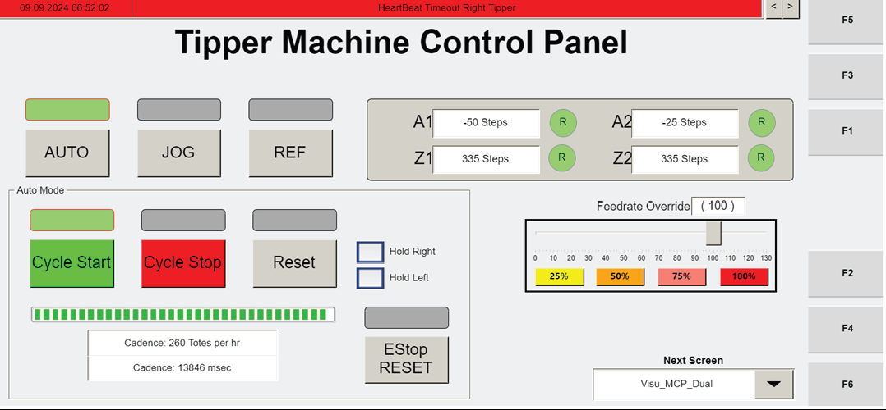

# Recover a Non-Recoverable Operator Station Motor Fault by Manually Resetting and Repositioning the Tote

## Runbook Header

| Field | Value |
| --- | --- |
| Procedure ID | `proc_recover_nonrecoverable_operator_station_motor_fault_with_tote_reposition_v1` |
| Title | Recover a Non-Recoverable Operator Station Motor Fault by Manually Resetting and Repositioning the Tote |
| Procedure Type | `recovery` |
| Primary Role | `operator` |
| Supporting Roles | None |
| Support Safe | Yes |
| Validation Status | `needs_sme_review` |
| Merge Status | `source_finalized` |

## Summary

Manual recovery procedure for an operator station motor fault that cannot be recovered in software, such as a motor overload fault. The operator uses the MCP_Dual screen to stop the tipping cycle, enter jog mode, clear any axis fault, reposition the tote if it is lifted off the robot, return the station to automatic mode, start the cycle so the grippers release and the robot goes to the hospital station, and then reset after the robot leaves the tipper.

## When To Use

Use when an operator station motor fault is not able to be recovered via software and the station needs to be manually reset, including cases such as a motor overload fault and cases where a tote is clamped by the gripper and may be lifted off the robot.

## Do Not Use For

* Do not use for recovery actions beyond the documented sequence.
* Do not use when further recovery steps are required after the documented sequence fails, because the source does not provide additional actions if the fault does not clear, the tote cannot be positioned on or nearly on the robot, or the robot does not leave the tipper.

## Safety And Operational Notes

* This procedure is for faults that are not recoverable via software and require manual station reset.
* If the tote is lifted off the robot, use the documented jog controls to position the tote on or nearly on the robot before returning to automatic operation.
* Do not invent additional recovery actions beyond the documented sequence.

## Access Or Tools Needed

* Access to the operator station HMI
* MCP_Dual screen (F3)
* CYCLE STOP control
* JOG control
* RESET control
* AUTO control
* CYCLE START control
* Visibility of Z1 Axis, Z2 Axis, A1 Axis, and A2 Axis indicators
* Plus and minus jog controls

## Related Operational Context

* ctx_manual_nonrecoverable_fault_operator_station_motors_v1
* ctx_manual_operator_station_hmi_reference_v1
* ctx_manual_estop_reset_reference_v1
* ctx_manual_inbound_hospital_station_qr_reference_v1

## Procedure Steps

### Step 1 — Open the MCP_Dual screen

**Responsible role:** operator

**Instruction:**
On the operator station HMI, navigate to the "MCP_Dual" screen using F3.

**Expected result:**
The MCP_Dual screen is displayed on the operator station HMI.

**Screens / Images:**

*MCP_Dual-related operator station screen area with axis labels, Manual Mode/Fault context, plus/minus controls, and RESET instruction.*

*F3 mapping to the operator station main control panel screen reference used for screen navigation.*

**Stop or Escalate If:**

* The operator station HMI is not accessible.
* The MCP_Dual screen cannot be reached using F3.

---

### Step 2 — Stop the tipping cycle

**Responsible role:** operator

**Instruction:**
Press CYCLE STOP to stop the tipping cycle.

**Expected result:**
The tipping cycle stops.

**Screens / Images:**

*Operator station HMI control area associated with manual recovery and stop/reset controls.*

*Operator station screen context for the non-recoverable fault recovery sequence.*

**Stop or Escalate If:**

* The tipping cycle does not stop.

---

### Step 3 — Enter manual jog mode

**Responsible role:** operator

**Instruction:**
Press JOG to enter manual jog mode, and verify the screen shows Manual Mode.

**Expected result:**
The station enters manual jog mode and the screen indicates Manual Mode.

**Screens / Images:**

*Manual jog mode interface and Manual Mode context.*

*JOG/manual mode reference used during non-recoverable fault recovery.*

**Stop or Escalate If:**

* JOG mode cannot be entered.
* Manual Mode is not indicated after pressing JOG.

---

### Step 4 — Inspect axis fault indications

**Responsible role:** operator

**Instruction:**
Check whether any of the displayed axes show a fault, using the Z1 Axis, Z2 Axis, A1 Axis, and A2 Axis indicators.

**Expected result:**
The operator identifies whether any of the displayed axes show a fault.

**Screens / Images:**

*Z1 Axis, Z2 Axis, A1 Axis, A2 Axis, and Fault indication areas.*

*Axis indicators and fault status in manual jog mode.*

**Stop or Escalate If:**

* The axis indicators are not visible or their status cannot be determined.

---

### Step 5 — Clear any displayed axis fault

**Responsible role:** operator

**Instruction:**
If any axis shows a fault, press RESET to clear the fault.

**Expected result:**
The displayed axis fault is cleared.

**Screens / Images:**

*RESET control in the operator station HMI recovery context.*

*Fault indication and RESET instruction associated with axis controls.*

**Stop or Escalate If:**

* The fault does not clear after pressing RESET.

---

### Step 6 — Reposition the tote if it is lifted off the robot

**Responsible role:** operator

**Instruction:**
If the tote is lifted off the robot, jog the Z-axis or A-axis, or both, to position the tote on or nearly on the robot using the plus and minus jog controls.

**Expected result:**
The tote is positioned on or nearly on the robot.

**Screens / Images:**

*Plus and minus jog controls and axis selection used to reposition the tote.*

*Manual jog mode reference for tote positioning during recovery.*

*Example of Z and A axis plus/minus jog controls for manual tipper movement.*

**Stop or Escalate If:**

* The tote cannot be positioned on or nearly on the robot.

---

### Step 7 — Use the correct axis pair for the side being recovered

**Responsible role:** operator

**Instruction:**
Use A1 and Z1 for the left axis, and use A2 and Z2 for the right tipper.

**Expected result:**
The correct axis pair is used for the side being recovered.

**Screens / Images:**

*A1, Z1, A2, and Z2 labels used to select the correct side.*

*Axis labels for left and right side selection.*

**Stop or Escalate If:**

* The correct side or axis pair cannot be identified from the HMI.

---

### Step 8 — Return the station to automatic mode

**Responsible role:** operator

**Instruction:**
Press AUTO to enter automatic mode.

**Expected result:**
The station enters automatic mode.

**Screens / Images:**

*AUTO control or automatic mode area used to return the station to automatic operation.*

*Operator station interface context for AUTO and cycle restart.*

**Stop or Escalate If:**

* The station does not enter automatic mode.

---

### Step 9 — Start the cycle

**Responsible role:** operator

**Instruction:**
Press CYCLE START.

**Expected result:**
The cycle starts.

**Screens / Images:**

*CYCLE START area used after AUTO is selected.*

*Operator station controls used to return the robot to automatic operation.*

**Stop or Escalate If:**

* The cycle does not start.

---

### Step 10 — Observe gripper release and robot departure

**Responsible role:** operator

**Instruction:**
Observe that the grippers release and the robot is commanded to go to the hospital station.

**Expected result:**
The grippers release and the robot is commanded to go to the hospital station.

**Screens / Images:**

*Operator station context for the release and robot departure sequence.*

*Controls and interface associated with the robot being returned to automatic operation.*

**Stop or Escalate If:**

* The grippers do not release.
* The robot does not go to the hospital station.

---

### Step 11 — Reset after the robot leaves the tipper

**Responsible role:** operator

**Instruction:**
After the robot has left the tipper, press RESET.

**Expected result:**
RESET is pressed after robot departure, completing the documented sequence.

**Screens / Images:**

*RESET context after the robot has left the tipper.*

*Operator station controls used at the end of the automatic recovery sequence.*

**Stop or Escalate If:**

* The robot does not leave the tipper.
* RESET cannot be completed after the robot leaves the tipper.

---

## Success Criteria

* The fault is manually reset.
* Any displayed axis fault is cleared.
* If needed, the tote is positioned on or nearly on the robot.
* The station returns to automatic mode.
* The grippers release.
* The robot is commanded to go to the hospital station and leaves the tipper.
* RESET is pressed after the robot has left the tipper.

## Failure Conditions

* The MCP_Dual screen cannot be accessed.
* The tipping cycle does not stop.
* Manual Mode cannot be entered.
* Axis fault status cannot be determined.
* A displayed fault does not clear with RESET.
* The tote cannot be positioned on or nearly on the robot.
* The station does not enter automatic mode.
* The cycle does not start.
* The grippers do not release.
* The robot does not leave the tipper or is not commanded to go to the hospital station.

## Escalation Guidance

* Stop if the documented HMI screen or controls are not accessible.
* Stop if the fault does not clear after RESET.
* Stop if the tote cannot be positioned on or nearly on the robot.
* Stop if the robot does not leave the tipper for the hospital station.
* The source does not provide further recovery steps beyond this sequence; escalate for SME review or site-specific support if the documented sequence does not restore operation.

## Missing Details / Known Gaps

* The source does not provide an estimated completion time.
* The source does not state whether production stop is required beyond pressing CYCLE STOP for the local tipping cycle.
* The source does not specify LOTO requirements.
* The source does not provide additional troubleshooting or escalation steps if RESET does not clear the fault, the tote cannot be repositioned, or the robot does not leave the tipper.
* The source does not define explicit acceptance indicators on the HMI beyond the described outcomes.

## Source Lineage

- Candidate IDs: candidate_operator_station_recover_nonrecoverable_motor_fault_with_tote_reposition
- Source ID: `manual_optisweep_om_v3`
- Source Type: `manual`
