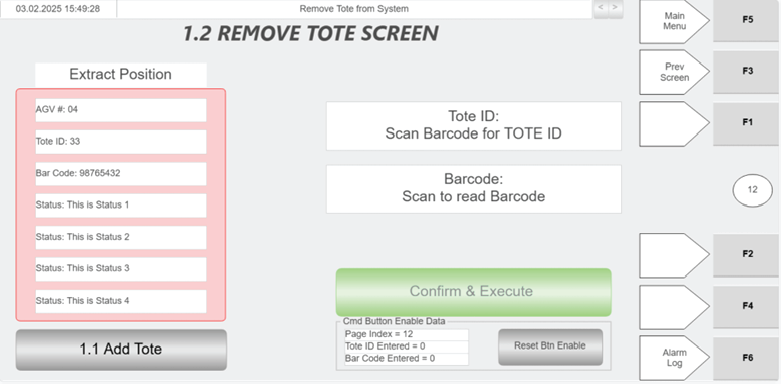
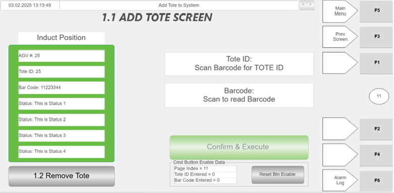
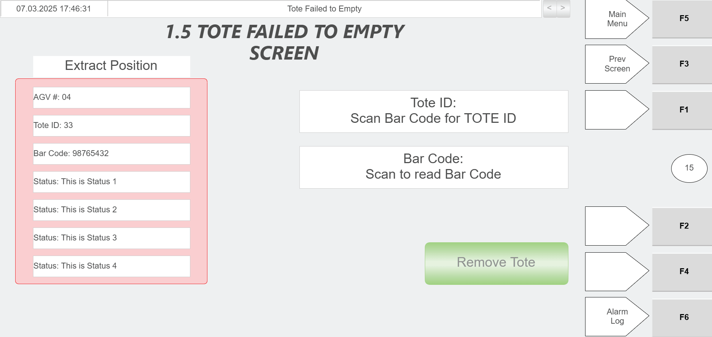
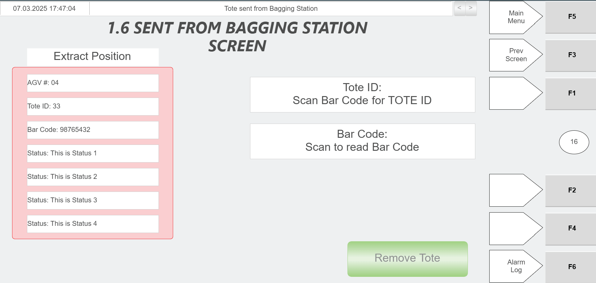

# Verify Tote Barcode Scan and Tote ID Population at the Hospital Station

## Runbook Header

| Field | Value |
| --- | --- |
| Procedure ID | `proc_verify_tote_barcode_scan_and_tote_id_population_at_the_hospital_station_v1` |
| Title | Verify Tote Barcode Scan and Tote ID Population at the Hospital Station |
| Procedure Type | `diagnostic` |
| Primary Role | `operator` |
| Supporting Roles | None |
| Support Safe | Yes |
| Validation Status | `needs_sme_review` |
| Merge Status | `source_finalized` |

## Summary

Use the hospital station HMI and green scanner to verify that scanning a tote barcode causes the Tote ID field to populate automatically on the corresponding hospital station screen.

## When To Use

Use this check when a tote is at the hospital station and the operator needs to confirm that the correct hospital station HMI screen is open, the tote barcode can be scanned with the green scanner, and the Tote ID field populates automatically after the scan. The source indicates the corresponding HMI screen is determined by the status fields.

## Do Not Use For

* Do not use this runbook for corrective recovery when the Tote ID field does not populate after scanning, because the source does not provide corrective steps.
* Do not use this runbook to perform alternate tote identification or manual Tote ID entry, because those actions are not provided in the source.

## Safety And Operational Notes

* Use only the scan-and-verify actions supported by the source.
* Do not invent alternate identification, manual entry, or corrective actions if the Tote ID field does not populate.

## Access Or Tools Needed

* Hospital station HMI access
* Green barcode scanner
* Tote with barcode

## Related Operational Context

* ctx_manual_scanner_setup_overview_v1
* ctx_manual_hospital_station_status_fields_reference_v1

## Procedure Steps

### Step 1 — Open the corresponding hospital station HMI screen

**Responsible role:** operator

**Instruction:**
Open the corresponding screen on the hospital station HMI used to extract the tote from the system. Determine the correct screen using the information in the status fields.

**Expected result:**
The correct hospital station HMI screen for the tote is displayed.

**Screens / Images:**

*Hospital station operation area associated with selecting the corresponding HMI screen based on status fields.*

*Example hospital station HMI layout showing Tote ID and barcode-related fields on a tote extraction screen.*

**Stop or Escalate If:**

* The corresponding HMI screen cannot be identified from the status fields.
* The required hospital station screen cannot be opened.

---

### Step 2 — Scan the tote barcode with the green scanner

**Responsible role:** operator

**Instruction:**
Use the green scanner to scan the tote barcode.

**Expected result:**
The tote barcode is scanned by the green scanner.

**Screens / Images:**

*Hospital station procedure context for scanning the tote barcode with the green scanner.*

*Example hospital HMI screen associated with tote barcode scanning and Tote ID population.*

**Stop or Escalate If:**

* The tote barcode cannot be scanned.
* The source-supported scan action does not produce the expected Tote ID field behavior in the next step.

---

### Step 3 — Observe the Tote ID field on the HMI

**Responsible role:** operator

**Instruction:**
Observe the Tote ID field on the hospital station HMI after scanning the tote barcode.

**Expected result:**
The Tote ID field updates after the scan.

**Screens / Images:**

*Tote ID field location on the hospital HMI screen.*

*Example Tote ID field location on a hospital HMI screen after barcode scan.*

*Example Tote ID field context on a hospital HMI screen where barcode scan populates Tote ID.*

*Example Tote ID field context on a hospital HMI screen after tote barcode scan.*

**Stop or Escalate If:**

* The Tote ID field does not automatically populate after scanning.

---

### Step 4 — Verify automatic Tote ID population

**Responsible role:** operator

**Instruction:**
Verify that the scanned tote ID automatically populates the Tote ID field on the HMI.

**Expected result:**
The scanned tote ID appears automatically in the Tote ID field.

**Screens / Images:**

*Tote ID field populated after barcode scan.*

*Hospital station operation context for confirming Tote ID field population after scan.*

**Stop or Escalate If:**

* The Tote ID field does not automatically populate after scanning.
* Corrective steps beyond this verification are needed, because the source does not provide them.

---

## Success Criteria

* The corresponding hospital station HMI screen is opened based on the status fields.
* The tote barcode is scanned using the green scanner.
* The Tote ID field automatically populates on the HMI after scanning.
* The populated Tote ID matches the scanned tote.

## Failure Conditions

* The corresponding HMI screen cannot be identified or opened from the status fields.
* The tote barcode cannot be scanned with the green scanner.
* The Tote ID field does not automatically populate after scanning.
* The source provides no corrective recovery steps for a non-populating Tote ID field.

## Escalation Guidance

* If the Tote ID field does not automatically populate after scanning, stop this procedure and escalate for SME or support review because the source does not provide corrective steps.
* Do not invent alternate identification or manual entry steps because they are not provided in the source.

## Missing Details / Known Gaps

* The source does not provide corrective troubleshooting steps if the Tote ID field does not populate after scanning.
* The source does not provide an estimated completion time.
* The source does not specify whether production stop or LOTO is required for this verification.
* The source does not define a separate supporting role or escalation destination.
* The source does not provide commands, manual entry alternatives, or recovery controls for scan failure in this procedure.

## Source Lineage

- Candidate IDs: candidate_operator_verify_hospital_station_tote_scan_and_tote_id_population
- Source ID: `manual_optisweep_om_v3`
- Source Type: `manual`
