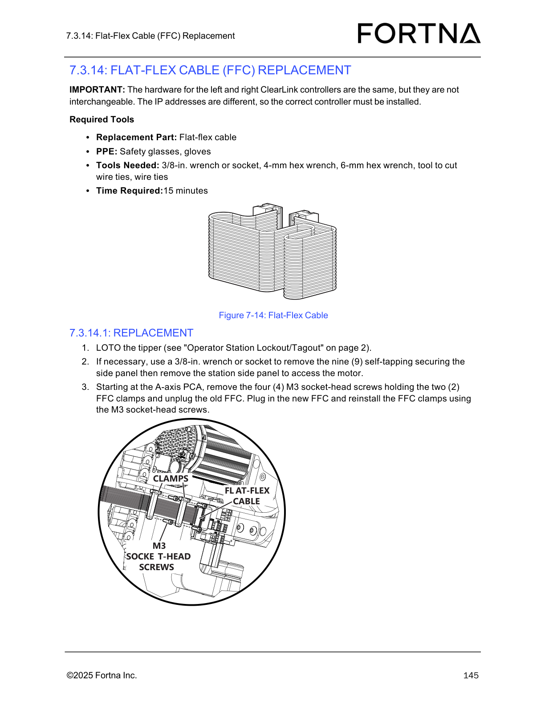
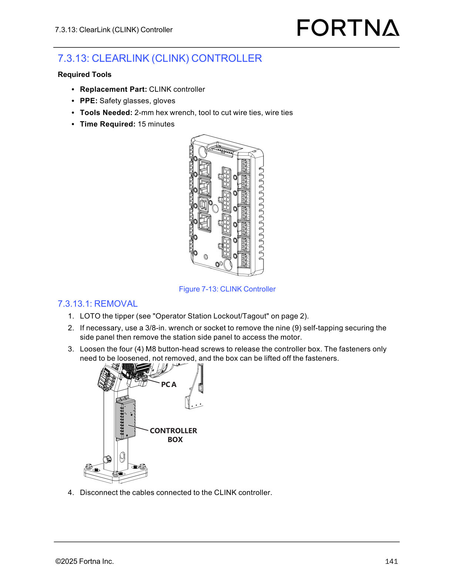
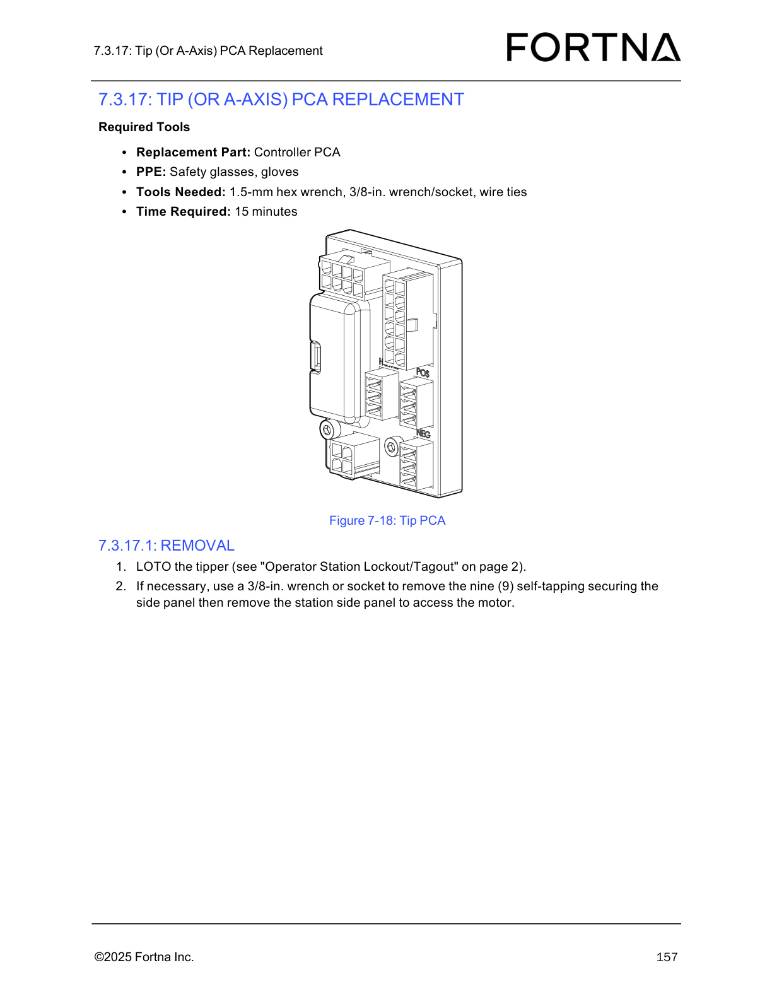

# Replace Flat-Flex Cable (FFC) At The A-Axis PCA

## Runbook Header

| Field | Value |
| --- | --- |
| Procedure ID | `proc_replace_flat_flex_cable_at_the_a_axis_pca_v1` |
| Title | Replace Flat-Flex Cable (FFC) At The A-Axis PCA |
| Procedure Type | `recovery` |
| Primary Role | `L2_support` |
| Supporting Roles | None |
| Support Safe | No |
| Validation Status | `needs_sme_review` |
| Merge Status | `source_finalized` |

## Summary

Remove the existing flat-flex cable and install the replacement FFC at the A-axis PCA using the documented lockout, access, clamp removal, cable replacement, and clamp reinstallation steps from the source manual.

## When To Use

Use this procedure when the flat-flex cable at the A-axis PCA must be replaced on the tipper, as documented in the OptiSweep Operation and Maintenance Manual.

## Do Not Use For

* Do not use this procedure for post-install verification or troubleshooting beyond the documented replacement steps; the source excerpt does not provide those details.
* Do not use this procedure to interchange left and right ClearLink controller hardware; the source notes the hardware is the same but not interchangeable because the IP addresses are different.

## Safety And Operational Notes

* LOTO the tipper before performing the replacement.
* Use safety glasses and gloves.
* Preserve correct component identity where applicable because left and right ClearLink controller hardware is the same but not interchangeable due to different IP addresses.

## Access Or Tools Needed

* Replacement flat-flex cable
* Safety glasses
* Gloves
* 3/8-in. wrench or socket
* 4-mm hex wrench
* 6-mm hex wrench
* Tool to cut wire ties
* Wire ties
* Access to the tipper
* Access to the station side panel and A-axis PCA
* Referenced Operator Station Lockout/Tagout procedure

## Procedure Steps

### Step 1 — Lock out and tag out the tipper

**Responsible role:** L2_support

**Instruction:**
LOTO the tipper using the referenced Operator Station Lockout/Tagout procedure before starting the flat-flex cable replacement.

**Expected result:**
The tipper is locked out and tagged out in accordance with the referenced procedure.

**Stop or Escalate If:**

* The tipper cannot be placed in a locked out/tagged out state.
* The referenced Operator Station Lockout/Tagout procedure is unavailable.

---

### Step 2 — Gather replacement part, PPE, and tools

**Responsible role:** L2_support

**Instruction:**
Gather the replacement flat-flex cable, safety glasses, gloves, 3/8-in. wrench or socket, 4-mm hex wrench, 6-mm hex wrench, tool to cut wire ties, and wire ties.

**Expected result:**
All documented parts, PPE, and tools are available at the work area.

**Stop or Escalate If:**

* The replacement flat-flex cable is not available.
* Required PPE or listed tools are not available.

---

### Step 3 — Remove the station side panel if needed for access

**Responsible role:** L2_support

**Instruction:**
If necessary, use a 3/8-in. wrench or socket to remove the nine self-tapping screws securing the side panel, then remove the station side panel to access the motor.

**Expected result:**
The station side panel is removed when needed and access to the internal area is available.

**Screens / Images:**

*Flat-flex cable and related clamp hardware used during FFC replacement on the tipper ClearLink controller assembly.*

*ClearLink controller/controller box location for access context after side panel removal.*

**Stop or Escalate If:**

* The side panel cannot be removed using the documented fasteners.
* Required access to the A-axis PCA cannot be obtained after panel removal.

---

### Step 4 — Remove the old flat-flex cable at the A-axis PCA

**Responsible role:** L2_support

**Instruction:**
Starting at the A-axis PCA, remove the four M3 socket-head screws holding the two FFC clamps and unplug the old FFC.

**Expected result:**
The two FFC clamps are removed and the old flat-flex cable is unplugged from the A-axis PCA.

**Screens / Images:**

*Flat-flex cable, FFC clamps, and M3 socket-head screw locations at the A-axis PCA.*

*Tip PCA / A-axis PCA location for component identification context.*

**Stop or Escalate If:**

* The four M3 socket-head screws cannot be removed.
* The FFC clamps cannot be removed.
* The old FFC cannot be unplugged as documented.

---

### Step 5 — Install the new flat-flex cable and reinstall clamps

**Responsible role:** L2_support

**Instruction:**
Plug in the new FFC and reinstall the FFC clamps using the M3 socket-head screws.

**Expected result:**
The new flat-flex cable is installed at the A-axis PCA and the FFC clamps are reinstalled with the M3 socket-head screws.

**Screens / Images:**

*Flat-flex cable and clamp hardware placement during reinstallation at the A-axis PCA.*

**Stop or Escalate If:**

* The new FFC cannot be installed as documented.
* The FFC clamps cannot be reinstalled.
* The replacement cannot be completed as documented.

---

## Success Criteria

* The old FFC is removed from the A-axis PCA.
* The new flat-flex cable is plugged in at the A-axis PCA.
* The two FFC clamps are reinstalled using the four M3 socket-head screws.

## Failure Conditions

* LOTO cannot be completed or confirmed.
* Required tools, PPE, or replacement cable are unavailable.
* The side panel cannot be removed when access is needed.
* The FFC clamp screws, clamps, or old cable cannot be removed as documented.
* The new FFC or clamp hardware cannot be installed as documented.
* Post-install verification or troubleshooting is required beyond the documented source steps.

## Escalation Guidance

* Escalate if the replacement cannot be completed as documented.
* Escalate if post-install verification or troubleshooting is needed because the source excerpt does not provide those steps.
* Escalate if there is uncertainty about correct component identity, especially regarding left versus right ClearLink controller hardware.

## Missing Details / Known Gaps

* The source packet does not provide the full section text for page 161.
* The source excerpt does not provide post-install verification steps.
* The source excerpt does not provide troubleshooting steps.
* The source does not provide a documented estimated time for this specific FFC replacement procedure in the supplied packet.
* The source does not explicitly state whether production stop is required beyond the required LOTO.

## Source Lineage

- Candidate IDs: candidate_replace_flat_flex_cable_at_a_axis_pca
- Source ID: `manual_optisweep_om_v3`
- Source Type: `manual`
