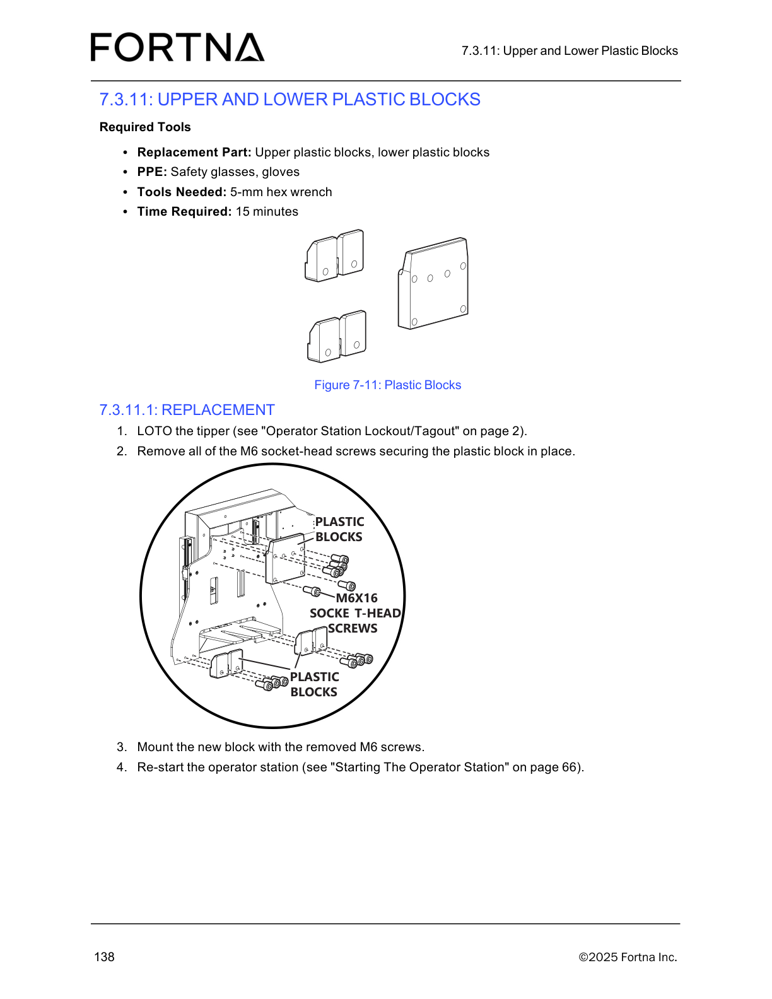

# Replace Upper and Lower Plastic Blocks

## Runbook Header

| Field | Value |
| --- | --- |
| Procedure ID | `proc_replace_upper_lower_plastic_blocks_v1` |
| Title | Replace Upper and Lower Plastic Blocks |
| Procedure Type | `recovery` |
| Primary Role | `L2_support` |
| Supporting Roles | None |
| Support Safe | No |
| Validation Status | `needs_sme_review` |
| Merge Status | `source_finalized` |

## Summary

Remove a worn or damaged upper or lower plastic block on the tipper and install the replacement block using the documented M6 socket-head screws, then restart the operator station. The source identifies required PPE and tools, requires LOTO, and references Figure 7-11 for block location and mounting points.

## When To Use

Use when an upper or lower plastic block on the tipper must be replaced due to wear or damage, using the documented replacement procedure in section 7.3.11.1.

## Do Not Use For

* Do not use for general operator execution; the procedure includes LOTO and component replacement.
* Do not use when the performer does not have access to the referenced LOTO procedure.
* Do not use when the performer does not have access to the referenced operator station startup procedure.
* Do not use if the block location, orientation, or mounting arrangement cannot be confirmed from the source-backed figure.

## Safety And Operational Notes

* LOTO the tipper before performing the replacement.
* Use safety glasses and gloves.
* This is not a support-safe procedure for general operator execution.
* The source references separate procedures for lockout/tagout and operator station startup but does not restate those steps here.

## Access Or Tools Needed

* Replacement upper plastic block or lower plastic block
* Safety glasses
* Gloves
* 5-mm hex wrench
* Access to the tipper
* Access to the referenced LOTO procedure
* Access to the referenced operator station startup procedure

## Procedure Steps

### Step 1 — Gather required replacement parts, PPE, and tool

**Responsible role:** L2_support

**Instruction:**
Gather the replacement upper or lower plastic block, safety glasses, gloves, and a 5-mm hex wrench.

**Expected result:**
All required replacement items, PPE, and the documented tool are available at the work area.

**Screens / Images:**

*Use Figure 7-11 to confirm the component being replaced is the upper or lower plastic block covered by this procedure.*

**Stop or Escalate If:**

* The correct replacement upper or lower plastic block is not available.
* Required PPE or the 5-mm hex wrench is not available.

---

### Step 2 — LOTO the tipper

**Responsible role:** L2_support

**Instruction:**
LOTO the tipper as referenced by the manual before continuing with the replacement.

**Expected result:**
The tipper is locked out and tagged out per the referenced procedure.

**Stop or Escalate If:**

* The documented LOTO reference is not available to the person performing the work.
* LOTO cannot be completed or verified.

---

### Step 3 — Locate the plastic block and identify its mounting screws

**Responsible role:** L2_support

**Instruction:**
Locate the upper or lower plastic block to be replaced and identify the M6 socket-head screws securing it in place. Use Figure 7-11 to confirm block location and mounting points.

**Expected result:**
The correct plastic block and its securing M6 socket-head screws have been identified.

**Screens / Images:**

*Upper plastic block location, lower plastic block location, and the M6x16 socket-head screws securing the block.*

**Stop or Escalate If:**

* The block location cannot be confirmed from Figure 7-11.
* The block orientation or mounting arrangement cannot be confirmed from the source-backed figure and procedure.

---

### Step 4 — Remove the existing plastic block fasteners

**Responsible role:** L2_support

**Instruction:**
Remove all of the M6 socket-head screws securing the plastic block in place.

**Expected result:**
All documented M6 socket-head screws securing the plastic block have been removed.

**Screens / Images:**

*The M6x16 socket-head screw locations securing the plastic block.*

**Stop or Escalate If:**

* The securing screws cannot be identified with confidence.
* One or more M6 socket-head screws cannot be removed.
* The fastener arrangement does not match the source-backed figure.

---

### Step 5 — Install the new plastic block

**Responsible role:** L2_support

**Instruction:**
Mount the new block using the removed M6 screws. Use Figure 7-11 to confirm mounting points and component orientation.

**Expected result:**
The new plastic block is mounted in place using the removed M6 screws.

**Screens / Images:**

*Mounting points and component orientation for the replacement upper or lower plastic block.*

**Stop or Escalate If:**

* The block orientation cannot be confirmed from Figure 7-11.
* The mounting arrangement cannot be confirmed from the source-backed figure and procedure.
* The new block cannot be mounted using the removed M6 screws.

---

### Step 6 — Restart the operator station

**Responsible role:** L2_support

**Instruction:**
Re-start the operator station as referenced by the manual.

**Expected result:**
The operator station is restarted after the replacement is completed.

**Stop or Escalate If:**

* The documented operator station startup reference is not available to the person performing the work.
* The operator station cannot be restarted as referenced by the manual.

---

## Success Criteria

* The replacement plastic block is mounted in place with the documented M6 screws.
* The operator station is restarted.
* The installed block location and mounting arrangement match Figure 7-11.

## Failure Conditions

* The correct replacement block, PPE, or required tool is unavailable.
* LOTO cannot be completed or verified.
* The block location, orientation, or mounting arrangement cannot be confirmed from the source-backed figure and procedure.
* The M6 socket-head screws cannot be removed or reused as documented.
* The referenced operator station startup procedure is unavailable or restart cannot be completed.

## Escalation Guidance

* Escalate if the block location, orientation, or mounting arrangement cannot be confirmed from the source-backed figure and procedure.
* Escalate if the documented restart or lockout/tagout references are not available to the person performing the work.
* Escalate if the securing M6 screw arrangement does not match Figure 7-11 or the documented procedure.

## Missing Details / Known Gaps

* The packet does not include the full text of section 7.3.11.1; step wording is grounded from the candidate and artifact retrieval text.
* The source references separate LOTO and operator station startup procedures, but their detailed steps are not included in this packet.
* The packet does not provide explicit torque values or verification checks for the M6 screws.
* The packet does not state whether production stop is required beyond the LOTO requirement.

## Source Lineage

- Candidate IDs: candidate_replace_upper_lower_plastic_blocks
- Source ID: `manual_optisweep_om_v3`
- Source Type: `manual`
