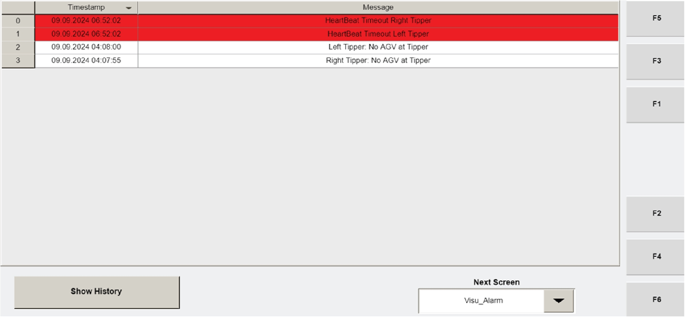
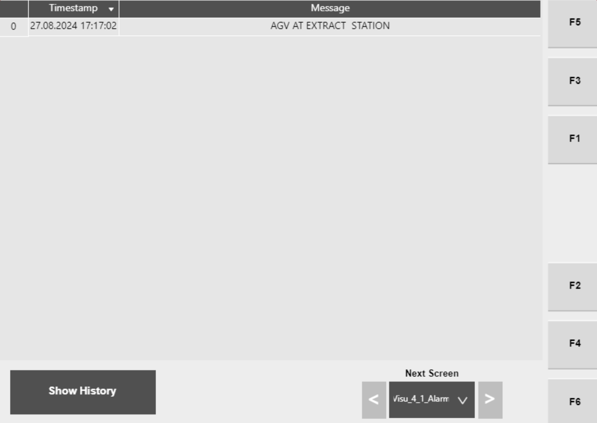

# Resume or End a Tipper Cycle After a Tipper Cycle Stopped Alarm

## Runbook Header

| Field | Value |
| --- | --- |
| Procedure ID | `proc_resume_or_end_a_tipper_cycle_after_a_tipper_cycle_stopped_alarm_v1` |
| Title | Resume or End a Tipper Cycle After a Tipper Cycle Stopped Alarm |
| Procedure Type | `recovery` |
| Primary Role | `operator` |
| Supporting Roles | None |
| Support Safe | Yes |
| Validation Status | `needs_sme_review` |
| Merge Status | `source_finalized` |

## Summary

Use the documented corrective action for the Left Tipper "Tipper Cycle Stopped" alarm to either resume the cycle with CYCLE START or end the cycle with RESET after confirming the alarm text and listed cause.

## When To Use

Use when the alarm text matches "Left Tipper: Tipper Cycle Stopped" and the operator is applying the corrective action documented in the alarm table.

## Do Not Use For

* Do not use for other alarm texts unless the source table gives the same corrective action.
* Do not assume this procedure applies to the right tipper without source confirmation; the cited source excerpt explicitly names the Left Tipper entry.

## Safety And Operational Notes

* Use only the documented controls and corrective action provided for the matching alarm entry.
* Do not apply this procedure to a different alarm condition unless the source provides the same corrective action.

## Access Or Tools Needed

* Access to the relevant operator station or documented control interface
* Alarm text confirmation from the HMI or alarm list
* Table 4-23 Alarms and Corrective Actions

## Related Operational Context

* ctx_manual_tipper_system_overview_v1

## Procedure Steps

### Step 1 — Confirm the tipper cycle stopped alarm text

**Responsible role:** operator

**Instruction:**
Review the displayed alarm list and confirm the alarm text matches "Left Tipper: Tipper Cycle Stopped" or the corresponding tipper cycle stopped entry before taking action.

**Expected result:**
The operator confirms the alarm text matches the documented alarm entry.

**Screens / Images:**

*VISU_ALARM view showing the list of tipper alarms and their timestamps.*

*Alarm list with timestamps if alarm review is being performed from the hospital HMI context.*

**Stop or Escalate If:**

* The alarm text does not match the documented tipper cycle stopped entry.
* The alarm cannot be confirmed from the available HMI or alarm list.

---

### Step 2 — Verify the documented cause

**Responsible role:** operator

**Instruction:**
Verify from the alarm table that the cause for this alarm is that the operator station is in Cycle Stopped state.

**Expected result:**
The operator confirms the listed cause matches the current alarm entry.

**Stop or Escalate If:**

* The source table cannot be consulted.
* The listed cause does not match "Op Station in Cycle Stopped state."

---

### Step 3 — Resume or end the cycle using the documented control

**Responsible role:** operator

**Instruction:**
Press CYCLE START to resume the cycle, or press RESET to end the cycle, using the documented corrective action.

**Expected result:**
The selected control is accepted and the system attempts to resume or end the cycle accordingly.

**Screens / Images:**

*Operator Station control panel showing the CYCLE START control and alarm messaging area.*

**Stop or Escalate If:**

* The alarm remains active after using the documented control.
* The control needed to perform the documented action is not available on the interface.

---

### Step 4 — Observe the resulting cycle state

**Responsible role:** operator

**Instruction:**
Observe whether the cycle resumes or ends as expected after the selected control is used.

**Expected result:**
The tipper either resumes operation after CYCLE START or the cycle ends after RESET.

**Screens / Images:**

*Control panel status and alarm messaging after pressing CYCLE START or RESET.*

*Alarm list to verify whether the tipper cycle stopped alarm remains active.*

**Stop or Escalate If:**

* The alarm remains active after using the documented control.
* The cycle does not resume after CYCLE START.
* The cycle does not end after RESET.

---

## Success Criteria

* The alarm text was confirmed as the documented tipper cycle stopped entry.
* The operator used the documented corrective action from the source.
* The tipper resumed after CYCLE START or the cycle ended after RESET, consistent with the source.

## Failure Conditions

* The displayed alarm text does not match the documented alarm entry.
* The cause cannot be verified from the source table.
* The alarm remains active after pressing CYCLE START or RESET.
* The cycle does not resume or end as expected after the selected control is used.

## Escalation Guidance

* Escalate if the alarm remains active after using the documented control.
* Escalate if the displayed alarm text does not match the documented entry and no matching source-supported corrective action is available.

## Missing Details / Known Gaps

* The packet does not provide a source-supported estimated completion time.
* The packet does not provide source-supported production stop or LOTO requirements for this procedure.
* The packet does not provide a source-supported RESET control image artifact explicitly tied to this alarm action.
* The candidate notes that right-side applicability should be confirmed during review because the cited source excerpt explicitly names the Left Tipper entry.

## Source Lineage

- Candidate IDs: candidate_resume_tipper_after_cycle_stopped_alarm
- Source ID: `manual_optisweep_om_v3`
- Source Type: `manual`
