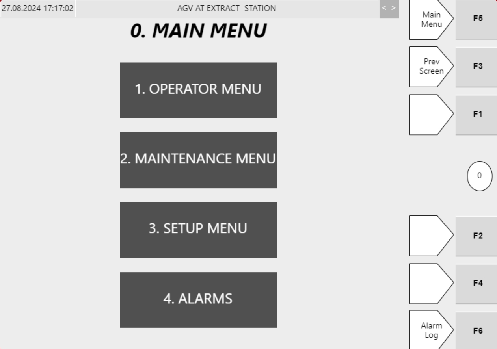

# Review Active Alarms On the Hospital HMI Alarms Screen

## Runbook Header

| Field | Value |
| --- | --- |
| Procedure ID | `proc_review_active_alarms_on_the_hospital_hmi_alarms_screen_v1` |
| Title | Review Active Alarms On the Hospital HMI Alarms Screen |
| Procedure Type | `diagnostic` |
| Primary Role | `L1_support` |
| Supporting Roles | None |
| Support Safe | Yes |
| Validation Status | `needs_sme_review` |
| Merge Status | `source_finalized` |

## Summary

Use the Hospital HMI Alarms screen to view the listed alarms and their associated time stamps, then record the entries exactly as displayed for comparison to the documented alarms and corrective actions table.

## When To Use

Use this procedure when alarm information needs to be reviewed directly on the Hospital HMI and the current alarm text and time stamps must be captured from the Alarms screen.

## Do Not Use For

* Do not use this procedure to infer alarm meaning beyond the displayed text and the documented alarms/faults table.
* Do not use this procedure as a corrective action procedure; the supplied source only supports viewing and recording alarms with time stamps.

## Safety And Operational Notes

* This runbook is limited to viewing and recording alarm information shown on the Hospital HMI.
* Do not infer alarm meaning beyond the displayed text and the documented table.

## Access Or Tools Needed

* Access to the Hospital HMI
* Hospital HMI Alarms screen
* Documented alarms/faults table

## Related Operational Context

* ctx_manual_hospital_hmi_alarms_screen_v1

## Procedure Steps

### Step 1 — Open the Hospital HMI Alarms screen

**Responsible role:** L1_support

**Instruction:**
Open or navigate to the Hospital HMI Alarms screen.

**Expected result:**
The Hospital HMI Alarms screen is displayed.

**Screens / Images:**

*Overall Hospital HMI Alarms screen layout.*

*Main menu access point showing Alarms as an available hospital HMI function.*

**Stop or Escalate If:**

* Escalate if the Hospital HMI Alarms screen cannot be accessed from the available source-supported HMI views.

---

### Step 2 — Locate the displayed alarm list

**Responsible role:** L1_support

**Instruction:**
Locate the list of alarms displayed on the screen.

**Expected result:**
The visible alarm entries can be identified on the Alarms screen.

**Screens / Images:**

*The alarms list area and the associated time stamp display.*

**Stop or Escalate If:**

* Escalate if the alarm list is not visible or cannot be read on the Hospital HMI Alarms screen.

---

### Step 3 — Read each visible alarm and time stamp

**Responsible role:** L1_support

**Instruction:**
For each visible alarm entry, read the alarm text and the associated time stamp.

**Expected result:**
Each visible alarm entry has been reviewed with its corresponding time stamp.

**Screens / Images:**

*Each visible alarm entry and its associated time stamp.*

**Stop or Escalate If:**

* Escalate if the displayed alarm text or time stamp cannot be read clearly.

---

### Step 4 — Record the alarm entries exactly as shown

**Responsible role:** L1_support

**Instruction:**
Record the alarm entries exactly as shown so they can be compared to the documented alarms/faults table.

**Expected result:**
A complete record of the visible alarm text and time stamps is created exactly as displayed.

**Screens / Images:**

*The displayed alarm text and time stamps that must be copied exactly.*

**Stop or Escalate If:**

* Stop and correct the record if alarm text is being paraphrased instead of copied exactly as shown.
* Escalate if the displayed information cannot be captured accurately.

---

### Step 5 — Match displayed alarm text to the documented alarm table when needed

**Responsible role:** L1_support

**Instruction:**
Use the displayed alarm text to identify the corresponding documented alarm entry in the alarms/faults list when needed.

**Expected result:**
The displayed alarm text is matched to a documented alarm entry when a corresponding table entry exists.

**Screens / Images:**

*The exact displayed alarm text to compare against the documented alarms/faults table.*

**Stop or Escalate If:**

* Escalate if the HMI alarm text cannot be matched to a documented alarm entry using the provided source material.
* Do not infer alarm meaning beyond the displayed text and the documented table.

---

## Success Criteria

* The Hospital HMI Alarms screen is viewed successfully.
* Visible alarm entries and their time stamps are read from the screen.
* Alarm entries are recorded exactly as displayed.
* Displayed alarm text can be compared to the documented alarms/faults table when needed.

## Failure Conditions

* The Hospital HMI Alarms screen cannot be accessed or displayed.
* The alarm list is not visible or cannot be read.
* Alarm text or time stamps cannot be captured accurately.
* Displayed alarm text cannot be matched to a documented alarm entry using the provided source material.

## Escalation Guidance

* Escalate if the HMI alarm text cannot be matched to a documented alarm entry using the provided source material.
* Escalate if the Hospital HMI Alarms screen cannot be accessed or the alarm list cannot be read.
* Do not infer alarm meaning beyond the displayed text and the documented table.

## Missing Details / Known Gaps

* The source does not provide exact navigation steps for reaching the Hospital HMI Alarms screen.
* The source does not specify whether login or a particular access level is required to view the Alarms screen.
* The source does not provide a time estimate for completing this review.
* The source does not define what to do if additional alarm history beyond the visible list is needed.

## Source Lineage

- Candidate IDs: candidate_review_hospital_hmi_alarm_list_with_timestamps
- Source ID: `manual_optisweep_om_v3`
- Source Type: `manual`
