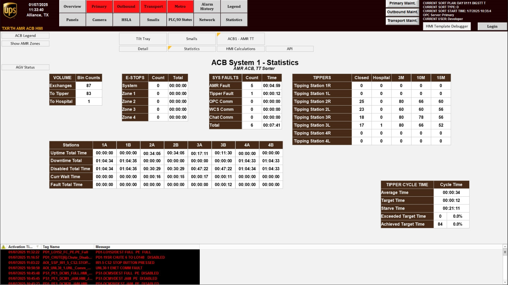
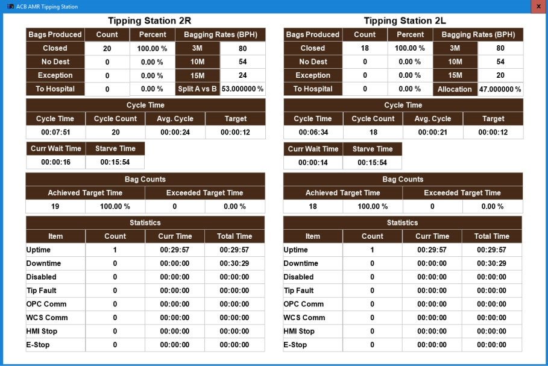

# Review Completed Bags, Errors, and Task Timing on the Tipping Station Screen

## Runbook Header

| Field | Value |
| --- | --- |
| Procedure ID | `proc_review_completed_bags_errors_and_task_timing_on_the_tipping_station_screen_v1` |
| Title | Review Completed Bags, Errors, and Task Timing on the Tipping Station Screen |
| Procedure Type | `diagnostic` |
| Primary Role | `L1_support` |
| Supporting Roles | None |
| Support Safe | Yes |
| Validation Status | `needs_sme_review` |
| Merge Status | `source_finalized` |

## Summary

Use the Tipping Station HMI screen to navigate to and review the documented information categories for completed bags, errors, and task duration, then record only the values shown on the screen.

## When To Use

Use when you need to view the Tipping Station screen information described in the manual for completed bags, errors, and how long tasks take.

## Do Not Use For

* Do not use this runbook to interpret field meanings, thresholds, or acceptable values because the source does not provide them.
* Do not use this runbook for maintenance positioning, jogging, or manual tipper movement.
* Do not use this runbook to change system settings or control production behavior; the source only supports viewing and recording displayed information.

## Safety And Operational Notes

* This runbook is source-supported as a screen review activity only.
* Record only the values displayed on the screen; do not infer meanings or thresholds not provided by the source.

## Access Or Tools Needed

* Access to the system HMI
* Ability to navigate to the Tipping Station screen
* Figure 4-7 or equivalent source-backed screen reference

## Related Operational Context

* ctx_manual_tipping_station_screen_overview_v1
* ctx_manual_hospital_station_tote_id_metric_v1
* ctx_manual_tipping_station_metrics_reference_v1

## Procedure Steps

### Step 1 — Press SMALLS on the HMI

**Responsible role:** L1_support

**Instruction:**
On the system HMI, press SMALLS.

**Expected result:**
The user enters the SMALLS navigation path described by the manual.

**Screens / Images:**

*The SMALLS screen entry point and the Smalls system overview context.*

**Stop or Escalate If:**

* Stop if the HMI does not allow access to the SMALLS path.

---

### Step 2 — Select ACB from the drop-down menu

**Responsible role:** L1_support

**Instruction:**
Select "ACB" from the drop-down menu.

**Expected result:**
The ACB option is selected.

**Screens / Images:**

*ACB screen context relevant to the documented ACB selection path.*

**Stop or Escalate If:**

* Stop if the ACB option is not present in the drop-down menu.

---

### Step 3 — Select ACB1 - AMT TT

**Responsible role:** L1_support

**Instruction:**
Select "ACB1 - AMT TT" from the available options.

**Expected result:**
The ACB1 - AMT TT option is selected.

**Stop or Escalate If:**

* Stop if "ACB1 - AMT TT" is not available in the options.

---

### Step 4 — Open the Tipping Station screen

**Responsible role:** L1_support

**Instruction:**
Press the tipper button on the right side of the screen to open the "Tipping Station" screen.

**Expected result:**
The Tipping Station screen opens.

**Screens / Images:**

*The Tipping Station screen and the tipper button location on the right side.*

**Stop or Escalate If:**

* Stop if the Tipping Station screen does not open.
* Stop if the displayed screen does not show the documented categories of information.

---

### Step 5 — Review completed bag information

**Responsible role:** L1_support

**Instruction:**
Check the Tipping Station screen for information on how many bags are completed.

**Expected result:**
Completed bag information is visible on the Tipping Station screen.

**Screens / Images:**

*Where completed bag information appears on the Tipping Station screen.*

**Stop or Escalate If:**

* Stop if the Tipping Station screen does not display completed bag information.

---

### Step 6 — Review error information

**Responsible role:** L1_support

**Instruction:**
Check the Tipping Station screen for error information.

**Expected result:**
Error information is visible on the Tipping Station screen.

**Screens / Images:**

*Where error information appears on the Tipping Station screen.*

**Stop or Escalate If:**

* Stop if the Tipping Station screen does not display error information.

---

### Step 7 — Review task timing information

**Responsible role:** L1_support

**Instruction:**
Check the Tipping Station screen for information on how long tasks take.

**Expected result:**
Task timing information is visible on the Tipping Station screen.

**Screens / Images:**

*Where task duration or timing information appears on the Tipping Station screen.*

**Stop or Escalate If:**

* Stop if the Tipping Station screen does not display task timing information.

---

### Step 8 — Record the displayed information

**Responsible role:** L1_support

**Instruction:**
Record the displayed information using only the values shown on the screen.

**Expected result:**
The displayed completed bag, error, and task timing information is recorded as shown.

**Screens / Images:**

*The displayed completed bag, error, and task timing information to be recorded exactly as shown.*

**Stop or Escalate If:**

* Escalate if the screen contents cannot be interpreted from the available source because field names, thresholds, or meanings are not provided.

---

## Success Criteria

* The Tipping Station screen is opened using the documented navigation path.
* The user can view information for completed bags, errors, and task duration.
* The displayed information is recorded using only the values shown on the screen.

## Failure Conditions

* The Tipping Station screen does not display the documented categories of information.
* The required navigation options are unavailable.
* The screen contents cannot be interpreted from the available source because field names, thresholds, or meanings are not provided.

## Escalation Guidance

* Stop if the Tipping Station screen does not display the documented categories of information.
* Escalate if the screen contents cannot be interpreted from the available source because field names, thresholds, or meanings are not provided.

## Missing Details / Known Gaps

* The source does not provide exact field labels on the Tipping Station screen.
* The source does not provide expected values, thresholds, or interpretation rules for the displayed information.
* The source does not provide an estimated completion time.
* The source does not specify whether production stop or LOTO is required.
* The source does not define downstream actions based on the reviewed values.

## Source Lineage

- Candidate IDs: candidate_review_tipping_station_screen_metrics
- Source ID: `manual_optisweep_om_v3`
- Source Type: `manual`
