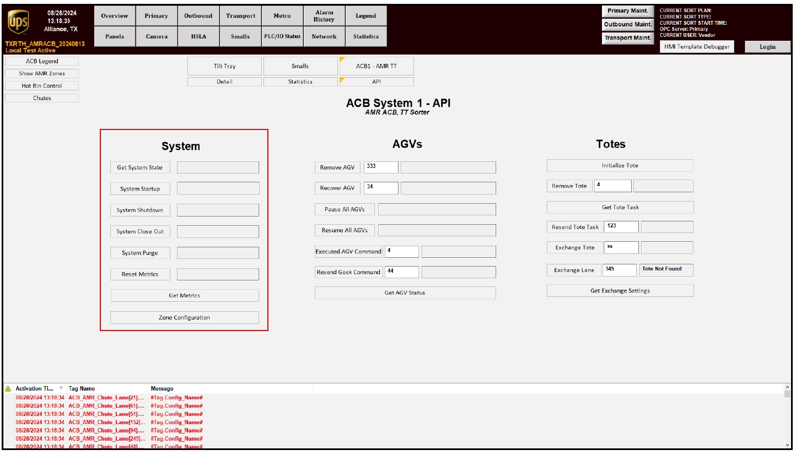

# Start the System From the System API Screen

## Runbook Header

| Field | Value |
| --- | --- |
| Procedure ID | `proc_start_the_system_from_the_system_api_screen_v1` |
| Title | Start the System From the System API Screen |
| Procedure Type | `operation` |
| Primary Role | `operator` |
| Supporting Roles | None |
| Support Safe | Yes |
| Validation Status | `needs_sme_review` |
| Merge Status | `source_finalized` |

## Summary

Initiate OptiSweep system startup from the system HMI by navigating to the system API screen and pressing the SYSTEM STARTUP control.

## When To Use

Use this procedure when the operator needs to initiate system startup from the system HMI using the documented SYSTEM STARTUP control on the system API screen.

## Do Not Use For

* Do not use this runbook to verify startup completion, because the source excerpt does not provide confirmation indicators or completion criteria after pressing SYSTEM STARTUP.
* Do not use this runbook for startup recovery, troubleshooting, or fault handling, because the source excerpt does not provide failure states or recovery actions.
* Do not infer additional startup verification steps or recovery actions from this excerpt alone.

## Safety And Operational Notes

* This source describes a normal HMI operating action.
* The source excerpt does not provide additional safety controls, interlocks, or warnings for this action.

## Access Or Tools Needed

* Access to the system HMI
* System API screen
* SYSTEM STARTUP control

## Related Operational Context

* ctx_manual_system_operation_overview_v1
* ctx_manual_system_api_screen_reference_v1
* ctx_manual_system_api_controls_overview_v1

## Procedure Steps

### Step 1 — Navigate to the system API screen

**Responsible role:** operator

**Instruction:**
On the system HMI, navigate to the system API screen.

**Expected result:**
The system API screen is displayed on the system HMI.

**Screens / Images:**

*System HMI screen associated with section 5.1 Starting the System.*

*System API Controls screen reference showing the System section of the API screen.*

**Stop or Escalate If:**

* The system API screen cannot be located using the source-provided guidance.
* The displayed screen does not match the documented system API/System API Controls context.

---

### Step 2 — Locate the SYSTEM STARTUP control

**Responsible role:** operator

**Instruction:**
Locate the control labeled SYSTEM STARTUP on the system API screen.

**Expected result:**
The SYSTEM STARTUP control is visible and identifiable on the system API screen.

**Screens / Images:**

*Startup-related system HMI screen associated with section 5.1.*

*The System Startup control in the System API Controls figure.*

**Stop or Escalate If:**

* The SYSTEM STARTUP control cannot be found on the system API screen.
* The available screen does not show the documented System section controls.

---

### Step 3 — Press SYSTEM STARTUP

**Responsible role:** operator

**Instruction:**
Press SYSTEM STARTUP.

**Expected result:**
The system startup command is initiated from the system API screen.

**Screens / Images:**

*The System Startup control used to initiate startup.*

*Startup-related system HMI screen associated with section 5.1.*

**Stop or Escalate If:**

* No source-supported confirmation indicator is available to verify the result from this excerpt alone.
* Any unexpected response occurs after pressing SYSTEM STARTUP, because the source excerpt does not provide recovery or escalation actions.

---

## Success Criteria

* The operator reaches the system API screen on the system HMI.
* The SYSTEM STARTUP control is identified on the system API screen.
* The SYSTEM STARTUP control is pressed to initiate the startup command.

## Failure Conditions

* The system API screen cannot be located or accessed using the source-provided guidance.
* The SYSTEM STARTUP control cannot be identified on the system API screen.
* The source excerpt does not provide confirmation indicators, failure states, or escalation instructions after pressing SYSTEM STARTUP.

## Escalation Guidance

* If the system API screen or SYSTEM STARTUP control cannot be located, stop and seek SME or local support guidance because the source excerpt does not provide alternate navigation or recovery steps.
* If an unexpected condition occurs after pressing SYSTEM STARTUP, stop and escalate for review because the source excerpt does not define failure handling.
* Do not add unsupported verification or recovery actions beyond what is documented in this source packet.

## Missing Details / Known Gaps

* The source excerpt does not provide startup completion indicators or confirmation messages.
* The source excerpt does not provide failure states or troubleshooting steps after pressing SYSTEM STARTUP.
* The source excerpt does not provide explicit escalation contacts or routing.
* The source excerpt does not provide an estimated completion time.
* The source excerpt does not state whether production stop or LOTO requirements apply.

## Source Lineage

- Candidate IDs: candidate_start_system_from_system_api_screen
- Source ID: `manual_optisweep_om_v3`
- Source Type: `manual`
