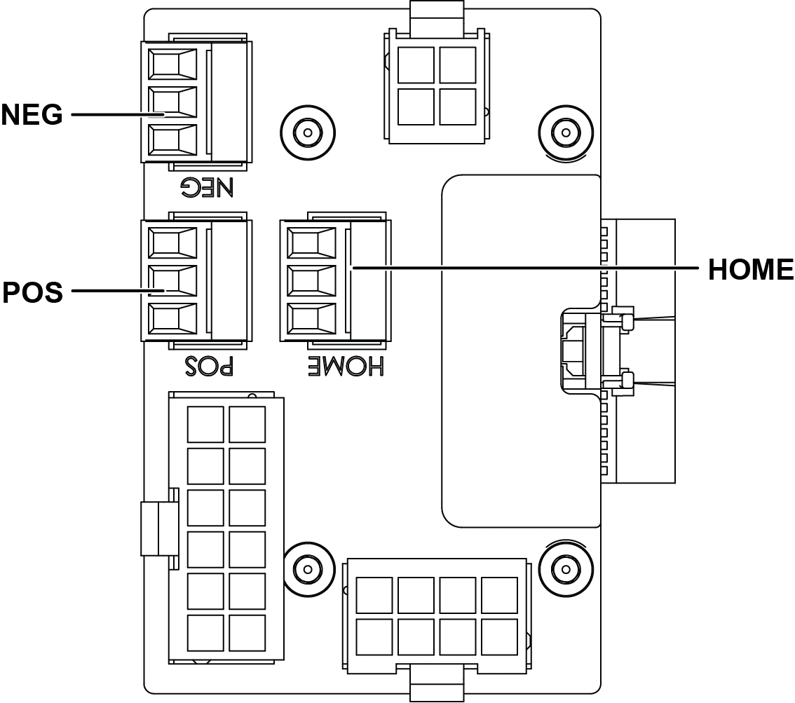

# Install Tip PCA And Reconnect Cables

## Runbook Header

| Field | Value |
| --- | --- |
| Procedure ID | `proc_install_tip_pca_and_reconnect_cables_v1` |
| Title | Install Tip PCA And Reconnect Cables |
| Procedure Type | `recovery` |
| Primary Role | `L2_support` |
| Supporting Roles | None |
| Support Safe | No |
| Validation Status | `needs_sme_review` |
| Merge Status | `source_finalized` |

## Summary

Mount a replacement Tip (A-Axis) PCA, reconnect the documented FFC, Molex connectors, and three green terminal blocks, secure wiring so nothing is dangling, reinstall side panels if needed, and restart the operator station using the referenced startup procedure.

## When To Use

Use this procedure after Tip (A-Axis) PCA replacement when the new PCA must be mounted, reconnected to the documented cable and connector types, wiring secured, panels reinstalled if needed, and the operator station restarted.

## Safety And Operational Notes

* This is not marked support-safe in the candidate and involves internal hardware installation and reconnection.
* Do not leave cables or wires dangling near the PCA; secure with a wire tie if necessary.

## Access Or Tools Needed

* Replacement Tip PCA
* Four (4) M3 socket-head screws
* Access to the FFC connection
* Access to the Molex connectors
* Access to the three (3) green terminal blocks
* Wire tie if needed
* Access to top and/or bottom side panels
* Referenced procedure: "Starting The Operator Station" on page 66

## Procedure Steps

### Step 1 — Mount the new Tip PCA

**Responsible role:** L2_support

**Instruction:**
Mount the new PCA using the four (4) M3 socket-head screws.

**Expected result:**
The replacement Tip PCA is physically installed and secured in place.

**Screens / Images:**

*A-axis PCA connection layout and board orientation context.*

**Stop or Escalate If:**

* The PCA cannot be mounted securely with the four (4) M3 socket-head screws.

---

### Step 2 — Reconnect the FFC

**Responsible role:** L2_support

**Instruction:**
Plug in the FFC.

**Expected result:**
The FFC is connected to the new PCA.

**Screens / Images:**

*FFC connection location at the A-axis PCA.*

*A-axis PCA connection points for orientation while reconnecting the FFC.*

**Stop or Escalate If:**

* Connector locations are unclear or cannot be matched to their original positions from removal.

---

### Step 3 — Reconnect the Molex connectors

**Responsible role:** L2_support

**Instruction:**
Plug in the Molex connectors.

**Expected result:**
The Molex connectors are reattached to the PCA.

**Screens / Images:**

*A-axis PCA connector layout to help identify connector locations.*

**Stop or Escalate If:**

* Connector locations are unclear or cannot be matched to their original positions from removal.

---

### Step 4 — Reconnect the green terminal blocks

**Responsible role:** L2_support

**Instruction:**
Plug in the three (3) green terminal blocks into the same locations from which they were removed.

**Expected result:**
All three green terminal blocks are reinstalled in their original locations.

**Screens / Images:**

*A-axis PCA connector layout for terminal block location context.*

**Stop or Escalate If:**

* Connector locations are unclear or cannot be matched to their original positions from removal.

---

### Step 5 — Secure wiring

**Responsible role:** L2_support

**Instruction:**
Ensure none of the cables or wires are dangling; use a wire tie if necessary.

**Expected result:**
Cables and wires are secured and not dangling.

**Screens / Images:**

*Cable routing path and general routing condition for the tip/A-axis area.*

*Wire tie handling points and routing guidance relevant to ensuring no wires dangle near the A-axis PCA.*

**Stop or Escalate If:**

* Cables or wires cannot be secured without dangling.

---

### Step 6 — Reinstall side panels if needed

**Responsible role:** L2_support

**Instruction:**
Reinstall the top and/or bottom side panels, if necessary.

**Expected result:**
Any removed top and/or bottom side panels are reinstalled.

**Stop or Escalate If:**

* Required side panels cannot be reinstalled.

---

### Step 7 — Restart the operator station

**Responsible role:** L2_support

**Instruction:**
Re-start the operator station using the referenced startup procedure on page 66.

**Expected result:**
The operator station restarts using the referenced startup procedure.

**Stop or Escalate If:**

* The operator station does not restart using the referenced startup procedure.

---

## Success Criteria

* The new Tip PCA is installed.
* The FFC is reconnected.
* The Molex connectors are reconnected.
* The three green terminal blocks are reconnected in their original locations.
* No cables or wires are left dangling.
* Top and/or bottom side panels are reinstalled as needed.
* The operator station restarts using the referenced startup procedure.

## Failure Conditions

* Connector locations are unclear or cannot be matched to their original positions from removal.
* Cables or wires cannot be secured without dangling.
* The operator station does not restart using the referenced startup procedure.

## Escalation Guidance

* Escalate if connector locations are unclear or cannot be matched to their original positions from removal.
* Escalate if cables or wires cannot be secured without dangling.
* Escalate if the operator station does not restart using the referenced startup procedure.

## Missing Details / Known Gaps

* The source packet does not provide the OCR text for pages 175-176, so step wording is grounded primarily in the candidate and attached source references.
* No explicit estimated time is provided for this Tip PCA installation section in the packet.
* No explicit LOTO requirement is provided in the supplied section packet for this installation procedure.
* No explicit production stop requirement is provided in the supplied section packet.
* No explicit role boundaries beyond likely L2_support are provided in the source packet.
* No commands are provided in the source packet.
* The packet does not include a dedicated artifact explicitly showing Molex connector locations or green terminal block locations for this exact section.

## Source Lineage

- Candidate IDs: candidate_tip_pca_install_new_board_and_reconnect_cabling
- Source ID: `manual_optisweep_om_v3`
- Source Type: `manual`
