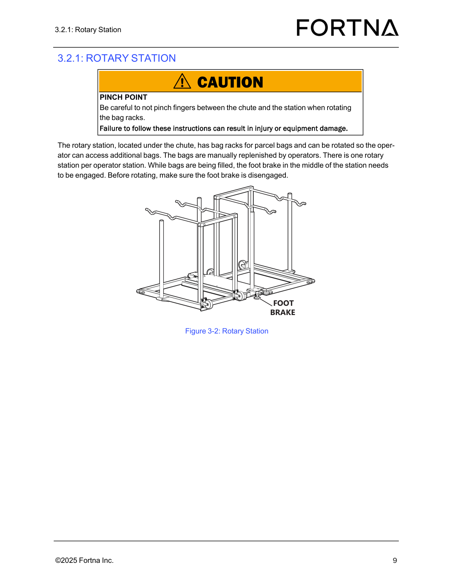

# Perform the daily visual maintenance checklist

## Runbook Header

| Field | Value |
| --- | --- |
| Procedure ID | `proc_perform_the_daily_visual_maintenance_checklist_v1` |
| Title | Perform the daily visual maintenance checklist |
| Procedure Type | `reference` |
| Primary Role | `L1_support` |
| Supporting Roles | None |
| Support Safe | Yes |
| Validation Status | `needs_sme_review` |
| Merge Status | `source_finalized` |

## Summary

Use the daily maintenance checklist form to record inspection details and visually inspect the Operator Station controller, chute, stacklights, guards, and floor and rack QR codes for the conditions identified in the manual.

## When To Use

Use this procedure when completing the documented daily inspection and maintenance tasks from the OptiSweep daily maintenance checklist.

## Do Not Use For

* Corrective repair or replacement activities for damaged components
* Troubleshooting procedures beyond the listed visual and operational checks
* Escalation or recovery actions when defects are found, because the source does not provide them

## Safety And Operational Notes

* The source frames this as a daily inspection and maintenance checklist.
* The source does not provide specific PPE, lockout/tagout, or production-stop requirements for this checklist.
* Do not infer corrective actions from this checklist; the source only identifies inspection items.

## Access Or Tools Needed

* Daily maintenance checklist form or photocopy
* Physical access to the Operator Station, guards, floor QR codes, and rack QR codes

## Related Operational Context

* ctx_manual_daily_maintenance_checklist_v1
* ctx_manual_operator_station_daily_inspection_v1

## Procedure Steps

### Step 1 — Record inspection details on the checklist

**Responsible role:** L1_support

**Instruction:**
On the daily maintenance checklist, record the Inspection Date, Inspected By, and Unit Inspected.

**Expected result:**
The checklist contains the inspection date, inspector name or identifier, and the unit inspected.

**Stop or Escalate If:**

* The checklist form is not available
* The unit to be inspected cannot be identified for recording

---

### Step 2 — Inspect the Operator Station controller for damage

**Responsible role:** L1_support

**Instruction:**
Visually inspect the Operator Station controller and check for damage.

**Expected result:**
No damage is observed on the Operator Station controller.

**Screens / Images:**

*Use the operator station reference image to identify the operator station area and related components.*

*Use the controller figure as a reference for controller identification if needed.*

**Stop or Escalate If:**

* Damage is found on the controller

---

### Step 3 — Ensure the Operator Station chute is free of debris

**Responsible role:** L1_support

**Instruction:**
Inspect the Operator Station chute and verify it is free of debris.

**Expected result:**
The chute is free of debris.

**Screens / Images:**

*Use the operator station reference image to identify the chute location.*

*Use the rotary station image to orient to the chute area above the rotary station.*

**Stop or Escalate If:**

* Debris is found in the chute

---

### Step 4 — Verify the stacklights are operational

**Responsible role:** L1_support

**Instruction:**
Check the stacklights at the Operator Station and verify they are operational.

**Expected result:**
The stacklights are operational.

**Screens / Images:**

*Use the operator station reference image to identify the stacklights mounted on the top of the frame on either side of the chute.*

**Stop or Escalate If:**

* A stacklight is not operational

---

### Step 5 — Inspect the guards and attaching hardware

**Responsible role:** L1_support

**Instruction:**
Inspect the guards and verify the attaching hardware is secure.

**Expected result:**
The guards show no issues and the attaching hardware is secure.

**Screens / Images:**

*Use the operator station reference image to orient to the guarded operator station area.*

**Stop or Escalate If:**

* Guard damage is found
* Attaching hardware is loose or not secure

---

### Step 6 — Inspect all floor QR codes

**Responsible role:** L1_support

**Instruction:**
Inspect all QR codes on the floor for damage or peeling.

**Expected result:**
All floor QR codes show no damage or peeling.

**Stop or Escalate If:**

* Any floor QR code is damaged
* Any floor QR code is peeling

---

### Step 7 — Inspect all rack QR codes

**Responsible role:** L1_support

**Instruction:**
Inspect all QR codes on the racks for damage or peeling.

**Expected result:**
All rack QR codes show no damage or peeling.

**Stop or Escalate If:**

* Any rack QR code is damaged
* Any rack QR code is peeling

---

## Success Criteria

* The daily maintenance checklist is completed with inspection date, inspector, and unit inspected.
* The Operator Station controller shows no damage.
* The Operator Station chute is free of debris.
* The stacklights are operational.
* The guards are intact and attaching hardware is secure.
* Floor QR codes show no damage or peeling.
* Rack QR codes show no damage or peeling.

## Failure Conditions

* Checklist record fields are incomplete.
* Damage is found on the Operator Station controller.
* Debris is found in the chute.
* A stacklight is not operational.
* A guard is damaged or attaching hardware is loose.
* A floor QR code is damaged or peeling.
* A rack QR code is damaged or peeling.

## Escalation Guidance

* If any inspected item shows damage, debris, peeling, loose hardware, or non-operational stacklights, stop normal checklist completion for that item and escalate according to site practice; the source does not provide corrective or escalation steps.
* If the checklist form is unavailable or cannot be completed, escalate according to site documentation control practice; the source does not provide an alternative method.

## Missing Details / Known Gaps

* The source section text is not present in the packet; checklist item wording is derived from candidate and packet summaries.
* The source does not provide explicit corrective actions for failed inspection items.
* The source does not provide explicit escalation contacts or routing.
* The source does not provide a time estimate for completing the checklist.
* The source does not specify whether production must be stopped to perform the checklist.
* The source does not specify whether lockout/tagout is required for this checklist.
* The source does not provide explicit acceptance criteria beyond the listed visual and operational conditions.

## Source Lineage

- Candidate IDs: daily_visual_maintenance_checklist_operator_station_guards_qr_codes
- Source ID: `manual_optisweep_om_v3`
- Source Type: `manual`
