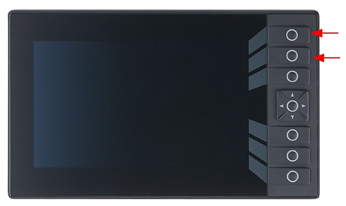
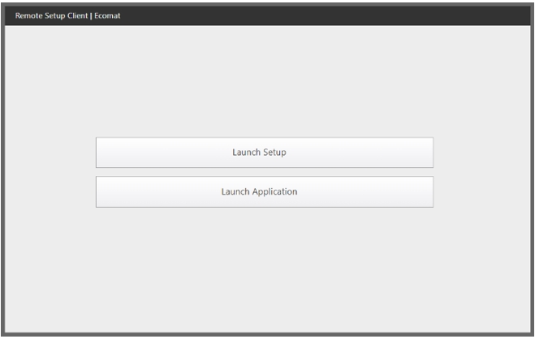
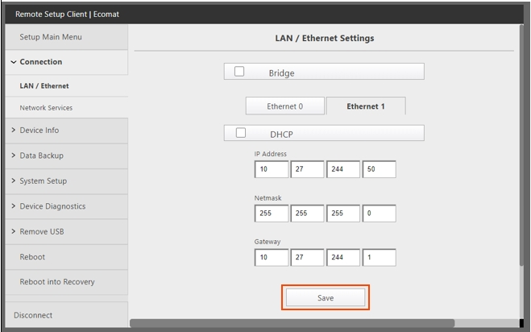
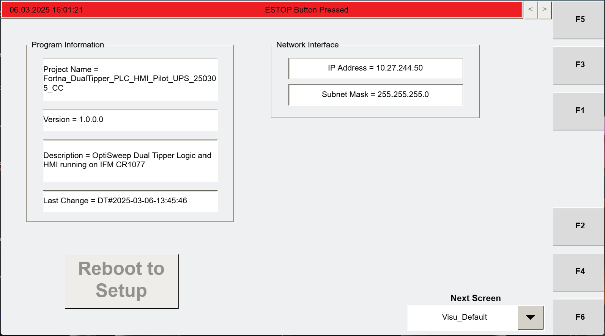

# Load tipper firmware from a USB drive using HMI boot mode

## Runbook Header

| Field | Value |
| --- | --- |
| Procedure ID | `proc_load_tipper_firmware_from_usb_via_hmi_boot_mode_v1` |
| Title | Load tipper firmware from a USB drive using HMI boot mode |
| Procedure Type | `recovery` |
| Primary Role | `L2_support` |
| Supporting Roles | None |
| Support Safe | No |
| Validation Status | `needs_sme_review` |
| Merge Status | `source_finalized` |

## Summary

Install a new firmware version on the tipper controller by powering the tipper down, entering HMI boot mode by holding the top three HMI buttons during power-up, loading firmware from a USB drive, then rebooting normally and verifying the HMI returns to the expected post-boot screens.

## When To Use

Use when a new firmware version must be installed on the tipper controller from a USB drive and the controller must be returned to normal boot operation with the expected HMI screens visible afterward.

## Safety And Operational Notes

* This procedure is not marked support-safe in the source candidate.
* The procedure includes powering the tipper off and on with the disconnect.
* Do not continue if the controller does not enter the expected gray-screen mode or does not return to normal boot behavior after firmware loading.

## Access Or Tools Needed

* Access to the tipper disconnect
* Access to the HMI
* USB drive containing the new firmware version
* USB dongle on the HMI

## Procedure Steps

### Step 1 — Turn off power to the tipper

**Responsible role:** L2_support

**Instruction:**
Turn off power to the tipper with the disconnect.

**Expected result:**
The tipper is powered off.

**Screens / Images:**

*General system power-state and stopping/startup screen context related to powering equipment off.*

**Stop or Escalate If:**

* The tipper cannot be powered off with the disconnect.

---

### Step 2 — Press and hold the top three HMI buttons

**Responsible role:** L2_support

**Instruction:**
Press and hold the top three buttons on the HMI.

**Expected result:**
The top three HMI buttons are held continuously in preparation for power-up.

**Screens / Images:**

*HMI area associated with the startup button sequence and gray-screen entry.*

*HMI setup/startup screen context related to the top-button hold sequence.*

**Stop or Escalate If:**

* The top three HMI buttons cannot be identified or held as required.

---

### Step 3 — Power on while continuing to hold the buttons

**Responsible role:** L2_support

**Instruction:**
Continue holding the top three HMI buttons while powering on the tipper.

**Expected result:**
The tipper powers on while the top three HMI buttons remain held.

**Screens / Images:**

*Startup sequence context showing continued button hold during power-on.*

*Startup/setup screen context associated with entering the gray-screen mode.*

**Stop or Escalate If:**

* The tipper does not power on as expected during the button-hold sequence.

---

### Step 4 — Wait for the gray screen

**Responsible role:** L2_support

**Instruction:**
Keep holding the buttons until a gray screen appears on the HMI.

**Expected result:**
A gray screen appears on the HMI.

**Screens / Images:**

*Gray-screen entry context on the HMI during startup.*

*Startup/setup screen context associated with the gray screen.*

**Stop or Escalate If:**

* The gray screen does not appear while holding the top three HMI buttons during power-up.

---

### Step 5 — Insert the firmware USB drive

**Responsible role:** L2_support

**Instruction:**
Plug the USB drive containing the new firmware version into the USB dongle on the HMI.

**Expected result:**
The USB drive is connected to the HMI USB dongle.

**Stop or Escalate If:**

* The USB drive containing the new firmware version cannot be connected to the HMI USB dongle.

---

### Step 6 — Select install from file

**Responsible role:** L2_support

**Instruction:**
Press the INSTALL FROM FILE button.

**Expected result:**
The HMI begins the file-based firmware installation process.

**Stop or Escalate If:**

* The firmware cannot be loaded from the USB drive.

---

### Step 7 — Load the firmware from the USB drive

**Responsible role:** L2_support

**Instruction:**
Load the firmware from the USB drive.

**Expected result:**
The firmware is loaded from the USB drive.

**Stop or Escalate If:**

* The firmware cannot be loaded from the USB drive.

---

### Step 8 — Reboot the controller normally

**Responsible role:** L2_support

**Instruction:**
Power the controller off and back on, and allow it to boot normally without pressing any buttons.

**Expected result:**
The controller reboots and begins a normal boot sequence.

**Screens / Images:**

*Expected normal post-boot HMI state after power cycle.*

*Controller startup and network verification screen context after normal boot.*

**Stop or Escalate If:**

* The controller does not boot normally after the power cycle.

---

### Step 9 — Verify the Visu_Default screen

**Responsible role:** L2_support

**Instruction:**
Verify that the HMI shows the "Visu_Default" screen displaying the IP and subnet mask settings.

**Expected result:**
The HMI shows the Visu_Default screen with the IP and subnet mask settings.

**Screens / Images:**

*The Visu_Default screen and the displayed IP and subnet mask settings.*

*Expected post-boot HMI screen state showing network settings.*

**Stop or Escalate If:**

* The Visu_Default screen does not appear.
* The Visu_Default screen does not display the IP and subnet mask settings.

---

### Step 10 — Open the Visu_MCP_Dual screen

**Responsible role:** L2_support

**Instruction:**
Press F3 to go to the "Visu_MCP_Dual" screen.

**Expected result:**
F3 opens the Visu_MCP_Dual screen.

**Screens / Images:**

*The Visu_MCP_Dual screen reached using F3.*

*Additional HMI context for the Visu_MCP_Dual screen.*

*Additional HMI context for the Visu_MCP_Dual screen.*

**Stop or Escalate If:**

* F3 does not open the Visu_MCP_Dual screen.

---

## Success Criteria

* The firmware is loaded from the USB drive.
* The controller reboots normally.
* The HMI displays the Visu_Default screen with IP and subnet mask settings.
* F3 opens the Visu_MCP_Dual screen.

## Failure Conditions

* The gray screen does not appear while holding the top three HMI buttons during power-up.
* The firmware cannot be loaded from the USB drive.
* The controller does not boot normally after the power cycle.
* The Visu_Default screen does not appear or does not display the IP and subnet mask settings.
* F3 does not open the Visu_MCP_Dual screen.

## Escalation Guidance

* Stop and escalate if the gray screen does not appear while holding the top three HMI buttons during power-up.
* Stop and escalate if the firmware cannot be loaded from the USB drive.
* Stop and escalate if the controller does not boot normally after the power cycle.
* Stop and escalate if the Visu_Default screen does not appear or does not display the IP and subnet mask settings.
* Stop and escalate if F3 does not open the Visu_MCP_Dual screen.

## Missing Details / Known Gaps

* The supplied source section text for page 209 is empty in this packet, so step wording is grounded primarily in the candidate and attached source references.
* The source packet does not provide the exact on-screen file selection sequence after pressing INSTALL FROM FILE.
* The source packet does not provide a firmware filename, file path, or file validation method.
* The source packet does not specify whether production must be stopped before performing this procedure.
* The source packet does not specify whether lockout/tagout is required.
* The source packet does not provide an estimated completion time.
* No explicit role boundaries beyond L2_support are stated in the packet.

## Source Lineage

- Candidate IDs: load_tipper_firmware_from_usb_via_hmi_boot_mode
- Source ID: `manual_optisweep_om_v3`
- Source Type: `manual`
