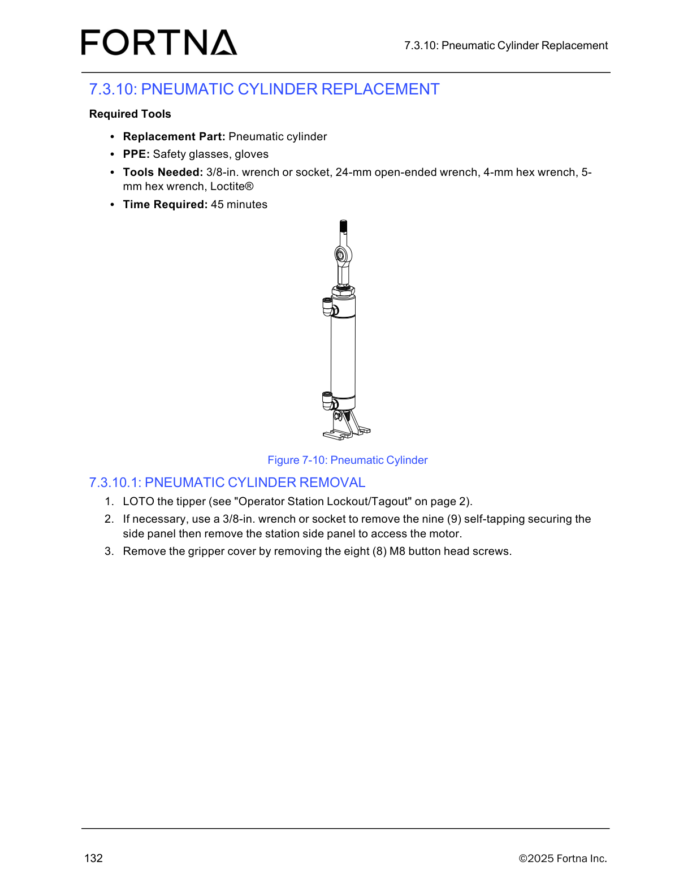

# Prepare access for pneumatic cylinder removal

## Runbook Header

| Field | Value |
| --- | --- |
| Procedure ID | `proc_prepare_access_for_pneumatic_cylinder_removal_v1` |
| Title | Prepare access for pneumatic cylinder removal |
| Procedure Type | `recovery` |
| Primary Role | `L2_support` |
| Supporting Roles | None |
| Support Safe | Yes |
| Validation Status | `needs_sme_review` |
| Merge Status | `source_finalized` |

## Summary

Safely prepare the tipper for pneumatic cylinder service by gathering the listed replacement part, PPE, and tools, applying lockout/tagout, removing the station side panel if needed, removing the gripper cover, and using Figure 7-10 to identify the pneumatic cylinder access area before continuing with further replacement work.

## When To Use

Use this procedure when preparing the OptiSweep tipper for pneumatic cylinder replacement or removal and access to the pneumatic cylinder area is required.

## Do Not Use For

* Do not use this runbook as a complete pneumatic cylinder removal or installation procedure; the supplied source section is truncated and only supports preparation and access steps.
* Do not use this runbook if lockout/tagout cannot be completed as referenced by the manual.
* Do not use this runbook if the required replacement part, PPE, or listed tools are unavailable.

## Safety And Operational Notes

* LOTO the tipper before starting work, as referenced by the manual.
* Use safety glasses and gloves.
* Stop work if lockout/tagout cannot be completed.
* This source-backed procedure only covers access preparation; do not proceed into unsupported removal or installation actions without additional source material.

## Access Or Tools Needed

* Replacement pneumatic cylinder
* Safety glasses
* Gloves
* 3/8-in. wrench or socket
* 24-mm open-ended wrench
* 4-mm hex wrench
* 5-mm hex wrench
* Loctite®
* Access to the tipper
* LOTO access/procedure reference

## Procedure Steps

### Step 1 — Gather replacement part, PPE, and tools

**Responsible role:** L2_support

**Instruction:**
Gather the replacement pneumatic cylinder, safety glasses, gloves, 3/8-in. wrench or socket, 24-mm open-ended wrench, 4-mm hex wrench, 5-mm hex wrench, and Loctite® before starting the procedure.

**Expected result:**
All listed parts, PPE, and tools are available at the work area.

**Screens / Images:**

*Use the figure as the procedure visual reference associated with the pneumatic cylinder replacement task while preparing for access work.*

**Stop or Escalate If:**

* Stop if the required PPE, replacement part, or listed tools are not available.

---

### Step 2 — Lock out and tag out the tipper

**Responsible role:** L2_support

**Instruction:**
LOTO the tipper as referenced by the manual before starting work.

**Expected result:**
The tipper is locked out and tagged out for maintenance.

**Stop or Escalate If:**

* Stop if lockout/tagout cannot be completed as referenced by the manual.

---

### Step 3 — Remove the station side panel if needed

**Responsible role:** L2_support

**Instruction:**
If necessary, use a 3/8-in. wrench or socket to remove the nine self-tapping fasteners securing the side panel, then remove the station side panel.

**Expected result:**
The station side panel is removed when needed for access.

**Screens / Images:**

*Use Figure 7-10 as the maintenance visual associated with the pneumatic cylinder area while opening access to the service location.*

**Stop or Escalate If:**

* Stop if the side panel cannot be removed with the listed fasteners released.
* Stop if access remains obstructed after the panel removal step.

---

### Step 4 — Remove the gripper cover

**Responsible role:** L2_support

**Instruction:**
Remove the gripper cover by removing the eight (8) M8 button head screws.

**Expected result:**
The gripper cover is removed and the pneumatic cylinder access area is more exposed.

**Screens / Images:**

*Use Figure 7-10 to orient to the pneumatic cylinder mounting area and nearby access components after the gripper cover is removed.*

**Stop or Escalate If:**

* Stop if the gripper cover cannot be removed after the eight M8 button head screws are removed.

---

### Step 5 — Identify the pneumatic cylinder access area using Figure 7-10

**Responsible role:** L2_support

**Instruction:**
Use Figure 7-10 to identify the pneumatic cylinder and its access area before continuing.

**Expected result:**
The pneumatic cylinder and its mounting/access area are visually identified.

**Screens / Images:**

*Identify the pneumatic cylinder, its mounting area, and nearby access components behind the station side panel and gripper cover.*

**Stop or Escalate If:**

* Stop if the pneumatic cylinder or its access area cannot be confidently identified.
* Stop before proceeding into cylinder removal or installation because the provided source section does not include the full downstream procedure.

---

## Success Criteria

* The required replacement part, PPE, and listed tools have been gathered.
* The tipper has been locked out and tagged out.
* The station side panel has been removed if needed for access.
* The gripper cover has been removed.
* The pneumatic cylinder and its access area have been identified using Figure 7-10.
* The pneumatic cylinder area is accessible for subsequent replacement work.

## Failure Conditions

* Lockout/tagout cannot be completed as referenced by the manual.
* Required PPE, replacement part, or listed tools are not available.
* The station side panel or gripper cover cannot be removed.
* The pneumatic cylinder area cannot be confidently identified from the available figure and opened access points.
* Further cylinder removal or installation details are needed but are not present in the supplied source packet.

## Escalation Guidance

* Escalate if lockout/tagout cannot be completed as referenced by the manual.
* Escalate if required PPE, replacement part, or listed tools are unavailable.
* Escalate for additional source material or SME review before attempting any pneumatic cylinder removal or installation steps beyond access preparation.

## Missing Details / Known Gaps

* The supplied source packet does not include the full pneumatic cylinder removal sequence.
* The supplied source packet does not include the pneumatic cylinder installation sequence.
* The source packet does not provide an estimated time for this procedure.
* The source packet does not specify whether production stop is required beyond the LOTO requirement.
* The source sections included in the packet contain no OCR text, so step wording is grounded primarily in the candidate and artifact retrieval text tied to page 148 and Figure 7-10.

## Source Lineage

- Candidate IDs: pneumatic_cylinder_removal_access_preparation
- Source ID: `manual_optisweep_om_v3`
- Source Type: `manual`
