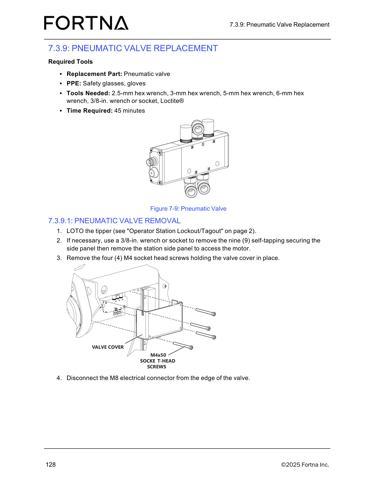

# Remove the pneumatic valve cover and disconnect the valve electrical connector

## Runbook Header

| Field | Value |
| --- | --- |
| Procedure ID | `proc_remove_pneumatic_valve_cover_and_disconnect_valve_electrical_connector_v1` |
| Title | Remove the pneumatic valve cover and disconnect the valve electrical connector |
| Procedure Type | `recovery` |
| Primary Role | `L2_support` |
| Supporting Roles | None |
| Support Safe | Yes |
| Validation Status | `needs_sme_review` |
| Merge Status | `source_finalized` |

## Summary

Initial pneumatic valve removal actions for the OptiSweep tipper: gather the specified replacement part, PPE, and tools; apply lockout/tagout to the tipper; remove the station side panel if needed for access; remove the valve cover fasteners; and disconnect the M8 electrical connector from the valve.

## When To Use

Use when performing the source-documented opening steps of pneumatic valve replacement/removal on the OptiSweep tipper and access is needed to the pneumatic valve cover and valve electrical connector.

## Do Not Use For

* Do not use as a complete pneumatic valve replacement procedure; the supplied source packet only supports the opening removal steps.
* Do not use if lockout/tagout of the tipper cannot be completed as referenced by the source.
* Do not use if guarded-area or service access cannot be safely obtained.

## Safety And Operational Notes

* LOTO the tipper before beginning removal work.
* Wear safety glasses and gloves.
* Stop if LOTO cannot be completed as referenced by the source.
* Stop if guarded-area or service access cannot be safely obtained.

## Access Or Tools Needed

* LOTO access for the tipper
* Replacement pneumatic valve
* Safety glasses
* Gloves
* 2.5-mm hex wrench
* 3-mm hex wrench
* 5-mm hex wrench
* 6-mm hex wrench
* 3/8-in. wrench or socket
* Loctite

## Procedure Steps

### Step 1 — Gather replacement part, PPE, and tools

**Responsible role:** L2_support

**Instruction:**
Gather the replacement pneumatic valve, safety glasses, gloves, 2.5-mm hex wrench, 3-mm hex wrench, 5-mm hex wrench, 6-mm hex wrench, 3/8-in. wrench or socket, and Loctite.

**Expected result:**
All listed PPE, tools, and the replacement pneumatic valve are available at the work area.

**Screens / Images:**

*Overall pneumatic valve assembly to orient the service task before beginning removal.*

**Stop or Escalate If:**

* Required PPE, tools, or replacement pneumatic valve are not available.

---

### Step 2 — Lock out and tag out the tipper

**Responsible role:** L2_support

**Instruction:**
LOTO the tipper as referenced by Operator Station Lockout/Tagout on page 2 before continuing.

**Expected result:**
The tipper is locked out/tagged out and ready for safe service access.

**Stop or Escalate If:**

* LOTO cannot be completed as referenced by the source.

---

### Step 3 — Remove the station side panel if access is needed

**Responsible role:** L2_support

**Instruction:**
If necessary for access, use a 3/8-in. wrench or socket to remove the nine self-tapping fasteners securing the side panel, then remove the station side panel.

**Expected result:**
The station side panel is removed when needed and the valve area is accessible.

**Screens / Images:**

*Valve area orientation after side panel access is opened.*

**Stop or Escalate If:**

* Guarded-area or service access cannot be safely obtained.
* The side panel cannot be removed as described.

---

### Step 4 — Remove the valve cover screws

**Responsible role:** L2_support

**Instruction:**
Remove the four M4 socket-head screws holding the valve cover in place.

**Expected result:**
The four valve cover screws are removed and the valve cover is free to be taken off.

**Screens / Images:**

*Valve cover and the four M4 socket-head screws on the pneumatic valve assembly.*

**Stop or Escalate If:**

* The valve cover fasteners cannot be identified or removed as described.

---

### Step 5 — Disconnect the M8 electrical connector

**Responsible role:** L2_support

**Instruction:**
Disconnect the M8 electrical connector from the edge of the valve.

**Expected result:**
The M8 electrical connector is disconnected from the valve.

**Screens / Images:**

*M8 electrical connector location at the edge of the valve.*

**Stop or Escalate If:**

* The M8 electrical connector cannot be identified or disconnected as described.

---

## Success Criteria

* The tipper is locked out/tagged out.
* The station side panel is removed if needed for access.
* The valve cover fasteners are removed.
* The M8 electrical connector is disconnected from the valve.

## Failure Conditions

* LOTO cannot be completed as referenced by the source.
* Guarded-area or service access cannot be safely obtained.
* The valve cover fasteners cannot be removed as described.
* The M8 electrical connector cannot be disconnected.
* The source packet does not include the full replacement or reinstallation sequence.

## Escalation Guidance

* Stop the procedure if LOTO cannot be completed as referenced by the source.
* Stop the procedure if guarded-area or service access cannot be safely obtained.
* Escalate for SME/manual review if additional pneumatic valve replacement or reinstallation steps are required, because the supplied source content is partial.

## Missing Details / Known Gaps

* The supplied source packet does not include the full pneumatic valve replacement or reinstallation sequence.
* The source sections in this packet contain no OCR text, so step wording is grounded primarily in the candidate and artifact retrieval summaries.
* The packet does not explicitly identify which exact hex wrench size is used for each fastener in these opening steps.
* The packet does not explicitly state whether production stop is required beyond LOTO.
* The packet does not provide a detailed post-disconnection verification step.

## Source Lineage

- Candidate IDs: pneumatic_valve_removal
- Source ID: `manual_optisweep_om_v3`
- Source Type: `manual`
