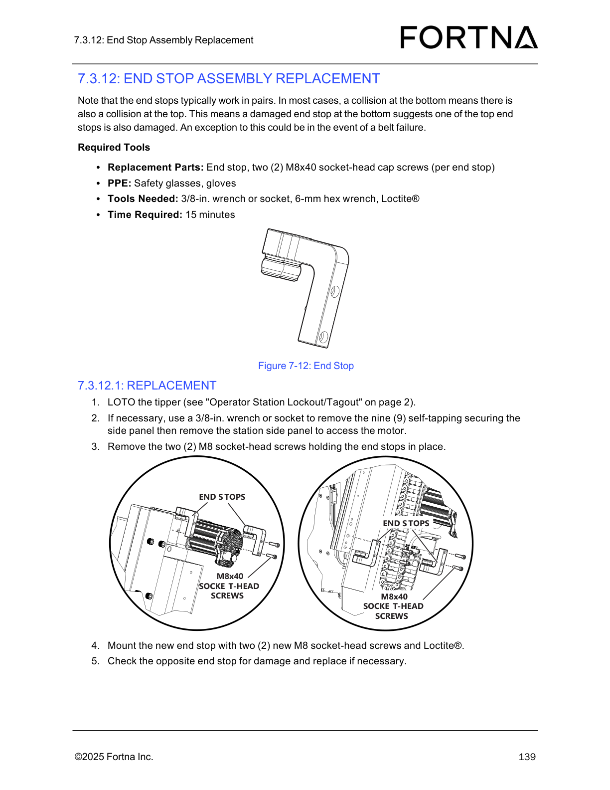

# Replace tipper end stop assembly

## Runbook Header

| Field | Value |
| --- | --- |
| Procedure ID | `proc_replace_tipper_end_stop_assembly_v1` |
| Title | Replace tipper end stop assembly |
| Procedure Type | `recovery` |
| Primary Role | `L2_support` |
| Supporting Roles | None |
| Support Safe | Yes |
| Validation Status | `needs_sme_review` |
| Merge Status | `source_finalized` |

## Summary

Replace a damaged tipper end stop by locking out the tipper, accessing the end stop as needed, removing the damaged end stop, installing a new end stop with two new M8x40 socket-head cap screws and Loctite®, and checking the opposite paired end stop for damage.

## When To Use

Use this procedure when a tipper end stop is damaged and requires replacement. The source also indicates the opposite end stop should be checked because end stops typically work in pairs.

## Do Not Use For

* Do not use this procedure as a diagnosis-only workflow when no damaged end stop has been identified.
* Do not assume paired collision damage applies without inspection when belt failure is the cause, because the source notes belt failure as an exception.

## Safety And Operational Notes

* LOTO the tipper before performing this procedure.
* Wear safety glasses and gloves.
* Use new M8x40 socket-head cap screws when installing the replacement end stop.

## Access Or Tools Needed

* LOTO access for the tipper
* Replacement end stop
* Two M8x40 socket-head cap screws per end stop
* Safety glasses
* Gloves
* 3/8-in. wrench or socket
* 6-mm hex wrench
* Loctite®

## Procedure Steps

### Step 1 — Lock out the tipper

**Responsible role:** L2_support

**Instruction:**
LOTO the tipper as referenced by the source before starting any removal or installation work.

**Expected result:**
The tipper is locked out and safe for maintenance access.

**Stop or Escalate If:**

* Stop if LOTO cannot be completed.
* Escalate if safe isolation of the tipper cannot be confirmed.

---

### Step 2 — Gather replacement parts, PPE, and tools

**Responsible role:** L2_support

**Instruction:**
Gather the replacement end stop, two M8x40 socket-head cap screws per end stop, safety glasses, gloves, a 3/8-in. wrench or socket, a 6-mm hex wrench, and Loctite®.

**Expected result:**
All required parts, PPE, and tools are available at the work area.

**Stop or Escalate If:**

* Stop if the replacement end stop is not available.
* Stop if new M8x40 socket-head cap screws are not available.
* Stop if required PPE or tools are missing.

---

### Step 3 — Remove the station side panel if access is needed

**Responsible role:** L2_support

**Instruction:**
If necessary, use a 3/8-in. wrench or socket to remove the nine self-tapping screws securing the side panel, then remove the station side panel to access the area.

**Expected result:**
The side panel is removed when needed and the end stop area is accessible.

**Screens / Images:**

*End stop location and surrounding mounting area for access orientation.*

**Stop or Escalate If:**

* Stop if the side panel cannot be removed safely.
* Escalate if access to the end stop area is still not possible after panel removal.

---

### Step 4 — Remove the damaged end stop

**Responsible role:** L2_support

**Instruction:**
Remove the two M8 socket-head screws holding the end stop in place.

**Expected result:**
The damaged end stop is removed from the tipper.

**Screens / Images:**

*The end stop and the two M8x40 socket-head screw mounting points.*

**Stop or Escalate If:**

* Stop if the end stop mounting screws cannot be removed.
* Escalate if the mounting area appears damaged beyond end stop replacement.

---

### Step 5 — Install the new end stop

**Responsible role:** L2_support

**Instruction:**
Mount the new end stop using two new M8 socket-head screws and Loctite®.

**Expected result:**
The new end stop is installed and secured with new hardware and Loctite®.

**Screens / Images:**

*Replacement end stop position and mounting orientation.*

**Stop or Escalate If:**

* Stop if new M8x40 socket-head cap screws are not available.
* Stop if Loctite® is not available.
* Escalate if the replacement end stop does not fit or cannot be mounted securely.

---

### Step 6 — Inspect the opposite end stop and replace if needed

**Responsible role:** L2_support

**Instruction:**
Check the opposite end stop for damage and replace it if necessary. Note that end stops typically work in pairs, and a collision at the bottom often suggests one of the top end stops is also damaged. Belt failure is noted by the source as an exception.

**Expected result:**
The opposite end stop has been inspected and replaced if damage is found.

**Screens / Images:**

*End stop identification and comparison points for checking the opposite paired end stop.*

**Stop or Escalate If:**

* Escalate if the opposite end stop is also damaged.
* Escalate if the observed damage pattern does not match expected paired collision behavior and belt failure is not evident.

---

## Success Criteria

* The damaged end stop is replaced.
* The new end stop is secured using two new M8x40 socket-head cap screws and Loctite®.
* The opposite paired end stop has been checked for damage.
* If the opposite end stop was damaged, it has also been replaced.

## Failure Conditions

* LOTO cannot be completed or confirmed.
* Required replacement parts, PPE, or tools are missing.
* The side panel cannot be removed when access is needed.
* The damaged end stop cannot be removed.
* The replacement end stop cannot be installed securely.
* The opposite end stop is damaged and not addressed.
* Observed damage pattern is inconsistent and cannot be explained by the source-noted belt failure exception.

## Escalation Guidance

* Escalate if LOTO cannot be completed or safe isolation cannot be confirmed.
* Escalate if the end stop mounting area is damaged beyond simple end stop replacement.
* Escalate if the opposite end stop is also damaged.
* Escalate if the damage pattern is unclear and belt failure does not explain the condition.

## Missing Details / Known Gaps

* The packet does not provide the full OCR text of the source section, so exact source wording beyond the supplied candidate and artifact summaries is limited.
* No estimated procedure time is provided in the packet for this end stop replacement task.
* The packet does not provide explicit torque values for the M8x40 socket-head cap screws.
* The packet does not provide explicit post-maintenance return-to-service steps after replacement.

## Source Lineage

- Candidate IDs: replace_tipper_end_stop_assembly
- Source ID: `manual_optisweep_om_v3`
- Source Type: `manual`
