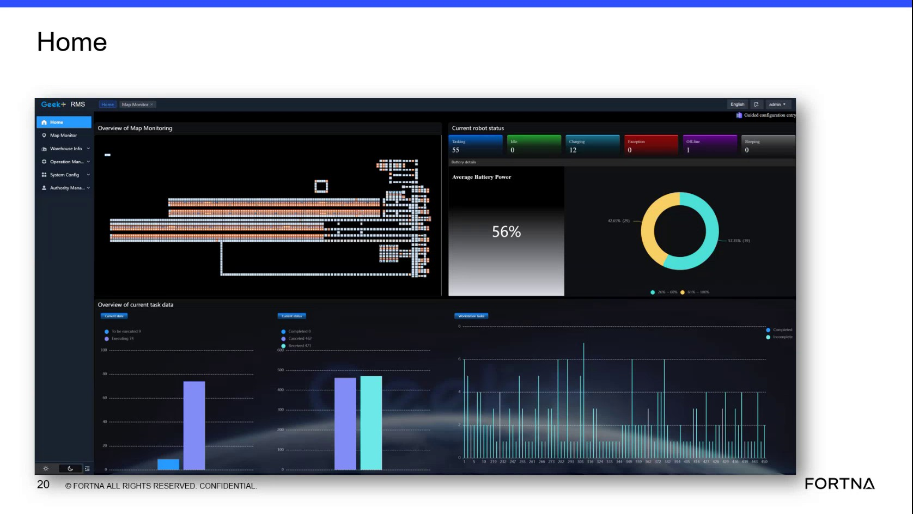
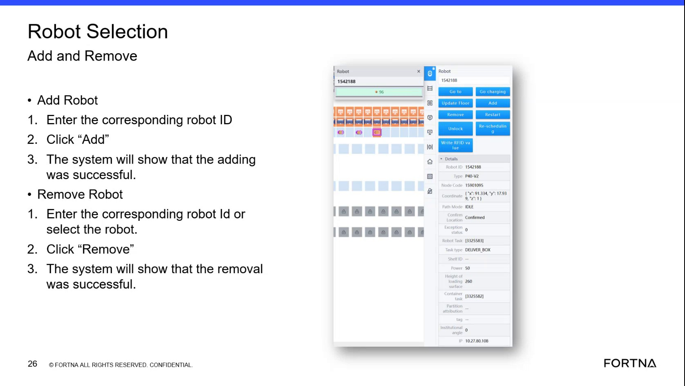

# Access the RMS Web Application to Perform Robot Selection Actions

## Runbook Header

| Field | Value |
| --- | --- |
| Procedure ID | `proc_access_the_rms_web_application_to_perform_robot_selection_actions_v1` |
| Title | Access the RMS Web Application to Perform Robot Selection Actions |
| Procedure Type | `reference` |
| Primary Role | `L1_support` |
| Supporting Roles | None |
| Support Safe | Yes |
| Validation Status | `needs_sme_review` |
| Merge Status | `source_finalized` |

## Summary

This source describes how support personnel can reach the Geek Plus RMS or related web application view used for Robot Selection actions. Local access is available from a device connected to the OT network using the site IP address. Remote access requires authorization to use the UPS VPN through Z Scaler before using the site address or RMS address. The source also notes that local teams can use shop-floor HMI stations where this view is displayed.

## When To Use

Use this reference when support personnel need to reach the RMS or web application view used for Robot Selection add or remove actions, either from an OT-network-connected device, an authorized remote connection, or a local shop-floor HMI station.

## Do Not Use For

* Do not use this runbook as a credential or authentication procedure; the source does not provide usernames, passwords, or additional login steps.
* Do not use this runbook as the procedure for actually adding or removing a robot; this source-specific runbook only covers how to access the application view used for those actions.

## Safety And Operational Notes

* Use only authorized remote access through the UPS VPN and Z Scaler when remote access is required.
* Do not invent passwords or additional authentication steps; the source does not provide them.

## Access Or Tools Needed

* OT-network-connected device for local access or authorized remote access through UPS VPN and Z Scaler
* IP address or RMS address for the site
* Physical HMI station if using shop-floor access

## Related Operational Context

* ctx_training_video_rms_access_otnet_v1
* ctx_training_video_remote_access_vpn_zscaler_v1
* ctx_training_video_hmi_station_availability_v1
* ctx_training_video_robot_selection_add_remove_v1

## Procedure Steps

### Step 1 — Determine the access path

**Responsible role:** L1_support

**Instruction:**
Determine whether access will be local on the OT network or remote.

**Expected result:**
A valid access path is selected before attempting to open the application.

**Stop or Escalate If:**

* Stop and escalate if remote access is required but authorization status is unknown.

---

### Step 2 — Access the application locally from the OT network

**Responsible role:** L1_support

**Instruction:**
For local access, use a laptop, computer, or other device connected to the OT network and open the web software application through its IP address as described in the source.

**Expected result:**
The RMS or web application opens from the OT-network-connected device.

**Screens / Images:**

*RMS described as a web application accessed through a unique IP address.*

*Robot Selection interface that can confirm the correct application view has been reached.*

**Stop or Escalate If:**

* Stop and escalate if the device is not connected to the OT network.
* Stop and escalate if the site IP address is not available from the source-supported access path.

---

### Step 3 — Confirm remote authorization requirements

**Responsible role:** L1_support

**Instruction:**
For remote access, confirm authorization to use the UPS VPN through Z Scaler before attempting to reach the OT-network-hosted application.

**Expected result:**
Remote authorization status is confirmed before access is attempted.

**Stop or Escalate If:**

* Escalate if remote access is needed but UPS VPN or Z Scaler authorization is not available.

---

### Step 4 — Open Geek Plus RMS remotely

**Responsible role:** L1_support

**Instruction:**
After remote authorization is available, enter the address or RMS address for the particular site to access Geek Plus RMS.

**Expected result:**
Geek Plus RMS opens for the selected site through the authorized remote path.

**Screens / Images:**

*Robot Selection screen in Geek Plus RMS as a confirmation that the correct site application has been reached.*

**Stop or Escalate If:**

* Stop and escalate if authorization is confirmed but the site address or RMS address still does not provide access.

---

### Step 5 — Use a local HMI station when shop-floor access is needed

**Responsible role:** operator

**Instruction:**
If local shop-floor access is needed, use one of the physical HMI stations where this view is displayed.

**Expected result:**
The user reaches the RMS view from a shop-floor HMI station.

**Screens / Images:**

*Robot Selection display that the source says is shown on local HMI stations.*

**Stop or Escalate If:**

* Stop and escalate if local shop-floor access is needed but no HMI station is available.

---

## Success Criteria

* The user reaches the RMS or web application view needed to perform Robot Selection add or remove actions.
* The correct site application is accessible through a supported local, remote, or HMI-based path described by the source.

## Failure Conditions

* Remote access is needed but UPS VPN or Z Scaler authorization is not available.
* The site IP address or RMS address is not available or does not provide access.
* The needed local HMI station is not available.

## Escalation Guidance

* Escalate if remote access is needed but UPS VPN or Z Scaler authorization is not available.
* Escalate if the source-supported local or remote address does not provide access after the required access path is confirmed.
* Escalate if local shop-floor access is required but the HMI station is unavailable.

## Missing Details / Known Gaps

* The source does not provide the actual site IP address or RMS address values.
* The source does not provide usernames, passwords, or detailed authentication steps.
* The source does not provide a screenshot or artifact of the physical HMI station itself; only the RMS/Robot Selection screen is available as visual support.
* The source does not provide an estimated completion time.

## Source Lineage

- Candidate IDs: candidate_training_video_access_rms_for_robot_selection_actions
- Source ID: `training_video_day1`
- Source Type: `training_video`
