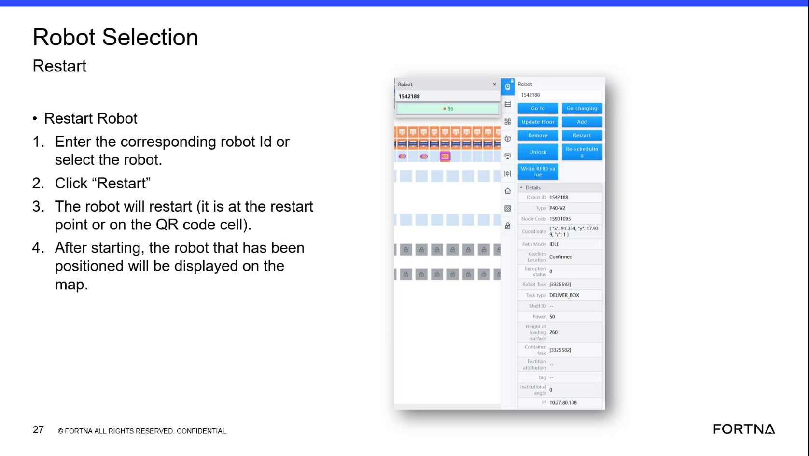

# Add a Robot From the Robot Selection Tab

## Runbook Header

| Field | Value |
| --- | --- |
| Procedure ID | `proc_add_a_robot_from_the_robot_selection_tab_v1` |
| Title | Add a Robot From the Robot Selection Tab |
| Procedure Type | `operation` |
| Primary Role | `operator` |
| Supporting Roles | None |
| Support Safe | Yes |
| Validation Status | `needs_sme_review` |
| Merge Status | `source_finalized` |

## Summary

Add a specific robot from the Robot Selection tab by entering the robot ID, selecting Add, and confirming the system shows a successful add. The source also states that if the robot is already in the system, nothing happens.

## When To Use

Use when a specific robot needs to be added to the system from the Robot Selection tab and the operator has the robot ID.

## Do Not Use For

* Do not use this procedure to remove a robot.
* Do not assume the robot was added if no success indication appears.

## Safety And Operational Notes

* The source states that if the robot is already in the system, nothing will happen.
* If the system does not show that the robot was added successfully, the source does not provide further recovery steps.

## Access Or Tools Needed

* Access to the Robot Selection tab
* Robot ID
* Ability to click the Add button

## Related Operational Context

* ctx_training_video_robot_selection_add_remove_tab_v1
* ctx_training_video_robot_add_remove_success_messages_v1

## Procedure Steps

### Step 1 — Open the Robot Selection tab

**Responsible role:** operator

**Instruction:**
Open the Robot Selection tab.

**Expected result:**
The Robot Selection tab is visible and ready for robot ID entry and add actions.

**Screens / Images:**

*Robot Selection tab view showing the robot ID entry field and Add button.*

**Stop or Escalate If:**

* Stop if the Robot Selection tab cannot be accessed.

---

### Step 2 — Enter the robot ID

**Responsible role:** operator

**Instruction:**
Enter the corresponding robot ID in the robot ID field.

**Expected result:**
The intended robot ID is entered in the Robot Selection tab.

**Screens / Images:**

*Robot ID entry field in the Robot Selection tab.*

**Stop or Escalate If:**

* Stop if the corresponding robot ID is not known.

---

### Step 3 — Click Add

**Responsible role:** operator

**Instruction:**
Click the "Add" button.

**Expected result:**
The system processes the add request for the entered robot ID.

**Screens / Images:**

*Add button in the Robot Selection tab.*

**Stop or Escalate If:**

* Stop if the Add button is not available.

---

### Step 4 — Verify successful add indication

**Responsible role:** operator

**Instruction:**
Check whether the system shows that the robot was added successfully.

**Expected result:**
The system shows a successful add indication if the robot was added.

**Screens / Images:**

*System success indication that the robot was added successfully.*

**Stop or Escalate If:**

* Escalate if the system does not show that the robot was added successfully.
* Do not assume the robot was added if no success indication appears.

---

### Step 5 — Interpret no-change result

**Responsible role:** operator

**Instruction:**
If no change occurs, note that the source states nothing happens when the robot is already in the system.

**Expected result:**
A no-change result is recognized as the source-described behavior for a robot already in the system.

**Stop or Escalate If:**

* Escalate if no success indication appears and further action is required, because the source provides no additional recovery steps.

---

## Success Criteria

* The robot is added to the system.
* The system shows that the robot was added successfully.
* If no change occurs, the result is consistent with the source statement that the robot may already be in the system.

## Failure Conditions

* The Robot Selection tab cannot be accessed.
* The robot ID is not available or cannot be entered.
* The Add button cannot be used.
* The system does not show that the robot was added successfully.
* No further recovery path is provided by the source when success is not shown.

## Escalation Guidance

* If the system does not show that the robot was added successfully, escalate because the source does not provide further recovery steps.
* Do not assume the robot was added if no success indication appears.

## Missing Details / Known Gaps

* The source does not specify any recovery steps if the add action does not show a success indication.
* The source does not specify required permissions beyond access to the Robot Selection tab.
* The source does not provide an estimated completion time.
* The source does not specify whether production stop or LOTO is required.

## Source Lineage

- Candidate IDs: candidate_training_video_add_robot_from_robot_selection_tab
- Source ID: `training_video_day1`
- Source Type: `training_video`
