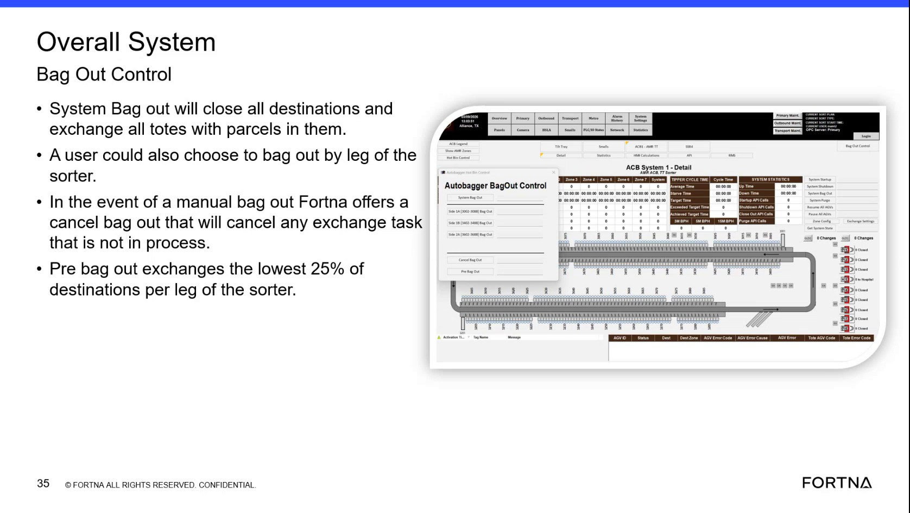

# Cancel a Manual Bag Out for Exchange Tasks Not in Process

## Runbook Header

| Field | Value |
| --- | --- |
| Procedure ID | `proc_cancel_a_manual_bag_out_for_exchange_tasks_not_in_process_v1` |
| Title | Cancel a Manual Bag Out for Exchange Tasks Not in Process |
| Procedure Type | `recovery` |
| Primary Role | `operator` |
| Supporting Roles | None |
| Support Safe | Yes |
| Validation Status | `needs_sme_review` |
| Merge Status | `source_finalized` |

## Summary

Use the cancel bag out function during a manual bag out to cancel exchange tasks that are not already in process. Any exchange already in process must be allowed to finish.

## When To Use

Use during a manual bag out when exchange tasks need to be canceled before they begin processing.

## Do Not Use For

* Do not use this procedure with the expectation that an exchange already in process will be canceled.
* Do not use this procedure as a rollback for in-process exchange work, because the source states that if an item is in an exchange, it has to finish.

## Safety And Operational Notes

* The source describes this as a control behavior for manual bag out and does not provide additional safety hazards or lockout requirements.
* Do not assume in-process exchanges can be interrupted; the source states they must finish.

## Access Or Tools Needed

* Access to manual bag out controls
* Visibility to exchange task state or in-process status

## Related Operational Context

* ctx_training_video_cancel_bag_out_reference_v1

## Procedure Steps

### Step 1 — Access the manual bag out controls

**Responsible role:** operator

**Instruction:**
Open or access the manual bag out controls used for bag out management.

**Expected result:**
The manual bag out controls are visible and available for operator use.

**Screens / Images:**

*Overall system bag out control slide showing bag out options and the cancel bag out capability for manual bag out.*

**Stop or Escalate If:**

* Stop or escalate if the manual bag out controls cannot be accessed or identified from the available interface.

---

### Step 2 — Identify the cancel bag out option

**Responsible role:** operator

**Instruction:**
Within the manual bag out controls, identify the cancel bag out option provided for manual bag out.

**Expected result:**
The cancel bag out option is identified and ready to be used.

**Screens / Images:**

*Bag out control content describing that manual bag out includes a cancel bag out option.*

**Stop or Escalate If:**

* Stop or escalate if the cancel bag out option is not visible or cannot be confirmed.

---

### Step 3 — Activate cancel bag out

**Responsible role:** operator

**Instruction:**
Activate cancel bag out to cancel exchange tasks that are not already in process.

**Expected result:**
Exchange tasks not already in process are canceled.

**Screens / Images:**

*The bag out control reference describing cancel bag out behavior for exchange tasks not in process.*

**Stop or Escalate If:**

* Escalate if the system behavior does not match the documented behavior for cancel bag out.
* Escalate if the system appears to cancel in-process exchange work contrary to the documented behavior.

---

### Step 4 — Allow in-process exchanges to finish

**Responsible role:** operator

**Instruction:**
Check whether any exchange task is already in process and allow that exchange to finish, because the source states it cannot be canceled once in exchange.

**Expected result:**
Any exchange already in process continues until finished.

**Stop or Escalate If:**

* Do not expect an exchange already in process to be canceled; the source states it must finish.
* Escalate if the system appears to cancel in-process exchange work contrary to the documented behavior.

---

### Step 5 — Verify cancellation outcome

**Responsible role:** operator

**Instruction:**
Verify that only exchange tasks not in process are canceled.

**Expected result:**
Exchange tasks not already in process are canceled, while any exchange already in process continues until finished.

**Stop or Escalate If:**

* Escalate if the system appears to cancel in-process exchange work contrary to the documented behavior.
* Escalate if the observed cancellation outcome does not match the documented behavior.

---

## Success Criteria

* Exchange tasks not already in process are canceled.
* Any exchange already in process continues until finished.
* Observed system behavior matches the documented cancel bag out behavior.

## Failure Conditions

* The cancel bag out option cannot be accessed or identified.
* The system appears to cancel exchange work that is already in process.
* The source does not describe additional rollback or confirmation behavior after cancellation.

## Escalation Guidance

* Escalate if the system appears to cancel in-process exchange work contrary to the documented behavior.
* Escalate if the cancel bag out option is unavailable when manual bag out is being managed.
* Escalate if observed results do not match the documented rule that only exchange tasks not in process are canceled.

## Missing Details / Known Gaps

* The source does not provide exact button labels for the cancel bag out control.
* The source does not provide exact task-state indicators for determining whether an exchange is in process.
* The source does not describe additional rollback behavior after cancellation.
* The source does not describe confirmation dialogs, prompts, or post-action notifications.
* The source does not provide a time estimate for completing this procedure.

## Source Lineage

- Candidate IDs: candidate_training_video_cancel_manual_bag_out
- Source ID: `training_video_day1`
- Source Type: `training_video`
