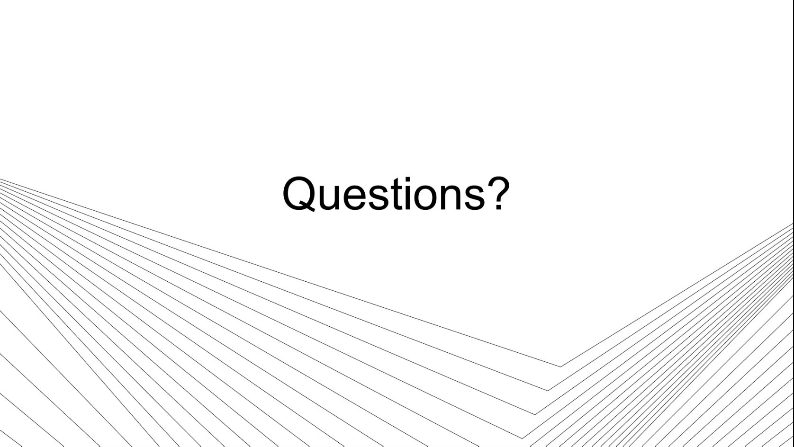

# Capture Observations for Later Diagnosis While Working to Restore Operation

## Runbook Header

| Field | Value |
| --- | --- |
| Procedure ID | `proc_capture_observations_for_later_diagnosis_while_working_to_restore_operation_v1` |
| Title | Capture Observations for Later Diagnosis While Working to Restore Operation |
| Procedure Type | `reference` |
| Primary Role | `L1_support` |
| Supporting Roles | None |
| Support Safe | Yes |
| Validation Status | `needs_sme_review` |
| Merge Status | `source_finalized` |

## Summary

Document operator-reported actions, reported Aviva status, and observed backend system state during an incident so later diagnosis is possible while immediate support remains focused on restoring operation.

## When To Use

Use during a live support incident when immediate restoration is the priority and support needs to capture enough observations to enable later diagnosis, especially when Aviva-reported actions or statuses need to be compared against RMS, WCS, or OptiSweep state.

## Do Not Use For

* Do not use this procedure as a complete root-cause diagnosis method during the live incident when the source states support should not expect to 100% diagnose what happened in the moment.
* Do not use this procedure to claim direct Aviva verification when support lacks Aviva access; in that case the source supports relying on operator-reported information only.

## Safety And Operational Notes

* The source emphasizes restoration of operation during high-priority incidents; observation capture should support, not delay, getting the system back running.
* Do not overstate conclusions during the live incident; the source says support should not expect to fully diagnose the issue in the moment.

## Access Or Tools Needed

* Incident notes or ticketing method
* Observed system state from RMS, WCS, or OptiSweep
* Operator-reported Aviva information when direct access is unavailable

## Related Operational Context

* ctx_training_video_support_focus_notes_and_restore_v1
* ctx_training_video_aviva_access_limits_for_support_v1
* ctx_training_video_rms_system_faults_first_check_v1
* ctx_training_video_wcs_optisweep_state_comparison_v1

## Procedure Steps

### Step 1 — Record operator-reported Aviva action

**Responsible role:** L1_support

**Instruction:**
Ask the operator what they pressed or sent from Aviva, if applicable, and record that action in the incident notes. If support does not have direct Aviva access, explicitly note that the action record is based on operator report.

**Expected result:**
The incident record contains the operator-reported Aviva action or command attempt.

**Screens / Images:**

*Guidance that non-UPS support users may not have Aviva access and should rely on the operator to report what was done in Aviva.*

**Stop or Escalate If:**

* Support cannot determine what action was attempted in Aviva.
* There is no direct Aviva access and the operator cannot provide a reliable description of what was pressed or sent.

---

### Step 2 — Record operator-reported Aviva status

**Responsible role:** L1_support

**Instruction:**
Ask the operator what status they see in Aviva and record that reported status in the incident notes. If support cannot directly view Aviva, note that the status is operator-reported.

**Expected result:**
The incident record contains the operator-reported Aviva status.

**Screens / Images:**

*Support guidance that the operator may need to describe what is visible in Aviva because support does not have direct access.*

**Stop or Escalate If:**

* The operator cannot identify the status shown in Aviva.
* The reported Aviva status is too incomplete to compare against backend state.

---

### Step 3 — Record observed backend system state

**Responsible role:** L1_support

**Instruction:**
Check the available backend system views and record the state observed in RMS, WCS, OptiSweep, or the RMS screen, including whether the expected state change is present. Where applicable, begin with the RMS screen to see whether any system faults are present.

**Expected result:**
The incident record contains observed backend state and any visible system fault information.

**Screens / Images:**

*Training guidance on checking RMS first and comparing WCS or OptiSweep state against Aviva-triggered actions.*

*Overall System RMS page showing system faults on the left and active AGV faults on the right.*

*Overall System RMS page reference and note that visibility may be blank when firewall access is blocked.*

**Stop or Escalate If:**

* RMS, WCS, or OptiSweep state cannot be accessed or viewed.
* The RMS page is unavailable or blank and backend state cannot be confirmed from available tools.
* System faults are present and require continued incident handling beyond note capture.

---

### Step 4 — Note mismatches between reported and observed state

**Responsible role:** L1_support

**Instruction:**
Compare the operator-reported Aviva action or status against the observed state in WCS, OptiSweep, or RMS, and note any mismatch between them.

**Expected result:**
The incident record clearly identifies whether the reported Aviva state matches or does not match backend system state.

**Screens / Images:**

*Example guidance that if Aviva put the system in startup but WCS or OptiSweep does not show startup, the issue may be a communication mismatch.*

**Stop or Escalate If:**

* A mismatch is observed but cannot be described clearly enough for later review.
* The reported Aviva state and backend state cannot be compared because one side of the comparison is unavailable.

---

### Step 5 — Document observations for later diagnosis without overstating diagnosis

**Responsible role:** L1_support

**Instruction:**
Document the captured actions, statuses, observed system state, and mismatches in enough detail that the issue can be reviewed later. Do not claim a complete root-cause diagnosis during the live incident if the source evidence does not support it.

**Expected result:**
A usable incident record exists for later diagnosis while live support remains focused on restoring operation.

**Screens / Images:**

*Training guidance that support should take enough notes to diagnose later while focusing on getting the system back running.*

**Stop or Escalate If:**

* Observation notes are incomplete and cannot support later diagnosis.
* Support is being pushed to provide a complete diagnosis that is not supported by the observations gathered.

---

## Success Criteria

* A record exists of what the operator says was pressed or sent from Aviva, if applicable.
* A record exists of the status the operator reported seeing in Aviva.
* Observed state from RMS, WCS, or OptiSweep is documented, including whether expected state changes are present.
* Any mismatch between operator-reported status and backend system-reported status is documented.
* The notes are detailed enough to support later diagnosis without requiring a complete live root-cause determination.

## Failure Conditions

* Support attempts to fully diagnose the issue in the moment instead of capturing observations for later diagnosis.
* Observation notes are incomplete or omit key reported actions, statuses, or mismatches.
* Aviva information is recorded without noting that it came from operator reports when direct access is unavailable.
* Backend state is not checked or not documented.

## Escalation Guidance

* If observations are incomplete because support lacks direct Aviva access, explicitly note that the information came from operator reports.
* If RMS, WCS, or OptiSweep state cannot be accessed, record that limitation in the incident notes.
* If the issue cannot be fully diagnosed during the live incident, preserve observations and continue prioritizing restoration as supported by the source.

## Missing Details / Known Gaps

* The source does not provide a specific incident note template, ticket fields, or logging system.
* The source does not provide a time estimate for completing this documentation.
* The source does not define formal escalation routing, only guidance to preserve observations and continue restoration focus.
* The source does not provide direct Aviva screen artifacts in this packet; Aviva information is supported through operator-report guidance.

## Source Lineage

- Candidate IDs: candidate_training_video_capture_observations_for_later_diagnosis_during_incident
- Source ID: `training_video_day1`
- Source Type: `training_video`
