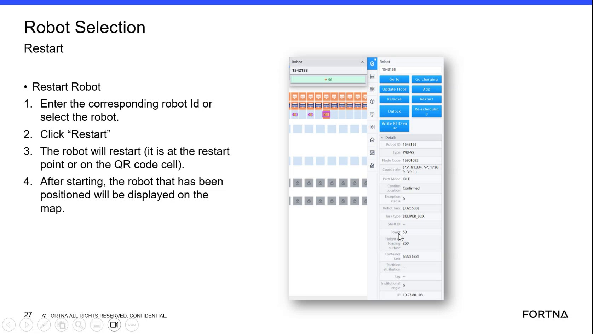

# Check AGB HV Charge Percentage In The Power Section

## Runbook Header

| Field | Value |
| --- | --- |
| Procedure ID | `proc_check_agb_hv_charge_percentage_in_the_power_section_v1` |
| Title | Check AGB HV Charge Percentage In The Power Section |
| Procedure Type | `diagnostic` |
| Primary Role | `L1_support` |
| Supporting Roles | None |
| Support Safe | Yes |
| Validation Status | `needs_sme_review` |
| Merge Status | `source_finalized` |

## Summary

Determine the current HV charge percentage for a selected AGB by selecting the AGB in the interface and reading the value shown in the small power section.

## When To Use

Use this procedure when troubleshooting or checking battery state for an AGB and you need to see the HV charge percentage displayed in the interface.

## Do Not Use For

* Do not use this procedure to infer battery condition beyond the values explicitly shown in the source.
* Do not use this procedure as a battery recovery, charging, or handling procedure.

## Safety And Operational Notes

* This source supports viewing and recording the displayed HV charge percentage only.
* Do not infer battery condition beyond the values explicitly shown in the source.

## Access Or Tools Needed

* Access to the AGB selection interface
* Visibility of the power section for the selected AGB

## Related Operational Context

* ctx_training_video_agb_hv_power_display_v1

## Procedure Steps

### Step 1 — Select the AGB in the interface

**Responsible role:** L1_support

**Instruction:**
Select the AGB in the interface.

**Expected result:**
The AGB is selected and its details area is available for inspection.

**Screens / Images:**

*Look for the selected AGB details area referenced in the training discussion.*

**Stop or Escalate If:**

* Escalate if the AGB cannot be selected.

---

### Step 2 — Locate the power section

**Responsible role:** L1_support

**Instruction:**
Locate the small section labeled power for the selected AGB.

**Expected result:**
The power section is visible for the selected AGB.

**Screens / Images:**

*Look for the selected AGB details area and the small section that says power.*

**Stop or Escalate If:**

* Escalate if the power section does not display for the selected AGB.

---

### Step 3 — Read the HV charge percentage

**Responsible role:** L1_support

**Instruction:**
Read the displayed HV charge percentage from the power section.

**Expected result:**
A numeric HV charge percentage is visible in the power section.

**Screens / Images:**

*Look at the power section for the HV charge percentage value; the training gives 50% as an example.*

**Stop or Escalate If:**

* Escalate if the power section does not display an HV charge percentage.

---

### Step 4 — Record the observed percentage

**Responsible role:** L1_support

**Instruction:**
Record the observed percentage value, such as the example value of 50% mentioned in the training discussion.

**Expected result:**
The displayed HV charge percentage is documented.

**Stop or Escalate If:**

* Stop and avoid further interpretation if the displayed value cannot be read clearly.
* Do not infer battery condition beyond the values explicitly shown in the source.

---

## Success Criteria

* The AGB is selected in the interface.
* The power section for the selected AGB is located.
* The HV charge percentage is visible and read.
* The observed percentage is recorded.

## Failure Conditions

* The AGB cannot be selected.
* The power section is not visible for the selected AGB.
* The power section does not display an HV charge percentage.
* The observed value cannot be recorded exactly as displayed.

## Escalation Guidance

* Escalate if the AGB cannot be selected.
* Escalate if the power section does not display an HV charge percentage.
* Do not infer battery condition beyond the values explicitly shown in the source.

## Missing Details / Known Gaps

* The source does not identify the exact interface name or navigation path used to select the AGB.
* The source does not provide a screenshot clearly dedicated to the power section; the attached artifact is only nearby visual support.
* The source does not define any numeric thresholds or interpretation rules for the displayed percentage within this procedure.
* The source does not specify where or how the observed percentage should be recorded.

## Source Lineage

- Candidate IDs: candidate_training_video_check_agb_hv_charge_percentage
- Source ID: `training_video_day1`
- Source Type: `training_video`
