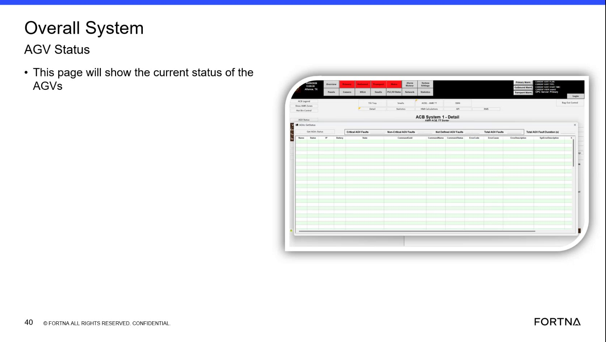

# Check Current AGV System Status Using the RMS Page

## Runbook Header

| Field | Value |
| --- | --- |
| Procedure ID | `proc_check_current_agv_system_status_using_the_rms_page_v1` |
| Title | Check Current AGV System Status Using the RMS Page |
| Procedure Type | `diagnostic` |
| Primary Role | `L1_support` |
| Supporting Roles | None |
| Support Safe | Yes |
| Validation Status | `needs_sme_review` |
| Merge Status | `source_finalized` |

## Summary

Use the RMS page to remotely access the "Overall System AGV Status" view and review the current system status information shown there. This source supports only locating and viewing the status page, not interpreting specific indicators or taking corrective action.

## When To Use

Use when remote support needs to view the current AGV or system status through the RMS page and confirm that the "Overall System AGV Status" page is available.

## Do Not Use For

* Do not use this procedure to interpret specific status meanings when the source does not define them.
* Do not use this procedure to perform corrective actions or AGV fault recovery.
* Do not use this procedure to infer navigation details, field meanings, or controls not shown in the source.

## Safety And Operational Notes

* This source supports remote status viewing only.
* Do not infer specific status meanings or corrective actions because they are not provided in this source segment.

## Access Or Tools Needed

* Access to the RMS page
* Remote access to the relevant interface
* Overall System AGV Status page

## Related Operational Context

* ctx_training_video_rms_page_remote_availability_v1
* ctx_training_video_overall_system_agv_status_page_v1
* ctx_training_video_overall_system_agv_status_current_status_v1

## Procedure Steps

### Step 1 — Open or navigate to the RMS page

**Responsible role:** L1_support

**Instruction:**
Open or navigate to the RMS page referenced in the training segment for remote availability.

**Expected result:**
The RMS page is accessible remotely.

**Screens / Images:**

*Reference to remote availability and the instruction to go to the RMS page.*

**Stop or Escalate If:**

* Escalate if the RMS page is not accessible remotely.

---

### Step 2 — Locate the Overall System AGV Status page

**Responsible role:** L1_support

**Instruction:**
Locate the page titled "Overall System AGV Status" within the available RMS-related interface.

**Expected result:**
The page titled "Overall System AGV Status" is visible.

**Screens / Images:**

*The page title "Overall System AGV Status" and its appearance on the training slide.*

**Stop or Escalate If:**

* Escalate if the Overall System AGV Status page cannot be located from the available remote interface.

---

### Step 3 — Confirm the page shows current system status

**Responsible role:** L1_support

**Instruction:**
Verify that the displayed page is the one described as showing the current status of the system.

**Expected result:**
The page is confirmed as the current system status view.

**Screens / Images:**

*The slide text indicating that the Overall System AGV Status page shows the current status of the system.*

**Stop or Escalate If:**

* Escalate if the displayed page cannot be confirmed as the current system status page.

---

### Step 4 — Review the displayed status information

**Responsible role:** L1_support

**Instruction:**
Review the current status information shown on the Overall System AGV Status page using only the values and indicators presented on that page.

**Expected result:**
The current AGV or system status is visible for remote review.

**Screens / Images:**

*The Overall System AGV Status page as the source-supported location for current system status.*

**Stop or Escalate If:**

* Escalate if status information is not visible on the page.
* Stop if interpretation of specific status meanings or corrective actions would be required, because this source does not provide them.

---

## Success Criteria

* The RMS page is accessed remotely.
* The "Overall System AGV Status" page is located.
* The page is confirmed as the current system status view.
* Current AGV or system status information is visible for review.

## Failure Conditions

* The RMS page is not accessible remotely.
* The Overall System AGV Status page cannot be located.
* The displayed page cannot be confirmed as the current system status page.
* Status information is not visible or requires unsupported interpretation.

## Escalation Guidance

* Escalate if the RMS page is not accessible remotely.
* Escalate if the Overall System AGV Status page cannot be located from the available remote interface.
* Do not infer specific status meanings or corrective actions because they are not provided in this source segment.

## Missing Details / Known Gaps

* The source does not provide detailed navigation steps to reach the Overall System AGV Status page from RMS.
* The source does not define specific fields, indicators, or status meanings shown on the page.
* The source does not provide corrective actions based on observed status.
* The source does not provide a time estimate for completing this procedure.
* The source does not specify whether production stop or LOTO is required.

## Source Lineage

- Candidate IDs: candidate_training_video_check_agv_system_status_on_rms_page
- Source ID: `training_video_day1`
- Source Type: `training_video`
