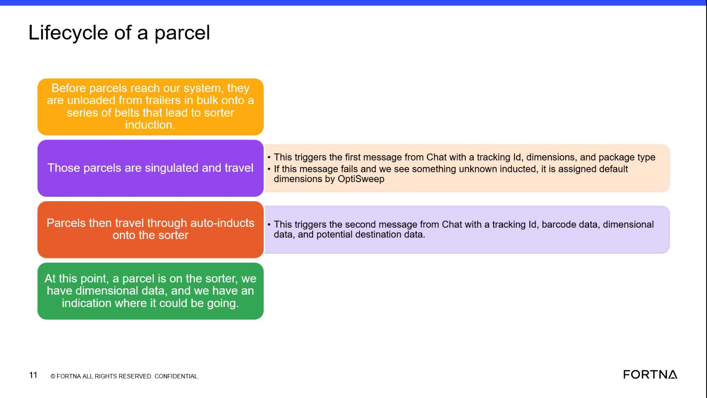

# Check Whether An Unknown Inducted Parcel Was Assigned Default Dimensions

## Runbook Header

| Field | Value |
| --- | --- |
| Procedure ID | `proc_check_whether_an_unknown_inducted_parcel_was_assigned_default_dimensions_v1` |
| Title | Check Whether An Unknown Inducted Parcel Was Assigned Default Dimensions |
| Procedure Type | `diagnostic` |
| Primary Role | `L1_support` |
| Supporting Roles | None |
| Support Safe | Yes |
| Validation Status | `needs_sme_review` |
| Merge Status | `source_finalized` |

## Summary

Use this source-based diagnostic to verify whether a parcel matches the training-slide fallback case in which OptiSweep assigns default dimensions when the first message fails and an unknown parcel is inducted.

## When To Use

Use when reviewing parcel evidence or message history to determine whether a parcel may have received default dimensions under the source-described fallback condition: the first message failed and an unknown parcel was inducted.

## Do Not Use For

* Do not use to determine the actual default dimension values, because the source does not provide them.
* Do not use as a corrective or recovery procedure, because the source only describes the fallback condition and outcome.
* Do not use when available evidence cannot show whether the parcel was unknown inducted or whether the first message failed.

## Safety And Operational Notes

* This candidate is source-described as support safe.
* Use only available evidence from parcel induction or message history; do not infer unsupported values or system behavior beyond the source statement.

## Access Or Tools Needed

* Access to parcel induction evidence or message history
* Training slide describing default-dimensions fallback behavior

## Related Operational Context

* ctx_training_video_default_dimensions_unknown_inducted_v1
* ctx_training_video_parcel_lifecycle_messages_v1

## Procedure Steps

### Step 1 — Identify the parcel as an unknown inducted case

**Responsible role:** L1_support

**Instruction:**
Review the available parcel case evidence and identify whether the parcel is described or evidenced as an unknown inducted parcel.

**Expected result:**
The parcel is either confirmed as an unknown inducted case or cannot be confirmed from available evidence.

**Screens / Images:**

*Look at the lifecycle slide text describing the fallback condition for an unknown inducted parcel.*

**Stop or Escalate If:**

* Stop or escalate if available evidence does not show whether the parcel was unknown inducted.

---

### Step 2 — Check whether the first message failed or is absent

**Responsible role:** L1_support

**Instruction:**
Check the available evidence for the initial message associated with tracking ID, dimensions, and package type. Determine whether that first message failed or is absent in the evidence being reviewed.

**Expected result:**
The first message is either shown as failed or absent, or the evidence is insufficient to determine its status.

**Screens / Images:**

*Look at the slide text describing the first Chat message as containing tracking ID, dimensions, and package type, and the fallback statement if this message fails.*

**Stop or Escalate If:**

* Escalate if the parcel appears unknown inducted but available evidence does not show whether the initial message failed.

---

### Step 3 — Verify whether the parcel matches the default-dimensions fallback case

**Responsible role:** L1_support

**Instruction:**
Using only the source-described fallback behavior, verify whether the parcel was assigned default dimensions by OptiSweep based on the combination of an unknown inducted parcel and failure of the first message.

**Expected result:**
You can conclude whether the parcel matches the source-described fallback case for default dimensions, or determine that the evidence is insufficient.

**Screens / Images:**

*Look at the exact fallback statement tying default dimensions to first-message failure and an unknown inducted parcel.*

**Stop or Escalate If:**

* Stop or escalate if the evidence does not support both the unknown-inducted condition and the first-message failure condition.
* Do not infer what the default dimension values are, because the source does not provide them.

---

### Step 4 — Record the source-based conclusion

**Responsible role:** L1_support

**Instruction:**
Record whether the parcel matches the source statement that ties default dimensions to the combination of first-message failure and an unknown inducted parcel. Include the slide evidence reference in the record.

**Expected result:**
A source-grounded diagnostic note is recorded without adding unsupported details.

**Screens / Images:**

*Use the slide text showing the default-dimensions fallback statement as the supporting image reference.*

**Stop or Escalate If:**

* Stop or escalate if the conclusion would require unsupported assumptions beyond the source statement.
* Do not record actual default dimension values, because the source does not provide them.

---

## Success Criteria

* The reviewer determines whether the parcel matches the source-described fallback case for default dimensions.
* The conclusion is based only on evidence of an unknown inducted parcel and first-message failure or absence.
* The finding is documented with the supporting source reference.

## Failure Conditions

* Available evidence does not show whether the parcel was unknown inducted.
* Available evidence does not show whether the first message failed.
* The reviewer attempts to infer actual default dimension values not provided by the source.

## Escalation Guidance

* Escalate if the parcel appears unknown inducted but available evidence does not show whether the initial message failed.
* Escalate if available evidence is insufficient to confirm the source-described fallback condition.
* Do not infer what the default dimension values are, because the source does not provide them.

## Missing Details / Known Gaps

* The source does not provide the actual default dimension values.
* The source does not provide a specific screen, query, or system workflow for checking message failure.
* The source does not provide corrective actions if the fallback condition is confirmed.
* The source does not provide timing estimates for this diagnostic.

## Source Lineage

- Candidate IDs: candidate_training_video_check_default_dimensions_for_unknown_inducted_parcel
- Source ID: `training_video_day1`
- Source Type: `training_video`
