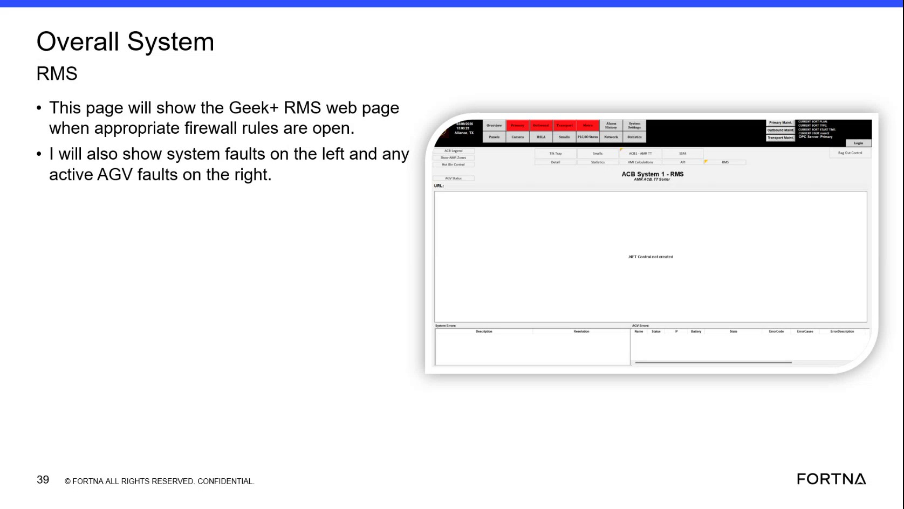

# Check Overall System RMS For System Faults And Active AGV Faults

## Runbook Header

| Field | Value |
| --- | --- |
| Procedure ID | `proc_check_overall_system_rms_for_system_faults_and_active_agv_faults_v1` |
| Title | Check Overall System RMS For System Faults And Active AGV Faults |
| Procedure Type | `diagnostic` |
| Primary Role | `L1_support` |
| Supporting Roles | None |
| Support Safe | Yes |
| Validation Status | `needs_sme_review` |
| Merge Status | `source_finalized` |

## Summary

Use the Overall System RMS page to determine whether system faults or active AGV faults are present during support troubleshooting. The source states this should be an initial support question and identifies where each fault type appears on the page.

## When To Use

Use during support troubleshooting when determining whether faults are currently visible in the Overall System RMS view, especially as an initial question on a support call.

## Do Not Use For

* Interpreting the meaning of specific faults beyond confirming whether they are shown
* Performing corrective actions for faults
* Using as a substitute for direct screen access when no one on the call can view or share the page

## Safety And Operational Notes

* This source segment supports observation and fault presence checking only.
* Do not invent fault meanings, corrective actions, or additional controls not shown in the source.

## Access Or Tools Needed

* Access to the Overall System RMS or Geek+ RMS web page
* Ability to view the RMS screen directly or through someone on the support call
* Support call participation

## Related Operational Context

* ctx_training_video_overall_system_rms_screen_v1
* ctx_training_video_system_faults_display_v1
* ctx_training_video_active_agv_faults_display_v1
* ctx_training_video_support_access_limitations_v1

## Procedure Steps

### Step 1 — Ask whether there are any system faults

**Responsible role:** L1_support

**Instruction:**
Begin the support check by asking whether there are any system faults.

**Expected result:**
The caller confirms whether system faults are currently present or visible.

**Screens / Images:**

*The training frame and transcript note that asking about system faults should be the first question.*

**Stop or Escalate If:**

* The caller cannot confirm whether any system faults are present
* No one on the call can access or view the Overall System RMS page

---

### Step 2 — View the Overall System RMS page

**Responsible role:** L1_support

**Instruction:**
Access or view the Overall System RMS page associated with the Geek+ RMS web page. If you do not have direct access, use a person on the support call who can view the page.

**Expected result:**
The Overall System RMS page is visible for review.

**Screens / Images:**

*Overall System RMS page reference showing this is the Geek+ RMS web page view used for fault review.*

**Stop or Escalate If:**

* The Overall System RMS page is not available for viewing
* No participant on the support call has access to the page

---

### Step 3 — Check the left side for system faults

**Responsible role:** L1_support

**Instruction:**
Review the left side of the Overall System RMS page for system faults.

**Expected result:**
You determine whether system faults are shown on the left side of the page.

**Screens / Images:**

*The left side of the Overall System RMS page where system faults are shown.*

**Stop or Escalate If:**

* System faults are present and need further diagnosis outside this source segment
* The left-side system faults area is not visible or cannot be confirmed

---

### Step 4 — Check the right side for active AGV faults

**Responsible role:** L1_support

**Instruction:**
Review the right side of the Overall System RMS page for any active AGV faults.

**Expected result:**
You determine whether active AGV faults are shown on the right side of the page.

**Screens / Images:**

*The right side of the Overall System RMS page where active AGV faults are shown.*

**Stop or Escalate If:**

* Active AGV faults are present and require diagnosis beyond this source segment
* The right-side active AGV faults area is not visible or cannot be confirmed

---

### Step 5 — Use another participant's view if direct access is unavailable

**Responsible role:** L1_support

**Instruction:**
If you do not have direct access, ask another person on the support call who has access to show the screen or describe what is visible on the Overall System RMS page.

**Expected result:**
Fault visibility can still be confirmed through another participant on the call.

**Screens / Images:**

*The source frame associated with the discussion of using available screen access during support calls.*

**Stop or Escalate If:**

* Many callers do not have HMI screen-sharing access and no alternate viewer is available
* The information being relayed from the page is incomplete or cannot be trusted

---

## Success Criteria

* The Overall System RMS page is reviewed directly or through a participant on the support call.
* It is confirmed whether system faults are present on the left side of the page.
* It is confirmed whether active AGV faults are present on the right side of the page.

## Failure Conditions

* System faults are shown on the left side of the page.
* Active AGV faults are shown on the right side of the page.
* No one on the support call can access, share, or confirm the Overall System RMS page.

## Escalation Guidance

* Escalate when faults are present and further interpretation or corrective action is required, because this source only supports identifying where faults are shown.
* Escalate when access limitations prevent anyone on the call from viewing or confirming the Overall System RMS page.

## Missing Details / Known Gaps

* The source does not provide navigation steps for reaching the Overall System RMS page.
* The source does not define fault severity, interpretation, or corrective actions.
* The source does not provide escalation contacts or routing details.
* The source does not provide a time estimate for completing this check.

## Source Lineage

- Candidate IDs: candidate_training_video_check_overall_system_rms_for_system_and_agv_faults
- Source ID: `training_video_day1`
- Source Type: `training_video`
