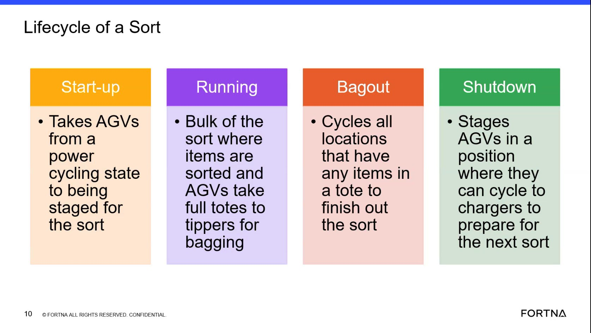
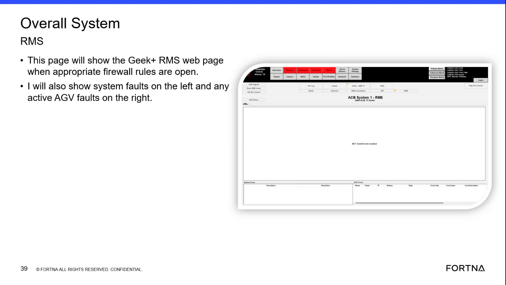

# Check Visible Fault Indicators During Startup Or Shutdown State Transitions

## Runbook Header

| Field | Value |
| --- | --- |
| Procedure ID | `proc_check_visible_fault_indicators_during_startup_or_shutdown_state_transitions_v1` |
| Title | Check Visible Fault Indicators During Startup Or Shutdown State Transitions |
| Procedure Type | `diagnostic` |
| Primary Role | `L1_support` |
| Supporting Roles | None |
| Support Safe | Yes |
| Validation Status | `needs_sme_review` |
| Merge Status | `source_finalized` |

## Summary

Use the training source's examples to inspect whether a startup or shutdown transition is delayed or incomplete because of a visible system fault or a visible AGV waiting condition.

## When To Use

Use when the system appears to be in startup or shutdown and the transition seems delayed, incomplete, or not progressing as expected, and you need to determine whether the source-described visible fault or waiting examples are present.

## Do Not Use For

* Do not use as a recovery procedure to clear faults or force completion of startup or shutdown.
* Do not use when corrective action requires steps not described in this source.
* Do not use as a complete troubleshooting workflow beyond observing visible faults or waiting conditions during startup or shutdown.

## Safety And Operational Notes

* This source provides diagnostic observation guidance only and does not provide recovery actions.
* Do not invent corrective actions, commands, or control changes not described in the source.

## Access Or Tools Needed

* Access to observe system startup or shutdown behavior
* Access to system fault indication if available

## Related Operational Context

* ctx_training_video_state_transition_fault_visibility_v1
* ctx_training_video_agv_startup_and_shutdown_states_v1

## Procedure Steps

### Step 1 — Confirm the system is in startup or shutdown and assess whether the transition is delayed

**Responsible role:** L1_support

**Instruction:**
Observe the system and determine whether it is currently in startup or shutdown. Check whether the transition appears delayed, incomplete, or not progressing as expected.

**Expected result:**
The current transition state is identified as startup or shutdown, and the observer has confirmed that the transition appears delayed or incomplete.

**Screens / Images:**

*Look at the lifecycle/state progression showing AGVs starting in shutdown, moving through startup, and returning to shutdown.*

**Stop or Escalate If:**

* The transition remains incomplete and the current state cannot be confidently identified from visible information.

---

### Step 2 — Check for a visible system fault indication

**Responsible role:** L1_support

**Instruction:**
Check whether the system is showing a system fault indication associated with the delayed startup or shutdown transition.

**Expected result:**
A visible system fault is either identified or ruled out based on what is available to observe.

**Screens / Images:**

*Look for where system faults appear on the left and active AGV faults appear on the right of the Overall System RMS page.*

**Stop or Escalate If:**

* A visible fault is present but the source does not provide corrective action.
* Fault visibility is expected but the required screen or access is unavailable.

---

### Step 3 — During shutdown, look for an AGV waiting to do an exchange

**Responsible role:** L1_support

**Instruction:**
If the system is in shutdown, look for the example condition described in the source: an AGV waiting to do an exchange.

**Expected result:**
The observer determines whether the shutdown delay matches the source example of an AGV waiting to do an exchange.

**Screens / Images:**

*Use the lifecycle context for shutdown behavior while checking for the visible AGV waiting condition mentioned in the training segment.*

**Stop or Escalate If:**

* Shutdown remains incomplete and the visible condition cannot be matched to the source example.
* A waiting-to-exchange condition is observed but the source provides no recovery action.

---

### Step 4 — During startup, look for delay while waiting for an AGV on the charger

**Responsible role:** L1_support

**Instruction:**
If the system is in startup, look for the example condition described in the source: a delay while waiting for an AGV on the charger.

**Expected result:**
The observer determines whether the startup delay matches the source example of waiting for an AGV on the charger.

**Screens / Images:**

*Use the startup/shutdown lifecycle context while checking for a startup delay associated with an AGV on the charger.*

**Stop or Escalate If:**

* Startup remains incomplete and the visible condition cannot be matched to the source example.
* A charger-related waiting condition is observed but the source provides no recovery action.

---

### Step 5 — Record the observed fault or waiting condition

**Responsible role:** L1_support

**Instruction:**
Record the visible waiting condition or fault indication exactly as observed and compare it to the source-described examples.

**Expected result:**
A clear observation record exists describing whether a visible system fault, shutdown exchange wait, or startup charger wait was observed.

**Stop or Escalate If:**

* The transition remains incomplete and no source-recognizable fault or waiting condition can be identified.
* The observed fault requires corrective action not described in this source.

---

## Success Criteria

* The observer identifies whether the delayed or incomplete startup or shutdown transition has a visible system fault indication.
* The observer identifies whether the visible condition matches one of the source-described examples: AGV waiting to do an exchange during shutdown or waiting for an AGV on the charger during startup.
* The observation is documented for follow-up or escalation.

## Failure Conditions

* Startup or shutdown remains delayed or incomplete.
* A visible system fault is present during the transition.
* During shutdown, an AGV is visibly waiting to do an exchange.
* During startup, the system appears to be waiting for an AGV on the charger.
* No source-recognizable fault or waiting condition can be identified even though the transition remains incomplete.

## Escalation Guidance

* Escalate if the transition remains incomplete and no source-recognizable fault or waiting condition can be identified.
* Escalate if the observed fault requires corrective action not described in this source.
* Escalate because this source does not provide recovery steps for clearing the fault.

## Missing Details / Known Gaps

* The source does not provide recovery or fault-clearing steps.
* The source does not define exact screens, navigation steps, or operator inputs for checking the fault indication within this segment.
* The source does not provide timing thresholds for when a startup or shutdown delay should be considered abnormal.
* The source does not specify escalation destination or ownership beyond indicating escalation is needed when no recognizable condition is found or corrective action is not described.

## Source Lineage

- Candidate IDs: candidate_training_video_check_startup_or_shutdown_transition_fault_visibility
- Source ID: `training_video_day1`
- Source Type: `training_video`
