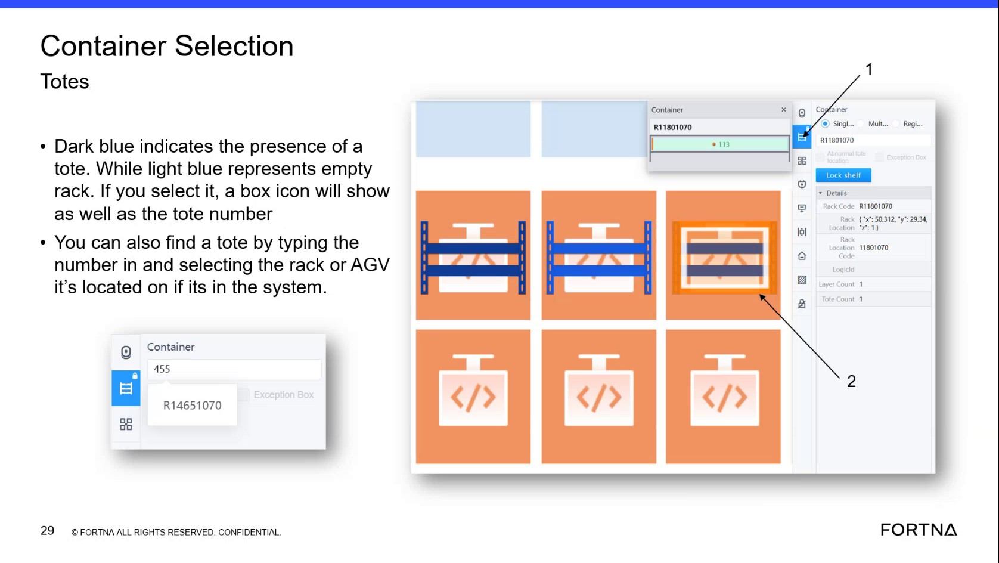

# Compare Physical Tote, Robot, And Rack Labels To RMS Map Identifiers

## Runbook Header

| Field | Value |
| --- | --- |
| Procedure ID | `proc_compare_physical_tote_robot_and_rack_labels_to_rms_map_identifiers_v1` |
| Title | Compare Physical Tote, Robot, And Rack Labels To RMS Map Identifiers |
| Procedure Type | `diagnostic` |
| Primary Role | `operator` |
| Supporting Roles | None |
| Support Safe | Yes |
| Validation Status | `needs_sme_review` |
| Merge Status | `source_finalized` |

## Summary

Use the RMS map and physical label visibility or reported physical observations to verify that tote, robot, and rack position labels match the identifiers shown in the system map.

## When To Use

Use when verifying whether a physical tote, robot, or rack position matches the identifier shown in the RMS map, including investigation of possible tote identity, robot identity, rack identity, or physical-to-system mismatch conditions.

## Do Not Use For

* Correcting mismatches when the physical label does not match the RMS map identifier
* Executing robot removal, robot add, tote swap, tote remove, or tote re-add actions
* Any complete recovery workflow for mismatch cases not provided in this source

## Safety And Operational Notes

* This source supports comparison and verification activity only; it does not provide a complete corrective procedure for mismatch cases.
* Do not use this runbook as authority to perform recovery actions not explicitly supported by this source.

## Access Or Tools Needed

* Access to the RMS map
* Visibility of physical tote labels
* Visibility of physical robot labels
* Visibility of physical rack position labels

## Related Operational Context

* ctx_training_video_rack_click_tote_identity_v1

## Procedure Steps

### Step 1 — Go to or obtain the physical observation

**Responsible role:** operator

**Instruction:**
Go to the physical area for the tote, robot, or rack position being checked, or use reported physical observations for that item or location.

**Expected result:**
The operator has a specific tote, robot, or rack position selected for comparison.

**Stop or Escalate If:**

* The physical item or location cannot be identified well enough to compare against the RMS map.

---

### Step 2 — Read the physical label

**Responsible role:** operator

**Instruction:**
Read the visible label on the tote, robot, or rack position.

**Expected result:**
A physical label value is available for comparison.

**Screens / Images:**

*Use as an example reference for rack and tote lookup context while identifying the physical item to compare with the map.*

**Stop or Escalate If:**

* The physical label cannot be read or confirmed.

---

### Step 3 — Open the RMS map and navigate to the item

**Responsible role:** operator

**Instruction:**
Open the RMS map and navigate to the corresponding location or selected object.

**Expected result:**
The relevant tote, robot, or rack position is visible in the RMS map.

**Screens / Images:**

*Reference that RMS is the robot management system web application used to investigate system state.*

*Reference rack selection and map lookup behavior for locating the relevant rack or tote in the map.*

**Stop or Escalate If:**

* RMS access is unavailable.
* The corresponding location or object cannot be found in the map.

---

### Step 4 — Read the identifier shown in the map

**Responsible role:** operator

**Instruction:**
Read the identifier shown in the map for the tote, robot, or rack position.

**Expected result:**
A system-reported identifier is available from the RMS map.

**Screens / Images:**

*If checking a rack, use the map behavior where clicking a dark blue rack shows which tote is on that rack.*

*Container Selection screen example for locating a tote, rack, or AGV and reading the selected item details.*

**Stop or Escalate If:**

* The RMS map does not display the identifier needed for comparison.

---

### Step 5 — Compare the physical label to the map identifier

**Responsible role:** operator

**Instruction:**
Compare the physical label to the identifier shown in the map.

**Expected result:**
The operator determines whether the physical and system identifiers match.

**Screens / Images:**

*Use the rack/tote lookup context to compare what is physically present with what the map reports.*

**Stop or Escalate If:**

* The physical label does not match the map identifier.

---

### Step 6 — Record any mismatch

**Responsible role:** operator

**Instruction:**
Record any mismatch between the physical label and the system-reported identifier.

**Expected result:**
Any mismatch is documented for follow-up.

**Stop or Escalate If:**

* A mismatch is found between the physical label and the map identifier.
* A corrective action is needed that is not provided in this source.

---

## Success Criteria

* The physical tote, robot, or rack position label is compared against the identifier shown in the RMS map.
* The operator can confirm whether the physical and system identifiers match.
* Any mismatch is recorded for follow-up.

## Failure Conditions

* The physical label cannot be read or confirmed.
* The RMS map cannot be accessed or does not show the needed identifier.
* The physical label does not match the identifier shown in the RMS map.
* A corrective action is required but is not provided by this source.

## Escalation Guidance

* Escalate or continue with a separate source-backed recovery procedure if the physical label does not match the map identifier.
* Do not infer or perform unsupported corrective actions from this training segment alone because it does not provide a complete corrective procedure for all mismatch cases.

## Missing Details / Known Gaps

* The source does not provide a dedicated named procedure for this comparison workflow.
* The source does not provide a complete corrective procedure for all mismatch cases.
* The source does not specify timing estimates.
* The source does not define explicit role boundaries beyond general operator/support usage.
* The source does not provide commands, exact navigation clicks for every object type, or a formal recording method for mismatches.

## Source Lineage

- Candidate IDs: candidate_training_video_compare_physical_labels_to_map_identifiers
- Source ID: `training_video_day1`
- Source Type: `training_video`
