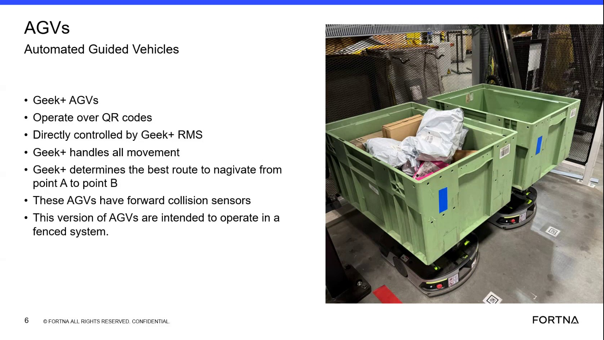

# Determine Whether AGV Or RMS Is Responsible For Observed Robot Behavior

## Runbook Header

| Field | Value |
| --- | --- |
| Procedure ID | `proc_determine_whether_agv_or_rms_is_responsible_for_observed_robot_behavior_v1` |
| Title | Determine Whether AGV Or RMS Is Responsible For Observed Robot Behavior |
| Procedure Type | `reference` |
| Primary Role | `L1_support` |
| Supporting Roles | None |
| Support Safe | Yes |
| Validation Status | `needs_sme_review` |
| Merge Status | `source_finalized` |

## Summary

Use the source-described division of responsibilities between onboard AGV hardware and Geek+ RMS to classify whether an observed robot behavior is primarily associated with AGV sensing functions or RMS supervisory control, task queue, and routing functions.

## When To Use

Use when reviewing or discussing observed AGV behavior and you need a source-backed way to determine whether the behavior aligns with onboard AGV sensing responsibilities or RMS control and routing responsibilities.

## Do Not Use For

* Do not use this runbook to infer deeper robot logic or undocumented subsystem ownership beyond what the source states.
* Do not use this runbook as a detailed troubleshooting or repair procedure, because the source provides only a high-level architecture explanation.
* Do not use this runbook when the observed behavior does not fit the source-described AGV or RMS responsibilities without escalation.

## Safety And Operational Notes

* This source is a high-level training explanation and does not authorize physical intervention or control changes.
* Do not infer undocumented controls, subsystem ownership, or recovery actions from this reference alone.

## Access Or Tools Needed

* Description of the observed AGV behavior or condition
* Source-backed AGV versus RMS responsibility mapping
* Optional access to RMS for context

## Related Operational Context

* ctx_training_video_agv_vs_rms_responsibilities_v1
* ctx_training_video_agv_rms_system_overview_v1
* ctx_training_video_wcs_to_rms_task_queue_v1

## Procedure Steps

### Step 1 — Identify the observed behavior

**Responsible role:** L1_support

**Instruction:**
Identify the observed robot behavior or condition being discussed, such as obstacle detection, movement execution, or route selection.

**Expected result:**
A specific behavior or condition is defined for comparison against the source-described responsibility split.

**Stop or Escalate If:**

* Escalate if the observed behavior cannot be clearly described well enough to compare against the source-described AGV and RMS responsibilities.

---

### Step 2 — Compare the behavior to AGV sensing functions

**Responsible role:** L1_support

**Instruction:**
Compare the behavior to the source-described AGV functions: physical sensors, distance calculation, and collision sensing on the AGV.

**Expected result:**
You can determine whether the behavior matches onboard AGV sensing or detection functions.

**Screens / Images:**

*Look for the explanation that AGVs have onboard physical sensors and forward collision sensors.*

**Stop or Escalate If:**

* Escalate if the behavior appears sensor-related but the source does not clearly support assigning it to AGV hardware.

---

### Step 3 — Compare the behavior to RMS control functions

**Responsible role:** L1_support

**Instruction:**
Compare the behavior to the source-described RMS functions: dictating what the robot needs to do, holding the task queue, sending commands to the AGV, and deciding routing from one station or point to another.

**Expected result:**
You can determine whether the behavior matches RMS tasking, command, or routing functions.

**Screens / Images:**

*Look for the explanation that RMS dictates what the robot needs to do, maintains the queue, sends commands, and determines the best route from point A to point B.*

**Stop or Escalate If:**

* Escalate if the behavior appears related to tasking or routing but the source does not clearly support assigning it to RMS.

---

### Step 4 — Attribute obstacle or collision detection to AGV hardware

**Responsible role:** L1_support

**Instruction:**
If the condition involves an obstacle seen by the robot or collision sensing, attribute the originating detection to AGV hardware and note that it reports back to RMS.

**Expected result:**
Obstacle or collision-related detection is classified as originating on the AGV, with reporting back to RMS.

**Screens / Images:**

*Look for the AGV collision sensor reference and the explanation that AGV sensing reports back to RMS.*

**Stop or Escalate If:**

* Escalate if the obstacle or collision-related condition appears to involve logic or ownership beyond onboard sensing and reporting.
* Stop short of assigning deeper subsystem ownership not stated in the source.

---

### Step 5 — Attribute route, queue, or commanded movement to RMS

**Responsible role:** L1_support

**Instruction:**
If the condition involves route choice, queued tasks, or commanded movement from one location to another, attribute that responsibility to RMS.

**Expected result:**
Route, queue, or command-related behavior is classified as RMS responsibility.

**Screens / Images:**

*Look for the slide/frame showing Geek+ RMS directly controls AGVs and determines the best route from point A to point B.*

**Stop or Escalate If:**

* Escalate if the observed behavior does not fit the source-described AGV or RMS responsibilities.
* Do not infer deeper robot logic or undocumented subsystem ownership beyond what the source states.

---

## Success Criteria

* The user can distinguish whether the observed behavior is associated with AGV onboard sensing functions or RMS control and routing functions.
* Observed obstacle or collision sensing is attributed to AGV hardware reporting back to RMS when supported by the source.
* Observed route choice, queued tasks, or commanded movement is attributed to RMS when supported by the source.

## Failure Conditions

* The observed behavior does not fit the source-described AGV or RMS responsibilities.
* The reviewer attempts to infer undocumented subsystem ownership or deeper robot logic not supported by the source.
* The source does not provide enough detail to classify the behavior confidently.

## Escalation Guidance

* Escalate if the observed behavior does not fit the source-described AGV or RMS responsibilities, because the segment provides only a high-level architecture explanation.
* Escalate if classification would require deeper robot logic or undocumented subsystem ownership beyond what the source states.

## Missing Details / Known Gaps

* The source provides a high-level architecture explanation only and does not define detailed troubleshooting decision trees.
* The source does not provide commands, system paths, thresholds for classification, or formal escalation contacts.
* The source does not define role boundaries beyond general support interpretation use.

## Source Lineage

- Candidate IDs: candidate_training_video_determine_agv_vs_rms_responsibility_for_robot_behavior
- Source ID: `training_video_day1`
- Source Type: `training_video`
