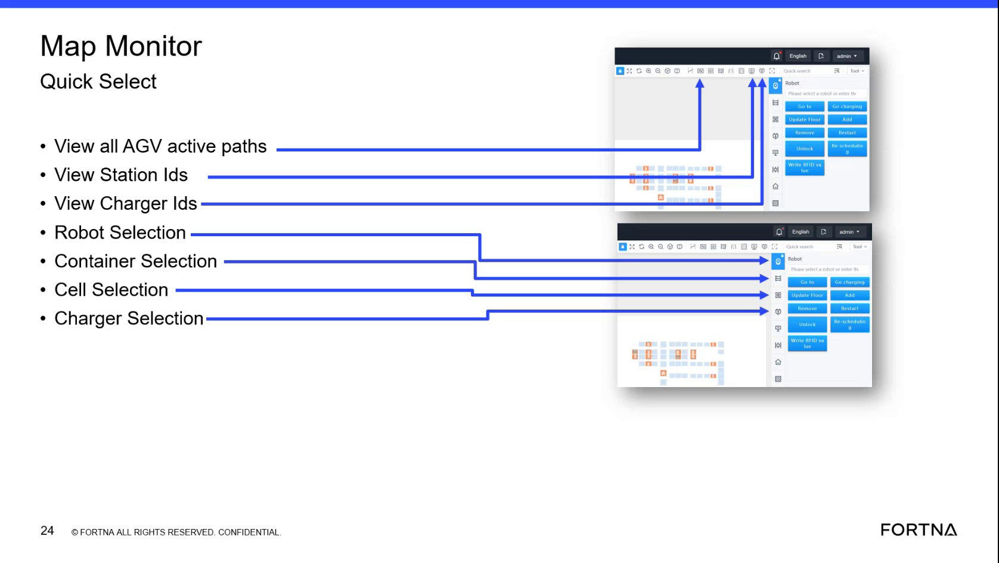

# Display Station IDs On the Map

## Runbook Header

| Field | Value |
| --- | --- |
| Procedure ID | `proc_display_station_ids_on_the_map_v1` |
| Title | Display Station IDs On the Map |
| Procedure Type | `reference` |
| Primary Role | `L1_support` |
| Supporting Roles | None |
| Support Safe | Yes |
| Validation Status | `needs_sme_review` |
| Merge Status | `source_finalized` |

## Summary

Use the Map Monitor Quick Select control to display unique station IDs for station locations on the map so the correct station can be identified for debugging or problem identification.

## When To Use

Use when working in Map Monitor and you need to identify station locations by their unique station IDs, especially for debugging or problem identification.

## Do Not Use For

* Do not use this runbook as a debugging procedure beyond displaying and recording station IDs.
* Do not use this runbook to infer station behaviors, navigation actions, or controls not stated in the source.

## Safety And Operational Notes

* This source describes a display/reference action only.
* Do not invent or perform additional station control or navigation actions beyond what is shown in the source.

## Access Or Tools Needed

* Access to the Map Monitor screen
* Map Monitor Quick Select controls

## Related Operational Context

* ctx_training_video_map_monitor_quick_select_overview_v1
* ctx_training_video_station_ids_reference_v1

## Procedure Steps

### Step 1 — Open Map Monitor and locate Quick Select

**Responsible role:** L1_support

**Instruction:**
Open the Map Monitor screen and locate the Quick Select area on the left-side panel.

**Expected result:**
The Map Monitor screen is open and the Quick Select controls are visible.

**Screens / Images:**

*Quick Select panel on the left side of Map Monitor, including the station ID display control.*

**Stop or Escalate If:**

* Stop or escalate if Map Monitor is not accessible.
* Stop or escalate if the Quick Select area is not visible.

---

### Step 2 — Select View Station IDs

**Responsible role:** L1_support

**Instruction:**
Click the "View Station Ids" icon.

**Expected result:**
The station ID display option is activated.

**Screens / Images:**

*The Quick Select icon labeled or described as View Station IDs.*

**Stop or Escalate If:**

* Escalate if station IDs do not display after selecting the station ID icon.

---

### Step 3 — Observe displayed station IDs on the map

**Responsible role:** L1_support

**Instruction:**
Observe the map and identify the displayed station IDs for station locations.

**Expected result:**
Unique station IDs are visible on the map at station locations.

**Screens / Images:**

*Map Monitor display behavior associated with the View Station IDs function.*

**Stop or Escalate If:**

* Escalate if station IDs do not display after selecting the station ID icon.

---

### Step 4 — Use station IDs to distinguish stations

**Responsible role:** L1_support

**Instruction:**
Use the displayed IDs to distinguish stations from cells, noting that stations are special locations with unique IDs.

**Expected result:**
The user can distinguish station locations using the displayed unique station IDs.

**Screens / Images:**

*Station ID display reference in the Quick Select training slide.*

**Stop or Escalate If:**

* Stop if the task requires station behavior, routing, or debugging actions not provided in this source.

---

### Step 5 — Record the needed station ID

**Responsible role:** L1_support

**Instruction:**
Record the station ID needed for debugging or problem identification if required by the task.

**Expected result:**
The required station ID is documented for later use in support investigation.

**Stop or Escalate If:**

* Escalate if the required station ID cannot be identified from the map display.

---

## Success Criteria

* The map displays unique station IDs for station locations.
* The user can identify the correct station by its displayed ID.
* The needed station ID is available for debugging or problem identification.

## Failure Conditions

* Map Monitor or Quick Select cannot be accessed.
* Station IDs do not display after selecting the station ID icon.
* The user cannot identify or record the needed station ID.

## Escalation Guidance

* Escalate if station IDs do not display after selecting the station ID icon.
* Escalate if the required station ID cannot be identified from the map.
* Escalate if the task requires additional debugging or station actions not provided in this source.

## Missing Details / Known Gaps

* The source packet does not provide a precise navigation path to open Map Monitor beyond referencing the screen.
* The source packet does not specify whether the View Station IDs control is a toggle or how it appears when active.
* The source packet does not provide a formal recording method or destination for captured station IDs.
* The source packet does not include the downstream debugging procedure that uses the recorded station ID.

## Source Lineage

- Candidate IDs: candidate_training_video_display_station_ids_on_map
- Source ID: `training_video_day1`
- Source Type: `training_video`
