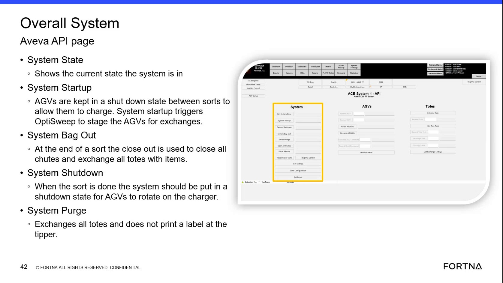
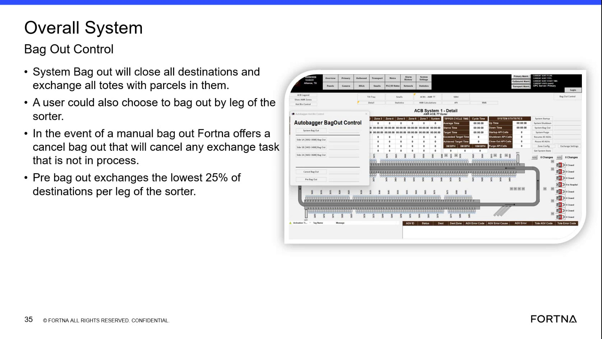
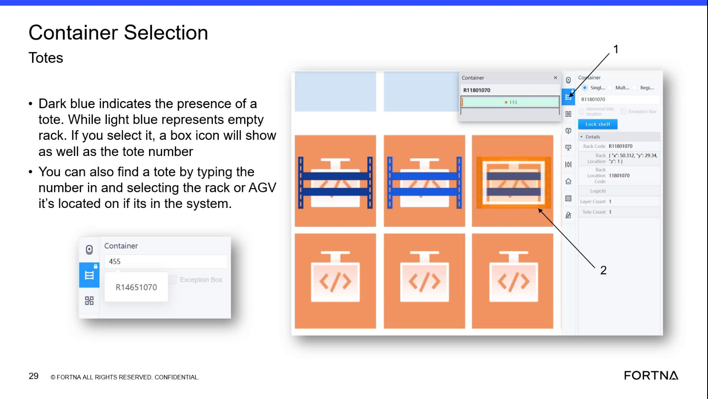
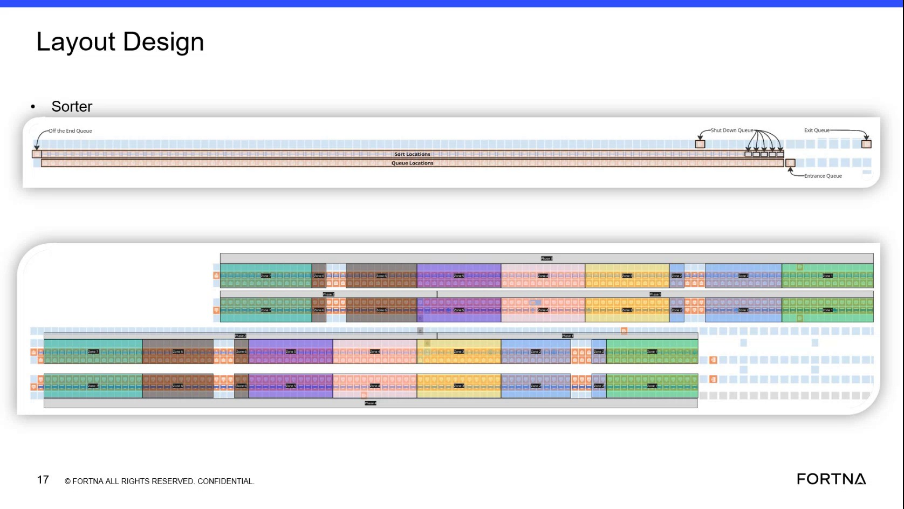

# Perform Bag Out to Clear Remaining Totes at End of Sort

## Runbook Header

| Field | Value |
| --- | --- |
| Procedure ID | `proc_perform_bag_out_to_clear_remaining_totes_at_end_of_sort_v1` |
| Title | Perform Bag Out to Clear Remaining Totes at End of Sort |
| Procedure Type | `operation` |
| Primary Role | `operator` |
| Supporting Roles | None |
| Support Safe | Yes |
| Validation Status | `needs_sme_review` |
| Merge Status | `source_finalized` |

## Summary

Use bag out at the end of a sort to clear remaining items from the sorter system before the next sort configuration begins. The source describes bag out as closing all chutes, ensuring totes with items are exchanged or marked for exchange, and clearing the system back to front until everything is out of the system.

## When To Use

Use when the current sort is complete and the system needs to be cleared so it is ready for the next sort configuration.

## Do Not Use For

* Do not use this runbook to define undocumented criteria for when bag out starts.
* Do not use this runbook to define how tote exchanges are executed beyond what the source states.
* Do not use this runbook as a detailed HMI control procedure; the source does not provide exact UI controls.

## Safety And Operational Notes

* Use only the source-supported bag out sequence; do not add unsupported controls or criteria.
* The source does not provide lockout, maintenance isolation, or physical hazard controls for this activity.

## Access Or Tools Needed

* Ability to close chutes
* Ability to start bag out
* Visibility into tote contents or exchange marking status
* Awareness of zone layout during back-to-front clearing

## Related Operational Context

* ctx_training_video_bag_out_cycle_v1
* ctx_training_video_sorter_zones_v1
* ctx_training_video_sort_transitions_v1

## Procedure Steps

### Step 1 — Confirm bag out is needed

**Responsible role:** operator

**Instruction:**
Confirm that the current sort is done and that the system needs to be cleared before the next sort configuration begins.

**Expected result:**
Bag out is recognized as the correct end-of-sort activity.

**Screens / Images:**

*Lifecycle reference showing bag-out as part of the sort lifecycle before preparing for the next sort.*

**Stop or Escalate If:**

* Stop if it is not confirmed that the current sort is complete.
* Escalate if the transition point between sorts is unclear from current operations.

---

### Step 2 — Close all chutes

**Responsible role:** operator

**Instruction:**
Close every chute, whether it has anything in it or not.

**Expected result:**
All chutes are closed for bag out.

**Screens / Images:**

*System state page reference showing bag out as a system action.*

*Bag out control reference stating system bag out closes all destinations.*

**Stop or Escalate If:**

* Stop if all chutes cannot be closed.
* Escalate if chute state cannot be confirmed.

---

### Step 3 — Start bag out

**Responsible role:** operator

**Instruction:**
Start bag out using the available system bag out control.

**Expected result:**
The system enters bag out / close out behavior.

**Screens / Images:**

*System page showing System Bag Out as an available action.*

*Overall System Bag Out Control slide.*

**Stop or Escalate If:**

* Escalate if the bag out control is unavailable.
* Escalate if the system does not enter bag out after operator initiation.

---

### Step 4 — Ensure totes with items are exchanged or marked for exchange

**Responsible role:** operator

**Instruction:**
Identify any tote that still has an item in it and ensure it gets an exchange or is marked for an exchange.

**Expected result:**
All totes containing items are queued for exchange or marked for exchange as part of bag out.

**Screens / Images:**

*Exchange process reference for understanding tote exchange behavior.*

*Rack/container lookup visual states that can help identify tote presence in rack locations.*

**Stop or Escalate If:**

* Escalate if tote contents or exchange marking status cannot be determined.
* Escalate if totes with items remain but are not being exchanged.

---

### Step 5 — Follow back-to-front bag out sequencing

**Responsible role:** operator

**Instruction:**
Move through the bag out sequence from back to front rather than by normal priority and time.

**Expected result:**
Bag out clearing follows back-to-front sequencing.

**Screens / Images:**

*Sorter layout and zone arrangement supporting the back-to-front clearing explanation.*

**Stop or Escalate If:**

* Escalate if bag out does not appear to be progressing back to front.
* Escalate if normal priority/time behavior appears to continue during bag out.

---

### Step 6 — Observe AGV farthest-area zone behavior

**Responsible role:** operator

**Instruction:**
Note that AGVs are described as going to the farthest area of their zone first and then proceeding through the remaining locations.

**Expected result:**
AGV movement aligns with the source-described farthest-area-first behavior within each zone.

**Screens / Images:**

*Layout and zone-related training image for farthest-area positioning and zone progression.*

*Facility layout context showing connected operating areas relevant to AGV movement.*

**Stop or Escalate If:**

* Escalate if AGV movement appears inconsistent with zone-based bag-out behavior.
* Escalate if zone layout awareness is insufficient to verify farthest-area-first progression.

---

### Step 7 — Continue until the system is empty

**Responsible role:** operator

**Instruction:**
Continue until everything is out of the system.

**Expected result:**
All remaining items are removed from the system and the sorter is ready to start another sort.

**Screens / Images:**

*Lifecycle reference showing bag-out completion before the next sort cycle.*

**Stop or Escalate If:**

* Escalate if items remain in the system after bag out is completed.

---

## Success Criteria

* All chutes have been closed for bag out.
* All totes with items have been exchanged or marked for exchange.
* Bag out has progressed using the back-to-front clearing pattern described by the source.
* Everything is out of the system.
* The sorter is ready to start another sort.

## Failure Conditions

* Bag out is started without confirming the sort is done.
* Any chute remains open during bag out.
* A tote with items is not exchanged or marked for exchange.
* Bag out does not follow the source-described back-to-front behavior.
* Items remain in the system after bag out is completed.

## Escalation Guidance

* Escalate if items remain in the system after bag out is completed.
* Escalate if bag out cannot be started or its state cannot be confirmed.
* Escalate if chute closure cannot be completed or verified.
* Escalate if tote contents or exchange marking status cannot be determined.
* Escalate if AGV movement does not align with the described back-to-front, farthest-area-first zone behavior.

## Missing Details / Known Gaps

* The source does not provide exact HMI button names, menu paths, or click-by-click bag out initiation steps.
* The source does not provide a detailed method for determining tote contents or exchange marking status.
* The source does not define exact completion indicators beyond everything being out of the system.
* The source does not specify role handoffs or supporting-role responsibilities.
* The source does not provide a time estimate for bag out completion.
* The source does not provide commands, API calls, or service procedures for this activity.

## Source Lineage

- Candidate IDs: candidate_training_video_execute_bag_out_end_of_sort_cycle
- Source ID: `training_video_day1`
- Source Type: `training_video`
