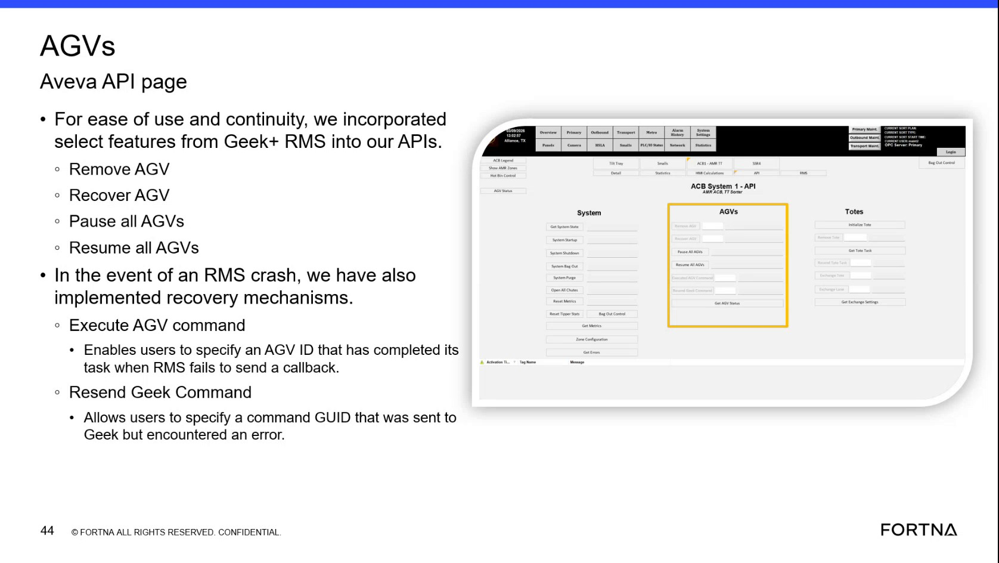

# Execute AGV Command To Complete An AGV Task After A Missed RMS Callback

## Runbook Header

| Field | Value |
| --- | --- |
| Procedure ID | `proc_execute_agv_command_to_complete_an_agv_task_after_a_missed_callback_v1` |
| Title | Execute AGV Command To Complete An AGV Task After A Missed RMS Callback |
| Procedure Type | `recovery` |
| Primary Role | `L2_support` |
| Supporting Roles | None |
| Support Safe | Yes |
| Validation Status | `needs_sme_review` |
| Merge Status | `source_finalized` |

## Summary

Use the Aveva-exposed Execute AGV command as a recovery mechanism when RMS crashes or fails to send the callback for an AGV task that has already completed physically. The user specifies the full AGV ID so the software can complete the AGV task.

## When To Use

Use this procedure when an AGV has already completed its task physically, but RMS failed to send or process the completion callback, including RMS crash-related recovery described in the source.

## Do Not Use For

* Do not use when the correct full AGV ID is not known.
* Do not use to complete a task that has not already completed physically.
* Do not treat this runbook as a restart procedure; the source only provides a related safety note that the system should be E-stopped before doing a restart.

## Safety And Operational Notes

* This source describes the action as a recovery mechanism.
* Related safety note from the same source context: the system should be E-stopped before doing a restart.
* The source does not provide operator guardrails for broader use of this recovery action; keep execution limited to support personnel.

## Access Or Tools Needed

* Access to the Aveva interface or API page with AGV commands
* The full AGV ID
* Knowledge of which AGV task already completed physically

## Related Operational Context

* ctx_training_video_execute_agv_command_recovery_v1
* ctx_training_video_estop_before_restart_safety_note_v1

## Procedure Steps

### Step 1 — Open the AGVs Aveva API area

**Responsible role:** L2_support

**Instruction:**
Open the Aveva interface or API area where AGV-related commands are available.

**Expected result:**
The AGV-related Aveva API page is open and available for use.

**Screens / Images:**

*AGVs Aveva API page showing exposed AGV command functions and recovery actions.*

**Stop or Escalate If:**

* The AGVs Aveva API page cannot be located or accessed.

---

### Step 2 — Locate Execute AGV command

**Responsible role:** L2_support

**Instruction:**
Locate the recovery mechanism named Execute AGV command.

**Expected result:**
The Execute AGV command input or control is identified on the AGVs Aveva API page.

**Screens / Images:**

*Recovery functions on the AGVs Aveva API page, including Execute AGV command.*

**Stop or Escalate If:**

* The Execute AGV command is not present where expected.

---

### Step 3 — Identify the affected AGV

**Responsible role:** L2_support

**Instruction:**
Identify the AGV that has already completed its task but did not get its completion callback processed by RMS.

**Expected result:**
A single affected AGV is identified for recovery.

**Stop or Escalate If:**

* The correct AGV is not known.
* It is not confirmed that the AGV task already completed physically.

---

### Step 4 — Enter the full AGV ID

**Responsible role:** L2_support

**Instruction:**
Specify the full AGV ID in the Execute AGV command input.

**Expected result:**
The full AGV ID is entered into the Execute AGV command input.

**Screens / Images:**

*Execute AGV command area referenced by the training slide; use the input associated with AGV recovery actions.*

**Stop or Escalate If:**

* The full AGV ID is not known.
* There is uncertainty about whether the entered AGV ID is correct.

---

### Step 5 — Execute the recovery command

**Responsible role:** L2_support

**Instruction:**
Execute the command so the software completes the AGV task.

**Expected result:**
The AGV task is completed in software using the specified full AGV ID.

**Screens / Images:**

*AGV recovery command area associated with Execute AGV command on the AGVs Aveva API page.*

**Stop or Escalate If:**

* The command does not complete the task as expected.
* The resulting software state does not reflect task completion for the specified AGV.

---

## Success Criteria

* The correct Execute AGV command is accessed in the Aveva AGV command area.
* The full AGV ID for the already-completed task is specified.
* The AGV task is completed in software after the missed callback condition.

## Failure Conditions

* The AGVs Aveva API page or Execute AGV command cannot be accessed.
* The correct AGV cannot be identified.
* The full AGV ID is not known or is uncertain.
* The command does not complete the AGV task as expected.

## Escalation Guidance

* Escalate if the correct AGV ID is not known.
* Escalate if the command does not complete the task as expected.
* If restart-related recovery is being considered in the broader incident, preserve the source safety note that the system should be E-stopped before doing a restart.

## Missing Details / Known Gaps

* The exact Aveva navigation path is not provided in the source.
* The exact button labels and field labels for Execute AGV command are not provided in the source.
* The source does not provide confirmation text, response messages, or explicit verification steps after execution.
* The source does not provide a time estimate for this procedure.
* The source does not specify whether production stop or LOTO is required for this action.

## Source Lineage

- Candidate IDs: candidate_training_video_execute_completed_agv_command_after_missed_callback
- Source ID: `training_video_day1`
- Source Type: `training_video`
