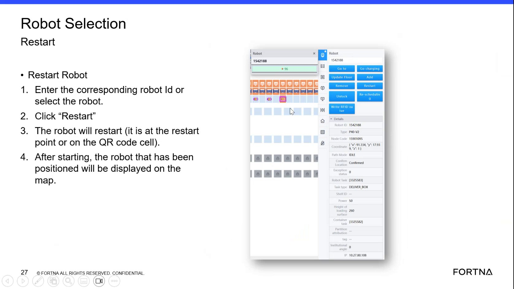
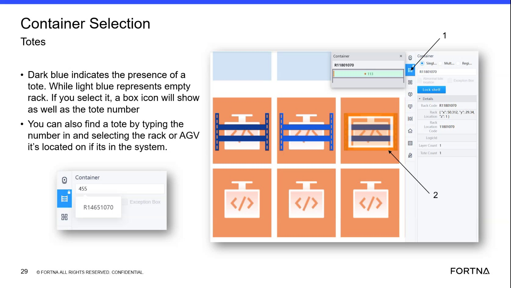

# Find A Tote By Tote Number In The Container Section

## Runbook Header

| Field | Value |
| --- | --- |
| Procedure ID | `proc_find_a_tote_by_tote_number_in_the_container_section_v1` |
| Title | Find A Tote By Tote Number In The Container Section |
| Procedure Type | `operation` |
| Primary Role | `operator` |
| Supporting Roles | None |
| Support Safe | Yes |
| Validation Status | `needs_sme_review` |
| Merge Status | `source_finalized` |

## Summary

Use the RMS container section to search for a tote by tote number so the system moves the map to the tote's current location in the system.

## When To Use

Use this procedure when you need to locate where a tote is currently represented in the system by entering its tote number in the container section and reviewing the map location the system navigates to.

## Do Not Use For

* Do not use this runbook as a procedure for tote swap, tote removal, or tote re-add actions; this source mentions those actions but does not provide enough procedural detail here to extract them safely as steps.

## Safety And Operational Notes

* Use only the tote lookup behavior supported by this source.
* Do not infer or perform swap, remove, or re-add recovery actions from this segment alone.

## Access Or Tools Needed

* Access to the RMS/container section
* Tote number to search

## Related Operational Context

* ctx_training_video_tote_search_container_section_v1

## Procedure Steps

### Step 1 — Open the container section

**Responsible role:** operator

**Instruction:**
Open the container section in the RMS interface.

**Expected result:**
The container section is visible and ready for tote number entry.

**Screens / Images:**

*Container section area used for tote lookup.*

*Container Selection screen and the area where tote or location lookup is performed.*

**Stop or Escalate If:**

* Stop if the container section cannot be opened or the lookup area is not available.

---

### Step 2 — Enter the tote number

**Responsible role:** operator

**Instruction:**
Enter the tote number into the container section search field.

**Expected result:**
The tote number is entered in the container section lookup field.

**Screens / Images:**

*The tote number entry area in the container section.*

**Stop or Escalate If:**

* Stop if the tote number is unavailable or cannot be entered.

---

### Step 3 — Run the tote lookup

**Responsible role:** operator

**Instruction:**
Submit or use the lookup function so the system navigates to that tote's location on the map.

**Expected result:**
The system takes the user to the part of the map where the tote is currently shown in the system.

**Screens / Images:**

*The map behavior after tote lookup, where the system takes the user to the tote's location.*

**Stop or Escalate If:**

* Stop if the lookup does not navigate to a tote location.
* Escalate if the tote is not found where expected.

---

### Step 4 — Observe the mapped tote location

**Responsible role:** operator

**Instruction:**
Observe the map area the system takes you to and identify where the tote is shown in the system.

**Expected result:**
The user can identify the tote's current system location on the map.

**Screens / Images:**

*The part of the map where the tote has been added or is currently shown in the system.*

*Container selection map indicators and tote/rack display cues.*

**Stop or Escalate If:**

* Escalate if the tote cannot be identified on the map after lookup.

---

### Step 5 — Compare to expected location if needed

**Responsible role:** operator

**Instruction:**
If needed, compare the located tote position to the expected physical location or expected rack.

**Expected result:**
The user determines whether the system location matches the expected location.

**Screens / Images:**

*The located tote position on the map for comparison to the expected rack or physical location.*

**Stop or Escalate If:**

* Escalate if the tote is not found where expected.
* Record the mismatch if the system location does not match the expected location.

---

## Success Criteria

* The tote number can be entered in the container section.
* The system takes the user to the part of the map where the tote is currently represented in the system.
* The user can identify the tote's current system location.

## Failure Conditions

* The container section or lookup field is not accessible.
* The tote number cannot be entered or searched.
* The map does not navigate to a tote location.
* The tote is not found where expected.
* The source does not provide enough detail to proceed into swap, remove, or re-add actions.

## Escalation Guidance

* If the tote is not found where expected, record the mismatch and continue with a separate source-backed recovery procedure if available.
* Do not perform swap, remove, or re-add actions from this runbook because this segment does not provide enough procedural detail to support them safely.

## Missing Details / Known Gaps

* The source does not specify the exact button name, key press, or control used to submit the tote lookup.
* The source does not define exact error messages or system responses when a tote is not found.
* The source does not provide a formal role boundary beyond operator-level use.
* The source does not provide a time estimate for completing the lookup.
* The source mentions swap, remove, and re-add actions but does not provide enough detail here to include those procedures.

## Source Lineage

- Candidate IDs: candidate_training_video_find_tote_by_tote_number_in_container_section
- Source ID: `training_video_day1`
- Source Type: `training_video`
