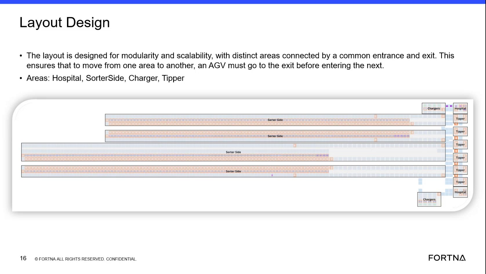

# Handle Hospital Exceptions Caused By Tipper Tote Detection Or Clamp Failures

## Runbook Header

| Field | Value |
| --- | --- |
| Procedure ID | `proc_handle_hospital_exceptions_caused_by_tipper_tote_detection_or_clamp_failures_v1` |
| Title | Handle Hospital Exceptions Caused By Tipper Tote Detection Or Clamp Failures |
| Procedure Type | `reference` |
| Primary Role | `operator` |
| Supporting Roles | `L1_support` |
| Support Safe | Yes |
| Validation Status | `needs_sme_review` |
| Merge Status | `source_finalized` |

## Summary

Reference guidance from the training source for recognizing tipper exception conditions that route an item or AGB to the hospital, and for monitoring the hospital area for those exceptions. The source identifies tote visibility problems at the photo sensors and inability to clamp fully as example causes, and states that the hospital is typically monitored by a supervisor or nearby tipper positions rather than a dedicated operator.

## When To Use

Use this reference when observing tipper operations or hospital flow and you need to recognize source-described exception patterns that cause an item or AGB to be sent to the hospital, and to understand how the hospital area is typically monitored.

## Do Not Use For

* Do not use this as a corrective procedure for resolving hospital items after arrival, because the source does not provide detailed hospital handling steps.
* Do not use this as authority for maintenance, controls changes, AGV removal, or recovery actions not described in this source segment.

## Safety And Operational Notes

* This source segment is observational/reference guidance only and does not provide physical intervention steps.
* Stop or escalate if handling the hospital item would require actions not described in the source.

## Access Or Tools Needed

* Visual access to the tipper tote position
* Ability to observe photo-sensor-related tote visibility at the tipper
* Ability to observe clamp or grip behavior
* Access to or visibility of the hospital area
* Audible awareness of the hospital alert mentioned in the source

## Related Operational Context

* ctx_training_video_hospital_exception_area_v1
* ctx_training_video_hospital_staffing_reference_v1

## Procedure Steps

### Step 1 — Check whether the tote is visible to the photo sensors

**Responsible role:** operator

**Instruction:**
At the tipper, observe whether the tote is positioned so the photo sensors can see it correctly. Use the source examples of the tote being pushed back too far or being on its side as indicators that the tote may not be seen correctly.

**Expected result:**
The observer can determine whether the tote appears correctly positioned for sensor detection or matches a source-described misposition condition.

**Screens / Images:**

*Hospital area in the layout and the nearby transcript context describing tote visibility failures at the tipper.*

**Stop or Escalate If:**

* The tote visibility problem requires corrective handling steps not described in the source.

---

### Step 2 — Observe whether the tipper can clamp the tote fully

**Responsible role:** operator

**Instruction:**
Observe whether the tipper can clamp or grip the tote fully during the tipper process.

**Expected result:**
The observer can determine whether the clamp fully engages the tote or whether the source-described clamp failure condition is present.

**Screens / Images:**

*Transcript-supported context that inability to clamp fully is a hospital-routing exception.*

**Stop or Escalate If:**

* Clamp failure requires corrective or maintenance actions not described in the source.

---

### Step 3 — Recognize hospital routing when detection or clamp failure occurs

**Responsible role:** operator

**Instruction:**
If the source-described condition is that the system cannot see the tote correctly or cannot clamp down fully, recognize that the item or AGB is sent to the hospital.

**Expected result:**
The observer understands that the documented exception outcome is hospital routing.

**Screens / Images:**

*Hospital area shown in the layout and transcript context linking tipper exceptions to hospital routing.*

**Stop or Escalate If:**

* The situation requires a recovery or corrective workflow not provided in this source.

---

### Step 4 — Monitor the hospital area for arriving exceptions

**Responsible role:** operator

**Instruction:**
Monitor the hospital area for arriving exceptions, noting that the source says it is usually watched by a supervisor or nearby tipper positions rather than continuously manned.

**Expected result:**
Hospital arrivals are noticed by shared coverage rather than a dedicated station operator.

**Screens / Images:**

*Hospital area location in the layout and transcript context stating the hospital is not a continuously manned station.*

**Stop or Escalate If:**

* No one is available to monitor or respond to hospital items as described in the source.
* Handling the hospital item requires steps not described in the source.

---

### Step 5 — Use the audible indication to notice hospital items

**Responsible role:** operator

**Instruction:**
Use the audible indication mentioned in the source to help notice hospital items that need attention, if present.

**Expected result:**
Audible indication helps draw attention to hospital exceptions.

**Stop or Escalate If:**

* The audible indication is absent or insufficient and the item requires handling steps not described in the source.

---

## Success Criteria

* Source-described tipper exception conditions are recognized correctly.
* The observer understands that tote visibility failures or inability to clamp fully route the item or AGB to the hospital.
* The hospital area is monitored in accordance with the source-described shared coverage model.

## Failure Conditions

* Photo sensors do not see the tote correctly.
* The tote is pushed back too far or on its side, as described in the source examples.
* The system cannot clamp down fully.
* A hospital item requires corrective handling steps not provided by this source.

## Escalation Guidance

* Escalate or stop if handling the hospital item would require steps not described in the source.
* Escalate if the exception requires corrective, maintenance, or recovery actions beyond recognizing and monitoring the condition.
* Escalate if hospital monitoring coverage is not available as described by the source.

## Missing Details / Known Gaps

* The source does not provide detailed corrective actions for hospital items after arrival.
* The source does not define exact operator versus supervisor handoff rules beyond shared monitoring coverage.
* The source does not provide commands, HMI steps, timing estimates, or escalation contacts for this exception flow.
* The source section text field is empty in the packet, so grounding relies on candidate evidence, artifact retrieval text, and context records from the same source.

## Source Lineage

- Candidate IDs: candidate_training_video_handle_hospital_exceptions_from_tipper_detection_or_clamp_failures
- Source ID: `training_video_day1`
- Source Type: `training_video`
