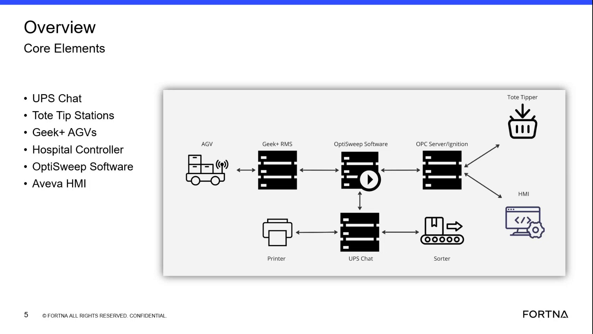

# Identify The Hospital Controller As The Component Used To Remove And Add Totes

## Runbook Header

| Field | Value |
| --- | --- |
| Procedure ID | `proc_identify_hospital_controller_as_component_used_to_remove_and_add_totes_v1` |
| Title | Identify The Hospital Controller As The Component Used To Remove And Add Totes |
| Procedure Type | `reference` |
| Primary Role | `operator` |
| Supporting Roles | None |
| Support Safe | Yes |
| Validation Status | `needs_sme_review` |
| Merge Status | `source_finalized` |

## Summary

Use the training overview slide and transcript to verify that the hospital controller is the component identified in this source as being used to remove and add totes.

## When To Use

Use this reference procedure when a user needs to identify which component on the OptiSweep overview architecture is described in the training source as handling tote removal and tote addition.

## Do Not Use For

* Do not use this as a detailed operating procedure for physically removing or adding totes.
* Do not use this to infer button presses, HMI workflow, controller commands, or recovery actions not stated in the source.
* Do not use this to determine AGV, tote tip station, or OptiSweep Software operating responsibilities beyond what is explicitly shown on the overview slide.

## Safety And Operational Notes

* This source is a component-identification reference only.
* Do not infer or perform tote add/remove operations from this segment alone.
* Escalate if a detailed operating procedure is required because this source does not provide action steps, controls, or screen workflow for tote handling.

## Access Or Tools Needed

* Access to the training video segment or extracted slide
* Transcript for the segment

## Related Operational Context

* ctx_training_video_hospital_controller_tote_handling_v1
* ctx_training_video_core_elements_architecture_v1

## Procedure Steps

### Step 1 — Locate the hospital controller on the overview slide

**Responsible role:** operator

**Instruction:**
Open the overview training slide and locate the hospital controller label in the architecture diagram.

**Expected result:**
The hospital controller is visible as one of the labeled core elements on the slide.

**Screens / Images:**

*Look for the hospital controller label among the core elements shown with UPS Chat, tote tipper or tote tip stations, Geek+ AGVs, OptiSweep software, sorter, printer, and Aveva HMI.*

**Stop or Escalate If:**

* Escalate if the overview slide cannot be accessed.
* Escalate if the hospital controller label is not legible in the available artifact.

---

### Step 2 — Confirm the transcript statement about tote handling

**Responsible role:** operator

**Instruction:**
Confirm from the transcript that the hospital controller is described as the component used to remove and add totes.

**Expected result:**
The transcript explicitly states that the hospital controller is for removing and adding totes.

**Stop or Escalate If:**

* Escalate if the transcript is unavailable.
* Escalate if a more detailed tote handling procedure is needed, because this source only identifies the component role.

---

### Step 3 — Differentiate the hospital controller from other components

**Responsible role:** operator

**Instruction:**
Compare the hospital controller label on the diagram with the other listed components so the tote add/remove role is not confused with AGVs, tote tip stations, or OptiSweep Software.

**Expected result:**
The user distinguishes the hospital controller from the other architecture components shown on the slide.

**Screens / Images:**

*Compare the hospital controller label against the other labeled core elements on the overview slide.*

**Stop or Escalate If:**

* Stop if the role is being inferred for components not explicitly assigned that role in the source.
* Escalate if the user needs authoritative functional boundaries for other components beyond this overview segment.

---

### Step 4 — Record the identified component role

**Responsible role:** operator

**Instruction:**
Record that the source assigns tote removal and tote addition activity to the hospital controller.

**Expected result:**
The user documents that the hospital controller is the source-identified component for tote removal and tote addition.

**Stop or Escalate If:**

* Stop if documentation begins to include unsupported tote handling steps.
* Escalate if a detailed operating or recovery procedure is requested.

---

## Success Criteria

* The user identifies the hospital controller on the overview architecture slide.
* The user verifies from the transcript that the hospital controller is the component used to remove and add totes.
* The user does not confuse this role with AGVs, tote tip stations, or OptiSweep Software.
* The recorded conclusion stays within the source-supported statement.

## Failure Conditions

* The slide or transcript cannot be accessed or verified.
* The hospital controller cannot be distinguished from other components on the overview slide.
* The user attempts to derive unsupported tote handling steps from this source.

## Escalation Guidance

* Escalate to SME review if a detailed tote add/remove operating procedure is needed.
* Escalate if users need screen-level workflow, button presses, or controller interactions, because this source does not provide them.
* Escalate if there is uncertainty about the responsibilities of other architecture components beyond the overview statement.

## Missing Details / Known Gaps

* The source does not provide a detailed tote removal procedure.
* The source does not provide a detailed tote addition procedure.
* The source does not provide HMI screens, button presses, commands, or controller interactions for tote handling.
* The source does not define escalation contacts or role boundaries beyond general operator use.

## Source Lineage

- Candidate IDs: candidate_training_video_identify_hospital_controller_role_for_tote_add_remove
- Source ID: `training_video_day1`
- Source Type: `training_video`
