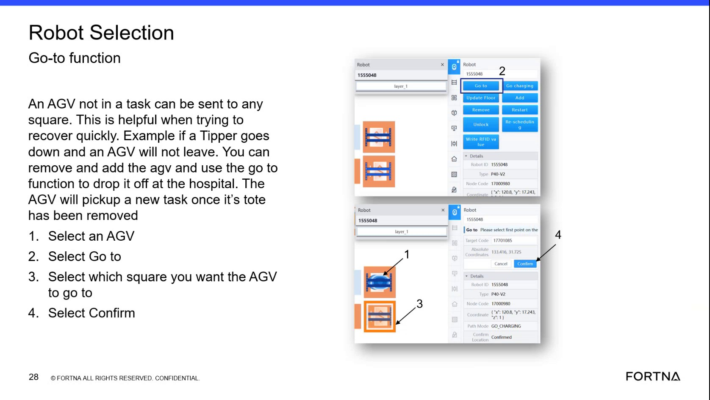
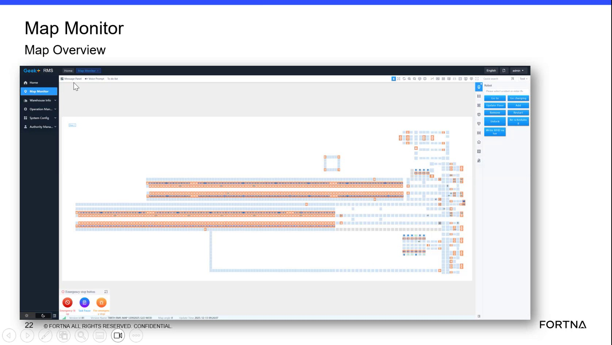

# Identify What A Screen Symbol Represents By Selecting It

## Runbook Header

| Field | Value |
| --- | --- |
| Procedure ID | `proc_identify_what_a_screen_symbol_represents_by_selecting_it_v1` |
| Title | Identify What A Screen Symbol Represents By Selecting It |
| Procedure Type | `reference` |
| Primary Role | `operator` |
| Supporting Roles | None |
| Support Safe | Yes |
| Validation Status | `needs_sme_review` |
| Merge Status | `source_finalized` |

## Summary

This source-backed reference procedure describes using the OptiSweep/RMS screen to identify what a symbol represents by selecting it and reviewing the information shown. The training also notes that the PowerPoint may provide supporting explanation.

## When To Use

Use when a user needs to determine what a visible screen symbol represents and the interface provides additional information after the symbol is selected.

## Do Not Use For

* Do not use to infer symbol meanings that are not explicitly shown on the screen or in the referenced training material.
* Do not use as a complete symbol dictionary; the source does not provide the full symbol set, exact screen, or all displayed fields.

## Safety And Operational Notes

* Use only the informational behavior supported by the source: selecting a symbol to view what it represents.
* Do not infer meanings beyond what the screen or referenced PowerPoint explicitly provides.
* The source does not specify the exact screen, symbol set, or displayed fields.

## Access Or Tools Needed

* Access to the screen containing the symbols
* Referenced training PowerPoint if available

## Related Operational Context

* ctx_training_video_selected_symbol_meaning_reference_v1

## Procedure Steps

### Step 1 — Locate the symbol to identify

**Responsible role:** operator

**Instruction:**
Locate the symbol on the screen that you want to identify.

**Expected result:**
The target symbol is visually identified and ready to be selected.

**Screens / Images:**

*General interface area referenced in the training segment where selecting items reveals more information, including nearby mention of symbol meaning.*

**Stop or Escalate If:**

* Stop if the symbol is not visible on the available screen.
* Escalate if you cannot determine whether you are on the correct screen because the source does not specify the exact interface.

---

### Step 2 — Select the symbol

**Responsible role:** operator

**Instruction:**
Select the symbol.

**Expected result:**
The interface responds to the selection and displays information associated with the symbol.

**Screens / Images:**

*The training segment associated with the statement that selecting the symbol helps indicate what it represents.*

**Stop or Escalate If:**

* Stop if selecting the symbol does not produce any visible information.
* Escalate if the interface behavior differs from the training description.

---

### Step 3 — Review the displayed information

**Responsible role:** operator

**Instruction:**
Observe the displayed information to determine what the selected symbol represents.

**Expected result:**
The user can identify the meaning or represented object of the selected symbol from the displayed information.

**Screens / Images:**

*Right-side panel referenced in training as an area that gives more information after selection.*

**Stop or Escalate If:**

* Stop if the displayed information does not explicitly identify the symbol.
* Escalate if the interface shows information that is unclear and no supporting training material is available.

---

### Step 4 — Check the referenced PowerPoint if needed

**Responsible role:** operator

**Instruction:**
If needed, compare what you see to the referenced PowerPoint material mentioned in the training.

**Expected result:**
The PowerPoint provides supporting explanation that helps confirm what the symbol represents.

**Stop or Escalate If:**

* Escalate if the symbol meaning remains unclear after checking the available training material.
* Stop if no referenced PowerPoint is available and the screen does not explicitly identify the symbol.

---

## Success Criteria

* The selected symbol's meaning or represented object is identified from the displayed information.
* If needed, the referenced PowerPoint confirms the interpretation.

## Failure Conditions

* The source does not specify the exact screen, symbol set, or displayed fields.
* The interface does not show enough information after selection to determine the symbol meaning.
* The user attempts to infer meaning beyond what the screen or referenced training material explicitly provides.

## Escalation Guidance

* Escalate for SME review if the symbol meaning is still unclear after selection and review of the referenced training material.
* Escalate if the current interface does not behave as described in the training segment.

## Missing Details / Known Gaps

* The source does not specify the exact screen where the symbol appears.
* The source does not provide the full symbol set.
* The source does not specify the exact fields or panel contents shown after selection.
* No command-line or API commands are provided in the source for this procedure.

## Source Lineage

- Candidate IDs: candidate_training_video_identify_symbol_meaning_by_selecting_it
- Source ID: `training_video_day1`
- Source Type: `training_video`
