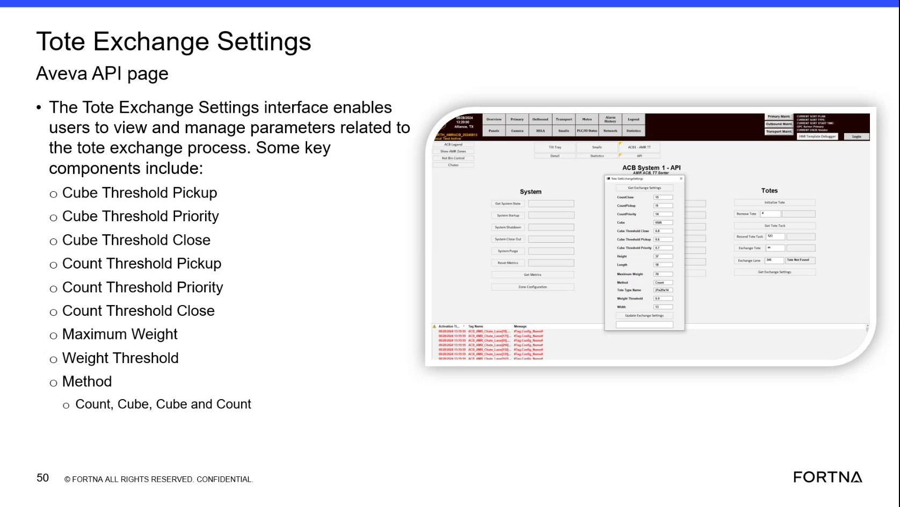

# Identify Who Can Update Tote Exchange Settings And Note Project Finalization Context

## Runbook Header

| Field | Value |
| --- | --- |
| Procedure ID | `proc_identify_who_can_update_tote_exchange_settings_and_note_project_finalization_context_v1` |
| Title | Identify Who Can Update Tote Exchange Settings And Note Project Finalization Context |
| Procedure Type | `reference` |
| Primary Role | `L1_support` |
| Supporting Roles | None |
| Support Safe | Yes |
| Validation Status | `needs_sme_review` |
| Merge Status | `source_finalized` |

## Summary

Use the training segment on Tote Exchange Settings to document the source-backed ownership context: the settings can be updated by the customer, but are generally finalized with the project team and UPS at the end of UAT. This runbook is for recording that distinction only and does not define permissions, approvals, or production change authority.

## When To Use

Use when documenting or answering questions about the source-stated ownership context for Tote Exchange Settings, especially when distinguishing who can update the settings versus how they are generally finalized during the project lifecycle.

## Do Not Use For

* Determining actual access control or permission models
* Defining approval rules for production changes
* Assigning escalation paths for configuration changes
* Deciding who should make production changes from this source alone

## Safety And Operational Notes

* This is a documentation/reference procedure only.
* Do not infer approval authority, access permissions, or operational change ownership beyond the source statement.

## Access Or Tools Needed

* Access to the training segment transcript or notes

## Related Operational Context

* ctx_training_video_tote_exchange_settings_ownership_v1

## Procedure Steps

### Step 1 — Review the Tote Exchange Settings training segment

**Responsible role:** L1_support

**Instruction:**
Review the Tote Exchange Settings training segment and note the statement about who can update the settings.

**Expected result:**
The relevant source statement is identified in the training segment.

**Screens / Images:**

*Tote Exchange Settings interface and the segment associated with the statement about customer updates and UAT finalization.*

**Stop or Escalate If:**

* The source segment cannot be accessed or verified.
* A stronger ownership or permission statement is required than what this source provides.

---

### Step 2 — Record customer update capability

**Responsible role:** L1_support

**Instruction:**
Record that the source says these settings can be updated by the customer.

**Expected result:**
Documentation includes the statement that the customer can update the settings.

**Screens / Images:**

*The Tote Exchange Settings page associated with the statement that these settings can be updated by the customer.*

**Stop or Escalate If:**

* Someone requests confirmation of actual access permissions or approval authority.
* The documentation needs a production change owner not stated in the source.

---

### Step 3 — Record UAT finalization context

**Responsible role:** L1_support

**Instruction:**
Record that the source also says the settings are generally finalized with the project team and UPS at the end of UAT.

**Expected result:**
Documentation includes the statement that the settings are generally finalized with the project team and UPS at the end of UAT.

**Screens / Images:**

*The Tote Exchange Settings segment tied to the statement about finalization with the project team and UPS at the end of UAT.*

**Stop or Escalate If:**

* A formal approval workflow is needed.
* A definitive production governance statement is required beyond the source wording.

---

### Step 4 — Distinguish update capability from finalization context

**Responsible role:** L1_support

**Instruction:**
When documenting the configuration ownership context, distinguish between update capability and finalization context exactly as stated in the source.

**Expected result:**
The final note clearly separates customer update capability from general end-of-UAT finalization context.

**Stop or Escalate If:**

* The distinction cannot be preserved without making unsupported assumptions.
* Stakeholders require a formal ownership model not defined in the source.

---

### Step 5 — Avoid unsupported ownership or approval claims

**Responsible role:** L1_support

**Instruction:**
Do not assign approval rules, access permissions, or escalation paths that are not explicitly provided by the source.

**Expected result:**
The documentation remains limited to the source-backed ownership context.

**Stop or Escalate If:**

* A stronger ownership, approval, or permission statement is needed because this source does not define access control details.
* Someone asks who should make production changes based on this source alone.

---

## Success Criteria

* A source-backed note states that Tote Exchange Settings can be updated by the customer.
* The same note states that the settings are generally finalized with the project team and UPS at the end of UAT.
* The documentation clearly distinguishes update capability from finalization context.
* No unsupported approval, permission, or escalation details are added.

## Failure Conditions

* The source statement cannot be verified from the referenced training segment.
* The documentation infers access control or approval authority not stated in the source.
* The documentation omits either the customer update statement or the end-of-UAT finalization context.

## Escalation Guidance

* Escalate if a stronger ownership, approval, or permission statement is needed because this source does not define access control details.
* Do not infer who should make production changes from this source alone.

## Missing Details / Known Gaps

* The source does not define actual access permissions or access control mechanisms.
* The source does not define approval rules for changing Tote Exchange Settings.
* The source does not define escalation paths for configuration ownership disputes.
* The source does not specify who should make production changes after UAT.

## Source Lineage

- Candidate IDs: candidate_training_video_identify_tote_exchange_settings_update_ownership
- Source ID: `training_video_day1`
- Source Type: `training_video`
