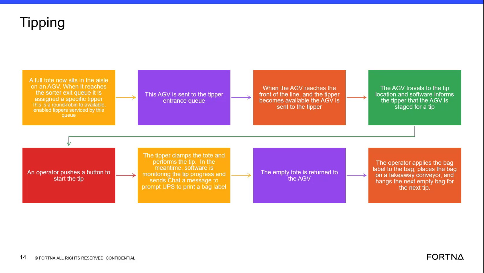
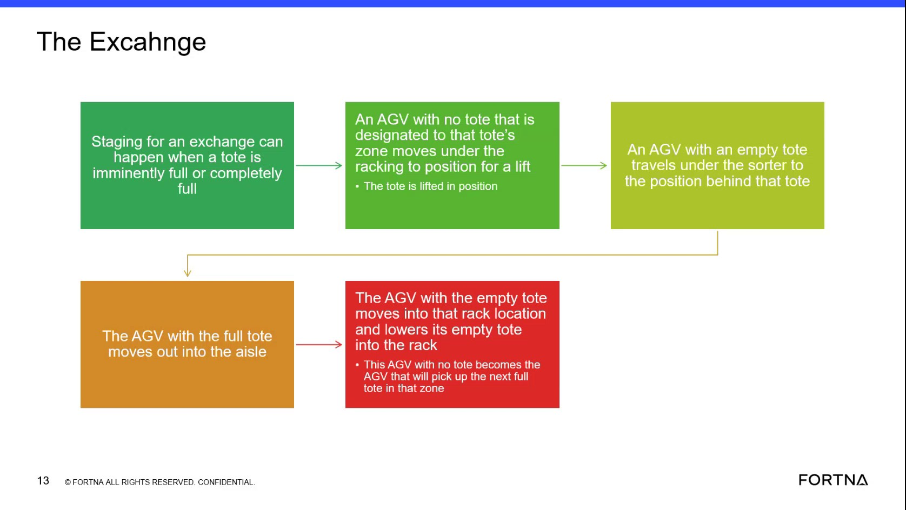

# Interpret An AGV Departure Without A Replacement AGV Behind It

## Runbook Header

| Field | Value |
| --- | --- |
| Procedure ID | `proc_interpret_an_agv_departure_without_a_replacement_agv_behind_it_v1` |
| Title | Interpret An AGV Departure Without A Replacement AGV Behind It |
| Procedure Type | `reference` |
| Primary Role | `L1_support` |
| Supporting Roles | None |
| Support Safe | Yes |
| Validation Status | `needs_sme_review` |
| Merge Status | `source_finalized` |

## Summary

Use the training-source explanation of AGV exchange behavior to interpret a visible gap when a front AGV moves out without another AGV replacing it behind. The documented meaning is that normal exchange behavior is paired, so a gap likely indicates the trailing AGV faulted or was not backfilled properly.

## When To Use

Use when a user or support person observes a front AGV move out and no replacement AGV appears behind it, and the goal is to interpret that condition using the training source's documented AGV exchange behavior.

## Do Not Use For

* Do not use to infer causes beyond the source-described explanations of trailing AGV fault or improper backfill.
* Do not use as a repair or recovery procedure; this runbook only supports interpretation of the observed condition.

## Safety And Operational Notes

* This is a reference/interpretation procedure only and does not direct physical intervention.
* Do not infer additional causes beyond the source-described fault or improper backfill explanation.

## Access Or Tools Needed

* Visual access to the AGV station or aisle
* Source-described AGV exchange behavior reference

## Related Operational Context

* ctx_training_video_agv_exchange_pairing_v1

## Procedure Steps

### Step 1 — Confirm the visible AGV gap condition

**Responsible role:** L1_support

**Instruction:**
Observe the station or aisle and confirm that a front AGV moved out without another AGV replacing it behind.

**Expected result:**
The observed condition is clearly identified as a front AGV departure with no visible replacement AGV behind it.

**Screens / Images:**

*The training frame and transcript describing the case where an AGV moves out without another one replacing it.*

**Stop or Escalate If:**

* Escalate if the observed movement does not clearly match the documented scenario of a front AGV moving out without replacement.

---

### Step 2 — Compare the observation to normal paired exchange behavior

**Responsible role:** L1_support

**Instruction:**
Use the documented exchange behavior as the comparison point: the front AGV will not move until there is an AGV behind it because software sends both commands at the same time.

**Expected result:**
The observer understands that normal exchange behavior is paired and should include a trailing AGV behind the front AGV before move-out.

**Screens / Images:**

*The normal exchange sequence showing the AGV with the full tote moving out while the AGV with the empty tote moves into the rack location.*

*The explanation that the front AGV will not move until there is an AGV behind it because software sends both commands at the same time.*

**Stop or Escalate If:**

* Escalate if the observed AGV movement does not match the documented paired-command behavior and no source-supported interpretation can be applied.

---

### Step 3 — Check for the source-described exception condition

**Responsible role:** L1_support

**Instruction:**
Check whether the trailing AGV has a fault or whether the situation appears to match the source-described case where the AGV behind was reported ready for a new task while also faulting, resulting in improper backfill.

**Expected result:**
The observed gap is associated with one of the source-supported exception explanations: trailing AGV fault or improper backfill.

**Screens / Images:**

*The transcript text stating that a missing replacement can happen if the AGV behind faulted or was not backfilled properly.*

**Stop or Escalate If:**

* Escalate if no trailing AGV fault or improper backfill explanation can be confirmed from available evidence.
* Stop interpretation at the source-supported causes and do not infer additional causes.

---

### Step 4 — Record the source-supported interpretation

**Responsible role:** L1_support

**Instruction:**
Record that the observed gap is not normal paired exchange behavior and matches the source-described fault or backfill exception.

**Expected result:**
The condition is documented as an abnormal exchange gap consistent with trailing AGV fault or improper backfill.

**Screens / Images:**

*Training slide or frame showing AGV exchange/backfill context behind a departing AGV.*

**Stop or Escalate If:**

* Escalate if the observed AGV movement does not match the documented paired-command behavior and no trailing AGV fault or backfill issue can be confirmed from available evidence.
* Do not record additional causes beyond the source-described fault or improper backfill explanation.

---

## Success Criteria

* The user can interpret the visible AGV gap as a likely trailing AGV fault or improper backfill condition rather than normal exchange behavior.
* The documented interpretation remains limited to the source-supported explanation.

## Failure Conditions

* A front AGV moves out without another AGV replacing it behind.
* The trailing AGV appears faulted or the exchange appears improperly backfilled.
* The observed condition cannot be matched to the documented paired-command behavior using available evidence.

## Escalation Guidance

* Escalate if the observed AGV movement does not match the documented paired-command behavior and no trailing AGV fault or backfill issue can be confirmed from available evidence.
* Do not infer additional causes beyond the source-described fault or improper backfill explanation.

## Missing Details / Known Gaps

* The source does not provide a formal logging location or documentation template for recording the interpretation.
* The source does not provide a specific system screen or fault-check workflow for confirming the trailing AGV fault in this segment.
* The source does not provide a time estimate for completing this interpretation.
* The source does not define supporting roles beyond the inferred L1 support audience.

## Source Lineage

- Candidate IDs: candidate_training_video_interpret_agv_gap_without_replacement
- Source ID: `training_video_day1`
- Source Type: `training_video`
