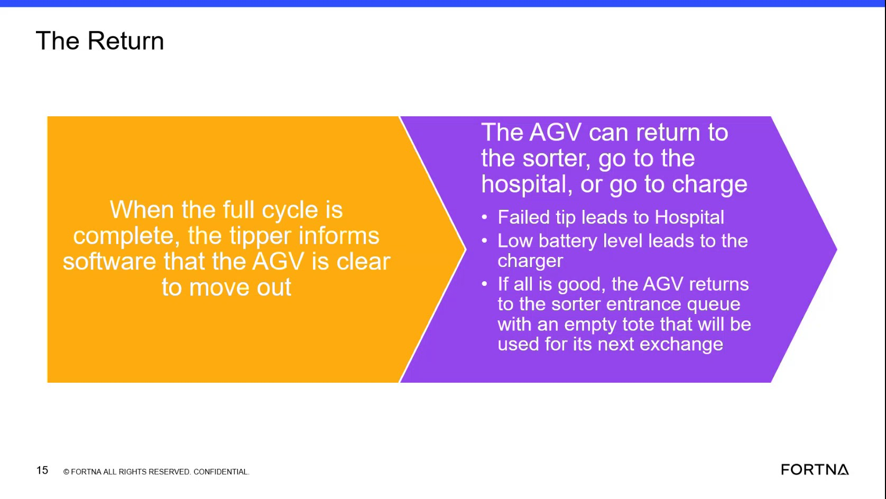

# Interpret AGV Destination After A Completed Cycle

## Runbook Header

| Field | Value |
| --- | --- |
| Procedure ID | `proc_interpret_agv_post_cycle_destination_v1` |
| Title | Interpret AGV Destination After A Completed Cycle |
| Procedure Type | `reference` |
| Primary Role | `operator` |
| Supporting Roles | None |
| Support Safe | Yes |
| Validation Status | `needs_sme_review` |
| Merge Status | `source_finalized` |

## Summary

Use the training-video destination mapping to interpret where an AGV should go after a completed tipper cycle. After the tipper indicates the AGV is clear to move out, the documented outcomes are: failed tip or clamp issue leads to hospital, low battery leads to charger, and otherwise the AGV returns to the sorter entrance queue with an empty tote for the next exchange.

## When To Use

Use this reference when a full tipper cycle has completed and you need to interpret the documented AGV destination based on the source-described post-cycle conditions.

## Do Not Use For

* Do not use this runbook to manually reroute an AGV.
* Do not use this runbook to diagnose root cause beyond the source-described conditions.
* Do not use this runbook to apply additional routing rules not stated in the source.
* Do not use this runbook as a corrective-action procedure for tipper, clamp, hospital, or charger recovery.

## Safety And Operational Notes

* This source is a training/reference aid and does not provide physical intervention steps.
* Do not invent additional routing logic beyond the documented outcomes in the source.

## Access Or Tools Needed

* Access to the training material or documented AGV destination mapping
* Ability to observe or confirm AGV condition after a completed cycle
* Ability to identify whether a failed tip, clamp issue, or low battery condition is present

## Related Operational Context

* ctx_training_video_agv_post_cycle_destinations_v1
* ctx_training_video_tipper_clear_to_move_signal_v1
* ctx_training_video_failed_tip_hospital_routing_v1
* ctx_training_video_low_battery_charge_destination_v1
* ctx_training_video_sorter_entrance_queue_empty_tote_v1

## Procedure Steps

### Step 1 — Confirm completed cycle and clear-to-move status

**Responsible role:** operator

**Instruction:**
Confirm that the full cycle is complete and identify that the tipper has informed the software that the AGV is clear to move out.

**Expected result:**
You have confirmed the AGV is at the post-cycle decision point described by the training source.

**Screens / Images:**

*The training slide statement that when the full cycle is complete, the tipper informs the software that the AGV is clear to move and destination outcomes are then evaluated.*

**Stop or Escalate If:**

* Escalate if the AGV is not at the completed-cycle clear-to-move condition described in the source.

---

### Step 2 — Check for failed tip or clamp issue

**Responsible role:** operator

**Instruction:**
Check whether the AGV had a failed tip or a clamp-related issue. Compare that condition to the documented outcome that a failed tip leads to the hospital.

**Expected result:**
If a failed tip or clamp issue is present, the documented destination is hospital.

**Screens / Images:**

*The slide content and narration showing that failed tip leads to hospital and that clamp issues are associated with hospital routing.*

**Stop or Escalate If:**

* Escalate if a failed tip or clamp-related issue is present but the observed AGV destination does not match the documented hospital outcome.
* Escalate if the condition cannot be interpreted using the source-described categories.

---

### Step 3 — Check for low battery condition

**Responsible role:** operator

**Instruction:**
Check whether the AGV has a low battery level. Compare that condition to the documented outcome that low battery leads to the charger.

**Expected result:**
If low battery is present, the documented destination is charger.

**Screens / Images:**

*The slide content and narration stating that low battery level leads to charger.*

**Stop or Escalate If:**

* Escalate if low battery is present but the observed AGV destination does not match the documented charger outcome.
* Escalate if battery condition cannot be interpreted from the available observation.

---

### Step 4 — Apply normal return outcome when no exception applies

**Responsible role:** operator

**Instruction:**
If neither failed tip nor low battery applies, compare the AGV state to the documented normal outcome that it returns to the sorter entrance queue with an empty tote for the next exchange.

**Expected result:**
If all is good and no exception applies, the documented destination is the sorter entrance queue with an empty tote.

**Screens / Images:**

*The slide content and narration showing the normal outcome: return to the sorter entrance queue with an empty tote for the next exchange.*

**Stop or Escalate If:**

* Escalate if neither failed tip nor low battery applies but the observed AGV destination does not match the documented normal return outcome.

---

### Step 5 — Record the documented destination

**Responsible role:** operator

**Instruction:**
Record the destination indicated by the documented mapping: sorter entrance queue, hospital, or charge.

**Expected result:**
A single documented destination outcome is identified and recorded from the source mapping.

**Screens / Images:**

*The destination options on the training slide: return to sorter, hospital, or charge.*

**Stop or Escalate If:**

* Escalate if the observed AGV destination or condition does not match the documented outcomes in the source.
* Stop and escalate if determining the destination would require inventing additional routing rules.

---

## Success Criteria

* The AGV destination is interpreted using only the source-provided mapping.
* The recorded destination is one of the documented outcomes: sorter entrance queue, hospital, or charge.
* The interpretation is based on completed-cycle clear-to-move status and the source-described condition categories.

## Failure Conditions

* The observed AGV destination does not match the documented outcomes in the source.
* The condition cannot be matched to failed tip/clamp issue, low battery, or normal return.
* Additional routing logic would be required beyond what the source provides.

## Escalation Guidance

* Escalate if the observed AGV destination or condition does not match the documented outcomes in the source.
* Escalate if the AGV appears to require a routing rule not described by the source.
* Do not invent additional routing rules beyond failed tip to hospital, low battery to charger, and otherwise return to the sorter entrance queue.

## Missing Details / Known Gaps

* The source does not provide system navigation steps, controls, or UI fields for checking these conditions.
* The source does not define how to formally record the interpreted destination.
* The source does not provide corrective actions if the observed destination does not match the documented mapping.
* The source does not provide thresholds or exact indicators for low battery.
* The source does not define detailed criteria for distinguishing all possible failure modes beyond failed tip or clamp-related issue.

## Source Lineage

- Candidate IDs: candidate_training_video_interpret_agv_post_cycle_destination
- Source ID: `training_video_day1`
- Source Type: `training_video`
