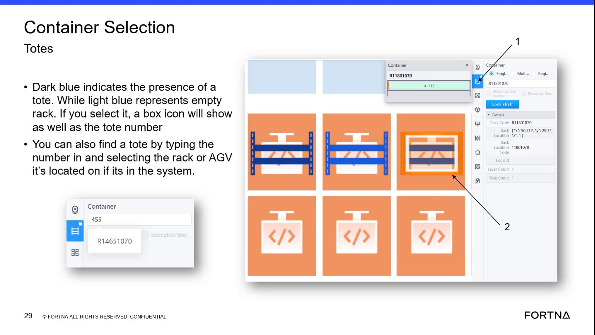

# Interpret Tote Presence And Empty Rack Colors On The Container Selection Screen

## Runbook Header

| Field | Value |
| --- | --- |
| Procedure ID | `proc_interpret_tote_presence_and_empty_rack_colors_on_the_container_selection_screen_v1` |
| Title | Interpret Tote Presence And Empty Rack Colors On The Container Selection Screen |
| Procedure Type | `reference` |
| Primary Role | `operator` |
| Supporting Roles | None |
| Support Safe | Yes |
| Validation Status | `needs_sme_review` |
| Merge Status | `source_finalized` |

## Summary

Use the documented color coding on the Container Selection screen to determine whether a rack location contains a tote or is empty. The source states that dark blue indicates the presence of a tote, light blue represents an empty rack, and selecting an item shows a box icon and the tote number.

## When To Use

Use this reference when viewing the Container Selection screen and you need to determine whether a displayed rack or tote location contains a tote or is empty based on the documented color meanings.

## Do Not Use For

* Do not use this runbook to infer meanings for colors other than dark blue and light blue.
* Do not use this runbook as authority for actions beyond visual interpretation of the Container Selection screen.
* Do not use this runbook to confirm physical tote presence without additional verification if the screen display is unclear or does not match the documented meanings.

## Safety And Operational Notes

* This is a visual reference procedure only; no physical intervention is supported by the source.
* Do not infer additional color meanings beyond those explicitly stated in the source.
* Seek clarification if the displayed color does not match the documented dark blue or light blue meanings.

## Access Or Tools Needed

* Access to the Container Selection screen
* Visual ability to compare displayed colors to the documented meanings

## Procedure Steps

### Step 1 — Open or view the Container Selection screen

**Responsible role:** operator

**Instruction:**
Open or view the Container Selection screen and locate the rack or tote display area.

**Expected result:**
The Container Selection screen is visible and the relevant rack or tote location can be seen.

**Screens / Images:**

*The Container Selection screen color-coded rack area used to interpret tote presence versus empty rack status.*

**Stop or Escalate If:**

* The Container Selection screen cannot be accessed or viewed.
* The rack or tote display area is not visible enough to interpret color state.

---

### Step 2 — Observe the displayed color for the location

**Responsible role:** operator

**Instruction:**
Observe the displayed color for the rack or tote location you want to check.

**Expected result:**
A visible color state is identified for the selected rack or tote location.

**Screens / Images:**

*The color shown for the rack or tote location being checked.*

**Stop or Escalate If:**

* The displayed color cannot be determined.
* The displayed color does not appear to be dark blue or light blue.

---

### Step 3 — Interpret dark blue as tote present

**Responsible role:** operator

**Instruction:**
Interpret dark blue as indicating the presence of a tote.

**Expected result:**
A dark blue location is understood to contain a tote.

**Screens / Images:**

*The dark blue rack or tote state described by the source as indicating tote presence.*

**Stop or Escalate If:**

* The dark blue state is not clearly distinguishable.
* The interface appears inconsistent with the documented meaning.

---

### Step 4 — Interpret light blue as empty rack

**Responsible role:** operator

**Instruction:**
Interpret light blue as representing an empty rack.

**Expected result:**
A light blue location is understood to be empty.

**Screens / Images:**

*The light blue rack state described by the source as representing an empty rack.*

**Stop or Escalate If:**

* The light blue state is not clearly distinguishable.
* The interface appears inconsistent with the documented meaning.

---

### Step 5 — Select the item to verify icon and tote number if needed

**Responsible role:** operator

**Instruction:**
If needed, select the displayed item and verify whether a box icon and tote number appear as described in the source.

**Expected result:**
When selected, the item shows a box icon and the tote number as described by the source.

**Screens / Images:**

*The selected item behavior showing a box icon and tote number.*

**Stop or Escalate If:**

* Selecting the item does not show the expected box icon and tote number.
* The selected item behavior conflicts with the documented source description.

---

## Success Criteria

* The user can distinguish tote-present versus empty-rack states on the Container Selection screen using the documented dark blue and light blue color meanings.
* When additional verification is needed, selecting the displayed item shows a box icon and tote number as described in the source.

## Failure Conditions

* The displayed color does not match the documented dark blue or light blue meanings.
* The displayed color is unclear or cannot be reliably compared to the documented meanings.
* Selecting the item does not show the expected box icon and tote number.
* Additional color meanings are inferred without source support.

## Escalation Guidance

* Escalate or seek clarification if the displayed color does not match the documented dark blue or light blue meanings in the source.
* Do not infer additional color meanings beyond those explicitly stated in the source.
* Seek clarification if the selected item does not show the expected box icon and tote number.

## Missing Details / Known Gaps

* The source does not provide an estimated time for this reference procedure.
* The source does not specify supporting roles beyond the operator.
* The source does not provide explicit navigation steps for opening the Container Selection screen.
* The source does not define any additional color meanings beyond dark blue and light blue.
* The source does not provide command-line or API commands.

## Source Lineage

- Candidate IDs: candidate_training_video_interpret_container_selection_tote_presence_colors
- Source ID: `training_video_day1`
- Source Type: `training_video`
