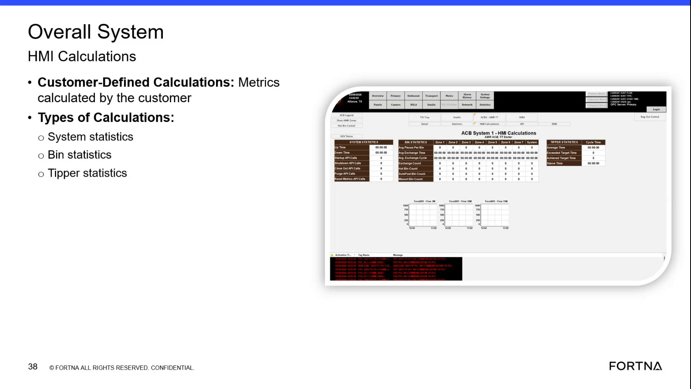

# Identify Customer-Defined Calculation Types In the Overall System HMI

## Runbook Header

| Field | Value |
| --- | --- |
| Procedure ID | `proc_identify_customer_defined_calculation_types_in_the_overall_system_hmi_v1` |
| Title | Identify Customer-Defined Calculation Types In the Overall System HMI |
| Procedure Type | `reference` |
| Primary Role | `operator` |
| Supporting Roles | None |
| Support Safe | Yes |
| Validation Status | `needs_sme_review` |
| Merge Status | `source_finalized` |

## Summary

Use the training slide content to identify which customer-defined calculation categories are documented in the Overall System HMI.

## When To Use

Use this reference when reviewing the Overall System HMI or the associated training slide to identify the documented customer-defined calculation categories shown for Customer-Defined Calculations.

## Do Not Use For

* Do not use this runbook to infer additional calculation types or meanings beyond the categories named in the source.
* Do not use this runbook as navigation guidance for reaching the HMI calculations page, because the source does not provide detailed navigation steps.
* Do not use this runbook to perform calculations, resets, or corrective actions, because the source only documents category identification.

## Safety And Operational Notes

* This is a reference procedure derived from training content and does not describe physical intervention or control actions.
* Do not infer additional calculation types or meanings beyond the categories named in the source.

## Access Or Tools Needed

* Access to the Overall System HMI or the training slide showing Customer-Defined Calculations
* Visual access to the calculation type list

## Related Operational Context

* ctx_training_video_customer_defined_calculations_overview_v1
* ctx_training_video_customer_defined_calculation_types_v1

## Procedure Steps

### Step 1 — View the Customer-Defined Calculations area

**Responsible role:** operator

**Instruction:**
Open or view the Overall System HMI calculations area where customer-defined calculations are shown, or use the training slide that displays this section.

**Expected result:**
The Customer-Defined Calculations area is visible for review.

**Screens / Images:**

*The slide or screen view showing the Overall System HMI Calculations area and the Customer-Defined Calculations heading.*

**Stop or Escalate If:**

* Escalate if the displayed HMI or training material does not show the documented Customer-Defined Calculations section.

---

### Step 2 — Confirm the Customer-Defined Calculations heading

**Responsible role:** operator

**Instruction:**
Locate the 'Customer-Defined Calculations' heading and confirm the screen states that these are 'metrics calculated by the customer.'

**Expected result:**
The heading and descriptive statement match the documented source wording.

**Screens / Images:**

*The 'Customer-Defined Calculations' heading and the text stating these are 'metrics calculated by the customer.'*

**Stop or Escalate If:**

* Escalate if the displayed HMI or training material does not show the documented Customer-Defined Calculations section.

---

### Step 3 — Locate the Types of Calculations list

**Responsible role:** operator

**Instruction:**
Find the 'Types of Calculations' list on the displayed slide or screen.

**Expected result:**
The list of calculation types is visible.

**Screens / Images:**

*The list of calculation types under Customer-Defined Calculations.*

**Stop or Escalate If:**

* Escalate if the displayed HMI or training material does not show the documented Customer-Defined Calculations section.

---

### Step 4 — Identify the documented calculation categories

**Responsible role:** operator

**Instruction:**
Identify the listed calculation categories as system statistics, bin statistics, and tipper statistics.

**Expected result:**
The documented customer-defined calculation categories are identified exactly as shown in the source.

**Screens / Images:**

*The listed category names: system statistics, bin statistics, and tipper statistics.*

**Stop or Escalate If:**

* Do not infer additional calculation types or meanings beyond the categories named in the source.

---

### Step 5 — Record or communicate the category using source wording

**Responsible role:** operator

**Instruction:**
Record or communicate which customer-defined calculation type is being referenced using only the documented category names from the source.

**Expected result:**
The referenced calculation type is recorded or communicated using the exact documented category name.

**Screens / Images:**

*Use the exact category names shown on the slide when recording or communicating the calculation type.*

**Stop or Escalate If:**

* Do not infer additional calculation types or meanings beyond the categories named in the source.

---

## Success Criteria

* The user can identify the documented customer-defined calculation categories in the Overall System HMI as system statistics, bin statistics, and tipper statistics.
* The category is recorded or communicated using only the documented source wording.

## Failure Conditions

* The displayed HMI or training material does not show the documented Customer-Defined Calculations section.
* The heading or list cannot be located or read.
* Additional calculation types or meanings are inferred beyond the source.

## Escalation Guidance

* Escalate if the displayed HMI or training material does not show the documented Customer-Defined Calculations section.
* If the visible content differs from the training source, stop and request SME review rather than inferring meaning or additional categories.

## Missing Details / Known Gaps

* The source does not provide detailed navigation steps for reaching the Overall System HMI calculations area.
* The source does not provide commands, calculations, thresholds, or corrective actions related to these categories.
* The source does not define how to distinguish among categories beyond their names on the slide.
* The source section text is empty in the packet; evidence is derived from source references, artifact retrieval text, and context records.

## Source Lineage

- Candidate IDs: candidate_training_video_interpret_customer_defined_calculation_types
- Source ID: `training_video_day1`
- Source Type: `training_video`
