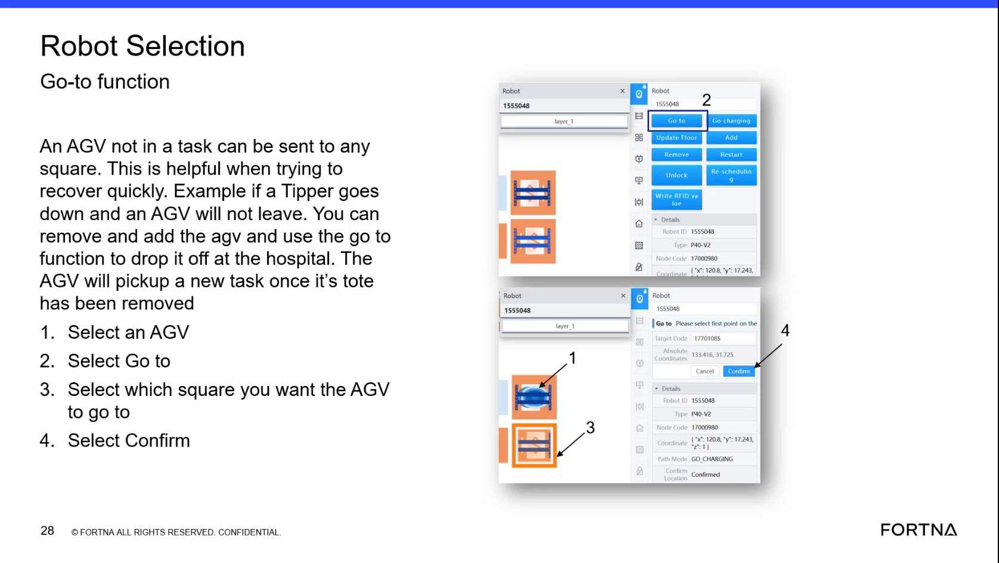

# Interpret A Green AGV State As Ready But Without A Current Task

## Runbook Header

| Field | Value |
| --- | --- |
| Procedure ID | `proc_interpret_a_green_agv_state_as_ready_but_without_a_current_task_v1` |
| Title | Interpret A Green AGV State As Ready But Without A Current Task |
| Procedure Type | `reference` |
| Primary Role | `operator` |
| Supporting Roles | None |
| Support Safe | Yes |
| Validation Status | `needs_sme_review` |
| Merge Status | `source_finalized` |

## Summary

Use this source-backed reference to interpret an AGV shown in green in the interface as ready to execute but not currently assigned a task. The same source also notes that an AGV not in a task can be manually repositioned with the Go to function instead of physically pushing it.

## When To Use

Use when viewing AGV status in the interface and you need to determine what a green AGV state means, or when deciding whether an idle AGV may be repositioned using the Go to function.

## Do Not Use For

* Do not use this runbook to interpret AGV states other than green.
* Do not use this runbook to infer a full AGV status table or undocumented meanings.
* Do not use this runbook as authority to physically push an AGV; the source specifically describes using the Go to function for an AGV not in a task.

## Safety And Operational Notes

* Use the Go to function for manual repositioning of an AGV that is not in a task rather than physically pushing it, as described in the source.
* Do not infer meanings for other AGV colors from this runbook because this candidate is limited to the documented green-state interpretation.

## Access Or Tools Needed

* Access to the AGV status display or interface
* Source-backed green state meaning

## Related Operational Context

* ctx_training_video_agv_green_state_no_task_v1
* ctx_training_video_agv_go_to_function_v1

## Procedure Steps

### Step 1 — Observe the AGV state in the interface

**Responsible role:** operator

**Instruction:**
View the AGV in the interface or status display and determine whether the AGV is shown in green.

**Expected result:**
The operator identifies whether the AGV is displayed in green.

**Screens / Images:**

*Look for the AGV state discussion and Go to function context tied to an AGV that is in green and not in a task.*

**Stop or Escalate If:**

* The displayed AGV state cannot be determined from the interface.
* The AGV is not shown in green and the operator needs a different state interpretation.

---

### Step 2 — Interpret the green state using the source meaning

**Responsible role:** operator

**Instruction:**
Compare the observed green AGV state to the source statement and interpret it as meaning the AGV is ready to execute something but does not currently have a task.

**Expected result:**
The operator correctly interprets the green AGV as ready but without a current task.

**Screens / Images:**

*Use the training frame and transcript segment that explains the green AGV state meaning.*

**Stop or Escalate If:**

* The displayed AGV state does not match the documented green-state meaning in the source.
* Additional interpretation is needed for a non-green state.

---

### Step 3 — Record or communicate the AGV status

**Responsible role:** operator

**Instruction:**
Record or communicate that the AGV is ready but currently idle with no task assigned.

**Expected result:**
The AGV status is communicated as ready but without a current task.

**Stop or Escalate If:**

* There is disagreement about the meaning of the displayed green state.
* The AGV behavior appears inconsistent with being ready but without a task.

---

### Step 4 — Use Go to for manual repositioning if needed

**Responsible role:** operator

**Instruction:**
If repositioning is needed and the AGV is not in a task, use the Go to function described in the source. Select an AGV, select Go to, select which square to send the AGV to, and select Confirm.

**Expected result:**
The AGV is manually directed to a selected square or map cell using the Go to function.

**Screens / Images:**

*Look for the Robot Selection Go to function steps and the explanation that this avoids pushing the AGV.*

**Stop or Escalate If:**

* The AGV is currently in a task.
* The Go to function is unavailable or does not behave as described.
* The operator is being asked to infer additional recovery actions not documented in this source.

---

## Success Criteria

* A green AGV state is interpreted as ready to execute but currently without a task.
* The operator does not infer unsupported meanings for other AGV states.
* If repositioning is needed, the operator uses the Go to function for an AGV not in a task.

## Failure Conditions

* The AGV display does not match the documented green-state meaning.
* The operator attempts to interpret undocumented AGV states using this runbook.
* The AGV is repositioned by unsupported means instead of the documented Go to function.

## Escalation Guidance

* Seek additional support if the displayed AGV state does not match the documented green-state meaning in the source.
* Escalate if a broader AGV state interpretation is needed because this source segment only documents the green state.
* Escalate if the AGV is not in a task but the Go to function cannot be used as described.

## Missing Details / Known Gaps

* The source packet does not provide a direct screenshot solely of the green state indicator; the attached artifact is the closest source-backed visual reference.
* The source does not provide a formal logging method, destination system, or communication channel for recording the interpreted AGV status.
* The source does not provide timing estimates, role boundaries beyond operator use, or production-stop/LOTO requirements for this reference procedure.

## Source Lineage

- Candidate IDs: candidate_training_video_interpret_green_agv_state_as_ready_without_task
- Source ID: `training_video_day1`
- Source Type: `training_video`
