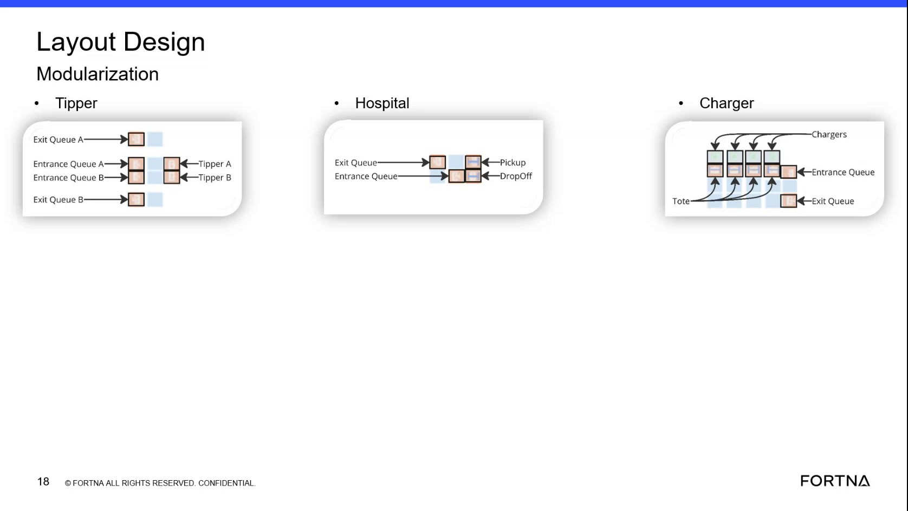

# Interpret AGV Flow Through the Hospital Module

## Runbook Header

| Field | Value |
| --- | --- |
| Procedure ID | `proc_interpret_agv_flow_through_the_hospital_module_v1` |
| Title | Interpret AGV Flow Through the Hospital Module |
| Procedure Type | `reference` |
| Primary Role | `operator` |
| Supporting Roles | None |
| Support Safe | Yes |
| Validation Status | `needs_sme_review` |
| Merge Status | `source_finalized` |

## Summary

Use the training-described hospital queue and tote-handling sequence to interpret expected AGV movement within the hospital area: entrance queue, drop-off when available, movement to pickup, waiting if no tote is present, and exit queue departure.

## When To Use

Use this reference when reviewing training material or observing AGV movement in the hospital area to compare observed movement against the documented hospital flow sequence.

## Do Not Use For

* Do not use this training segment alone to infer undocumented causes of abnormal movement.
* Do not use this reference as a corrective-action or recovery procedure when observed AGV behavior does not match the documented sequence.

## Safety And Operational Notes

* This is a reference procedure derived from training content and is intended for interpretation of AGV flow, not direct control actions.
* Do not infer undocumented causes or corrective actions from this training segment alone.

## Access Or Tools Needed

* Access to the training slide or diagram for the hospital module
* Ability to observe AGV position relative to hospital entrance queue, drop-off, pickup, and exit queue

## Related Operational Context

* ctx_training_video_hospital_flow_reference_v1

## Procedure Steps

### Step 1 — Identify the hospital flow locations

**Responsible role:** operator

**Instruction:**
Locate the hospital portion of the modularization diagram or training material and identify the entrance queue, drop-off location, pickup location, and exit queue.

**Expected result:**
The hospital flow locations are identified on the source diagram or training frame.

**Screens / Images:**

*Hospital entrance queue, drop-off location, pickup location, and exit queue labels/flow on the training slide.*

**Stop or Escalate If:**

* The hospital entrance queue, drop-off, pickup, or exit queue cannot be identified from the source material.

---

### Step 2 — Verify entry through the entrance queue

**Responsible role:** operator

**Instruction:**
Confirm that the AGV enters the hospital through the entrance queue before any drop-off or pickup action.

**Expected result:**
The AGV is interpreted as entering the hospital through the entrance queue first.

**Screens / Images:**

*Hospital entrance queue as the first queue in the hospital flow.*

**Stop or Escalate If:**

* Observed AGV movement does not match the documented entrance-first sequence.

---

### Step 3 — Check drop-off availability and drop-off movement

**Responsible role:** operator

**Instruction:**
Check whether the drop-off location is free; if it is free, the AGV proceeds there and drops off.

**Expected result:**
When the drop-off location is free, the AGV proceeds to drop-off as described in the training flow.

**Screens / Images:**

*Hospital drop-off location in relation to the entrance queue and subsequent pickup location.*

**Stop or Escalate If:**

* Observed AGV movement does not match the documented drop-off behavior.
* The drop-off sequence cannot be reconciled with the training-described flow.

---

### Step 4 — Verify movement from drop-off to pickup

**Responsible role:** operator

**Instruction:**
After drop-off, verify that the AGV moves to the pickup location.

**Expected result:**
The AGV is observed or interpreted as moving from drop-off to pickup.

**Screens / Images:**

*Path/order from hospital drop-off location to pickup location.*

**Stop or Escalate If:**

* Observed AGV movement does not match the documented drop-off-to-pickup sequence.

---

### Step 5 — Check for tote presence at pickup

**Responsible role:** operator

**Instruction:**
Check whether a tote is present at the pickup location; if a tote is there, the AGV picks it up.

**Expected result:**
If a tote is present at pickup, the AGV performs the pickup as described.

**Screens / Images:**

*Hospital pickup location where tote presence determines whether pickup occurs.*

**Stop or Escalate If:**

* Observed pickup behavior does not match the documented tote-present condition.

---

### Step 6 — Verify waiting behavior when no tote is present

**Responsible role:** operator

**Instruction:**
If no tote is present, verify that the AGV waits at the pickup location for a tote to be picked up.

**Expected result:**
When no tote is present, the AGV remains at pickup and waits as described in the training flow.

**Screens / Images:**

*Hospital pickup location and the waiting state described when no tote is present.*

**Stop or Escalate If:**

* Observed AGV movement does not match the documented waiting behavior at pickup when no tote is present.

---

### Step 7 — Confirm departure to the exit queue

**Responsible role:** operator

**Instruction:**
Confirm that after leaving the hospital process, the AGV proceeds to the exit queue.

**Expected result:**
The AGV is observed or interpreted as proceeding to the exit queue after the hospital sequence.

**Screens / Images:**

*Hospital exit queue as the final queue after drop-off/pickup behavior.*

**Stop or Escalate If:**

* Observed AGV movement does not match the documented exit-queue departure sequence.

---

## Success Criteria

* The user can identify the hospital entrance queue, drop-off location, pickup location, and exit queue from the source material.
* The user can trace the documented AGV sequence through the hospital area and compare observed movement to the source-described flow.

## Failure Conditions

* Observed AGV movement does not match the documented entrance, drop-off, pickup, wait, and exit sequence.
* The hospital flow locations cannot be clearly identified from the source material.
* The source segment is insufficient to determine the cause of abnormal movement or the corrective action to take.

## Escalation Guidance

* Escalate if the observed AGV movement does not match the documented entrance, drop-off, pickup, wait, and exit sequence.
* Do not infer undocumented causes or corrective actions from this training segment alone.
* Escalate to an appropriate support or supervisory role for interpretation beyond the documented training flow if observed behavior differs from the source.

## Missing Details / Known Gaps

* No source-supported time estimate is provided.
* No source-supported role boundary beyond operator-level use is explicitly defined for this reference.
* No commands, system controls, or corrective actions are provided in this source segment.
* The source does not specify what to do if the drop-off location is not free beyond the described flow condition.
* The source does not define escalation destination or troubleshooting steps for mismatched movement.

## Source Lineage

- Candidate IDs: candidate_training_video_interpret_hospital_module_flow
- Source ID: `training_video_day1`
- Source Type: `training_video`
