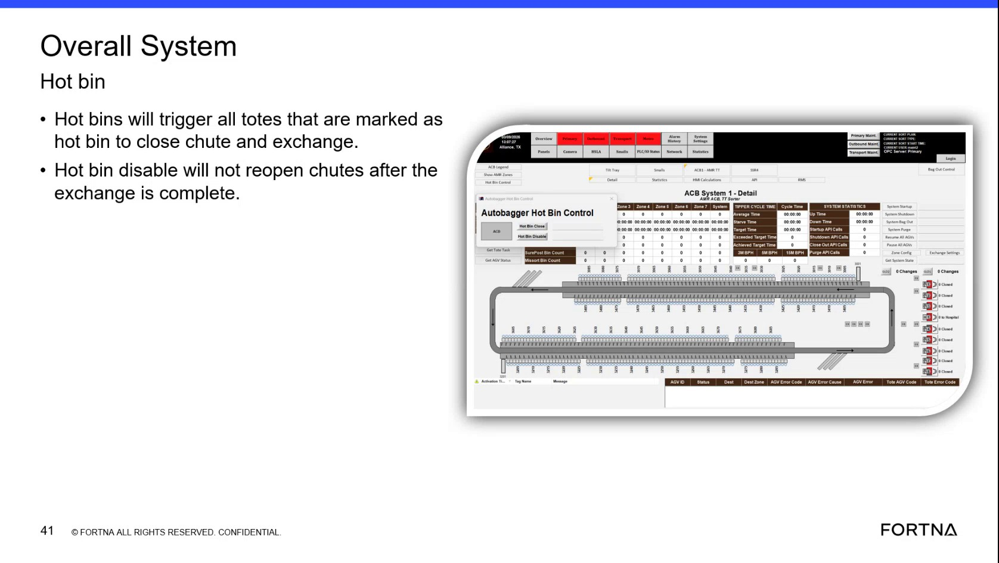

# Interpret Hot Bin Handling Behavior For Marked Totes

## Runbook Header

| Field | Value |
| --- | --- |
| Procedure ID | `proc_interpret_hot_bin_handling_behavior_for_marked_totes_v1` |
| Title | Interpret Hot Bin Handling Behavior For Marked Totes |
| Procedure Type | `reference` |
| Primary Role | `operator` |
| Supporting Roles | None |
| Support Safe | Yes |
| Validation Status | `needs_sme_review` |
| Merge Status | `source_finalized` |

## Summary

Use the training source to interpret expected OptiSweep behavior when totes are marked as hot bin. The source describes hot bins as the highest priority bins and states that totes marked as hot bin will close chute and exchange.

## When To Use

Use when reviewing or verifying source-described OptiSweep behavior for totes marked as hot bin, including understanding priority and expected chute close and exchange behavior.

## Do Not Use For

* Do not use as a corrective action procedure.
* Do not use to infer additional system logic, controls, or recovery actions beyond the training source description.
* Do not use for hot bin disable behavior beyond what is explicitly stated in the supplied source evidence.

## Safety And Operational Notes

* This source is training-oriented and describes behavior rather than a full operator workflow.
* Do not infer additional corrective actions or system logic beyond the source description.

## Access Or Tools Needed

* Access to the training source or documented hot bin behavior
* Ability to observe or verify tote handling behavior
* Indicator or message reference if available in the operating environment

## Related Operational Context

* ctx_training_video_hot_bin_behavior_v1
* ctx_training_video_indicator_message_reference_v1

## Procedure Steps

### Step 1 — Identify hot bin marking context

**Responsible role:** operator

**Instruction:**
Identify that the tote or bin handling being discussed is marked as hot bin using the source-described indicator or message reference.

**Expected result:**
The reviewed tote or scenario is recognized as the hot bin case referenced by the training source.

**Screens / Images:**

*Hot bin wording and indicator-related context in the training frame.*

**Stop or Escalate If:**

* Stop if the scenario cannot be tied to a hot bin marking or indicator reference from the source.
* Escalate if the available system context does not provide a source-supported way to identify the hot bin case.

---

### Step 2 — Confirm hot bin priority

**Responsible role:** operator

**Instruction:**
Confirm from the source that hot bins are treated as the highest priority bins for urgent handling.

**Expected result:**
The user understands that hot bins are the highest priority bins in the described context.

**Screens / Images:**

*Text or transcript context stating that hot bins are the highest priority bins.*

**Stop or Escalate If:**

* Escalate if the observed or taught behavior conflicts with the source statement that hot bins are highest priority.

---

### Step 3 — Check documented hot bin system behavior

**Responsible role:** operator

**Instruction:**
Check the documented system behavior for totes marked as hot bin: the source states they will close chute and exchange.

**Expected result:**
The expected hot bin response is identified as close chute and exchange.

**Screens / Images:**

*Wording that states totes marked as hot bin will close chute and exchange.*

**Stop or Escalate If:**

* Escalate if observed system behavior does not match the documented hot bin behavior in the source.

---

### Step 4 — Verify observed behavior against source

**Responsible role:** operator

**Instruction:**
Observe or verify whether the affected totes follow the documented close-chute and exchange behavior.

**Expected result:**
The affected totes are verified to follow, or not follow, the source-described close-chute and exchange behavior.

**Screens / Images:**

*Training frame showing hot bin close chute and exchange wording for comparison to observed behavior.*

**Stop or Escalate If:**

* Escalate if observed system behavior does not match the documented hot bin behavior in the source.
* Stop if verification would require assumptions not supported by the source.

---

### Step 5 — Record indicator message reference

**Responsible role:** operator

**Instruction:**
Record that the source describes this behavior as driven by a message type called the indicator.

**Expected result:**
The source terminology for the message reference is documented as indicator.

**Screens / Images:**

*Transcript or frame context referencing the message type called the indicator.*

**Stop or Escalate If:**

* Stop if documenting the indicator reference would require interpretation beyond the source wording.

---

## Success Criteria

* The user can interpret that totes marked as hot bin are handled as highest-priority items.
* The user can identify that the source describes hot bin totes as triggering chute close and exchange behavior.
* The indicator message reference is captured using source-supported wording.

## Failure Conditions

* Observed system behavior does not match the documented hot bin behavior in the source.
* The scenario cannot be confirmed as a hot bin case using source-supported indicator or message context.
* Additional corrective logic or actions would be required but are not supported by the source.

## Escalation Guidance

* Escalate if observed system behavior does not match the documented hot bin behavior in the source.
* Do not infer additional corrective actions or system logic beyond the source description.

## Missing Details / Known Gaps

* The source does not provide a full operator workflow for locating or reading the indicator in a live system.
* The source does not specify exact screens, controls, or commands for verifying hot bin status.
* The source does not define corrective actions if hot bin behavior is missing or incorrect.
* The source section text is empty in the packet; evidence is derived from supplied source references, context records, and artifact retrieval text.
* The source mentions additional hot bin disable behavior in artifact retrieval text, but the candidate is limited to the explicit hot bin statements and does not expand that behavior into procedure steps.

## Source Lineage

- Candidate IDs: candidate_training_video_interpret_hot_bin_behavior
- Source ID: `training_video_day1`
- Source Type: `training_video`
