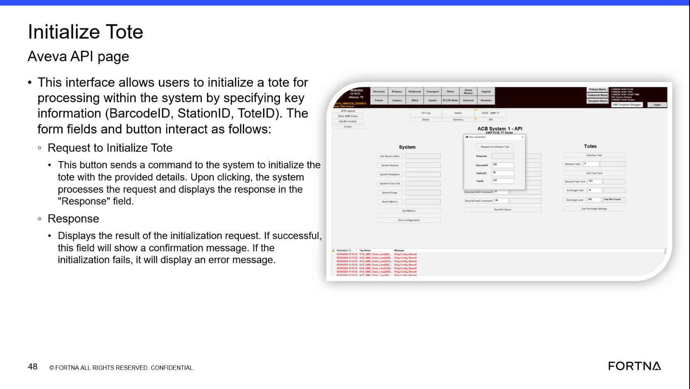

# Interpret the Response From an Initialize Tote Request

## Runbook Header

| Field | Value |
| --- | --- |
| Procedure ID | `proc_interpret_the_response_from_an_initialize_tote_request_v1` |
| Title | Interpret the Response From an Initialize Tote Request |
| Procedure Type | `reference` |
| Primary Role | `L1_support` |
| Supporting Roles | None |
| Support Safe | Yes |
| Validation Status | `needs_sme_review` |
| Merge Status | `source_finalized` |

## Summary

Use the Response field on the Initialize Tote Aveva API page to determine whether tote initialization succeeded or why it was rejected. The source states that successful requests show confirmation, while unsuccessful requests show an error message or tote status. The source also notes an AGV-related limitation where the response may indicate the tote cannot be initialized.

## When To Use

Use when reviewing the result of an Initialize Tote request on the Initialize Tote Aveva API page and you need to determine whether the tote was initialized successfully or identify the source-reported reason it was not initialized.

## Do Not Use For

* Not for correcting or resolving initialization failures when the source only provides the returned response meaning and not a corrective workflow.
* Not for diagnosing issues outside the Response field behavior described in the source.
* Not for performing tote initialization from another interface not identified as the Initialize Tote Aveva API page.

## Safety And Operational Notes

* This source describes interpretation of a response field only; it does not provide corrective actions for failed initialization responses.
* If the response indicates the tote cannot be initialized and no corrective action is provided in the source, escalate rather than inventing a recovery action.

## Access Or Tools Needed

* Access to the Initialize Tote Aveva API page
* Visibility of the Response field after a request
* Source-backed understanding of confirmation versus error/status responses

## Related Operational Context

* ctx_training_video_initialize_tote_response_v1
* ctx_training_video_initialize_tote_agv_limitation_v1

## Procedure Steps

### Step 1 — Open or review the Initialize Tote request

**Responsible role:** L1_support

**Instruction:**
Submit or review an Initialize Tote request on the Initialize Tote Aveva API page before interpreting the returned result.

**Expected result:**
The Initialize Tote request context is available for review on the page.

**Screens / Images:**

*Initialize Tote Aveva API page showing the request area used to initialize a tote.*

**Stop or Escalate If:**

* The page being reviewed is not the Initialize Tote Aveva API page supported by the source.

---

### Step 2 — Locate the Response field

**Responsible role:** L1_support

**Instruction:**
Locate the Response field on the Initialize Tote Aveva API page.

**Expected result:**
The Response field is identified on the page.

**Screens / Images:**

*The Initialize Tote Aveva API page area where the Response field appears after a request.*

**Stop or Escalate If:**

* The Response field is not visible or cannot be identified on the page.

---

### Step 3 — Check for a confirmation message

**Responsible role:** L1_support

**Instruction:**
Check whether the Response field shows a confirmation message, which indicates the initialization was successful.

**Expected result:**
You can determine whether the request succeeded based on the presence of a confirmation message.

**Screens / Images:**

*The Response field result area used to confirm whether initialization succeeded.*

**Stop or Escalate If:**

* The response behavior does not align with the source statement that successful requests show confirmation.

---

### Step 4 — Read the returned error or tote status

**Responsible role:** L1_support

**Instruction:**
If the request did not succeed, read the returned error message or tote status shown in the Response field.

**Expected result:**
The returned error message or tote status is identified from the Response field.

**Screens / Images:**

*The Response field where error information or tote status is displayed when initialization does not succeed.*

**Stop or Escalate If:**

* The response does not match the documented confirmation, error, or tote status behavior described in the source.

---

### Step 5 — Compare the message to documented examples

**Responsible role:** L1_support

**Instruction:**
Compare the returned message to the source-backed examples, including the note that a tote on an AGV may return a response saying it cannot be initialized.

**Expected result:**
The returned message is interpreted against the source examples, including the AGV-related limitation.

**Screens / Images:**

*The Initialize Tote page context referenced by the training segment while discussing response meanings and AGV-related limitations.*

**Stop or Escalate If:**

* The response indicates the tote cannot be initialized and the source does not provide a corrective action.
* The response does not match the documented confirmation, error, or tote status behavior described in the source.

---

### Step 6 — Record the response text exactly

**Responsible role:** L1_support

**Instruction:**
Record the returned status or error text exactly as shown if the initialization did not complete.

**Expected result:**
The exact response text is captured for reference or escalation.

**Stop or Escalate If:**

* The response cannot be captured exactly.
* The response indicates the tote cannot be initialized and no corrective action is provided in the source.

---

## Success Criteria

* The user can determine from the Response field whether the tote was initialized successfully.
* If initialization did not succeed, the user can identify the source-reported error message or tote status.
* If initialization did not complete, the returned status or error text is recorded exactly as shown.

## Failure Conditions

* The Response field cannot be located or read.
* The response does not match the documented confirmation, error, or tote status behavior described in the source.
* The response indicates the tote cannot be initialized and the source provides no corrective action.

## Escalation Guidance

* Escalate if the response does not match the documented confirmation, error, or tote status behavior described in the source.
* Escalate if the response indicates the tote cannot be initialized and the source does not provide a corrective action.

## Missing Details / Known Gaps

* The source does not provide exact confirmation message text.
* The source does not provide exact error message text beyond the described behaviors and AGV-related example.
* The source does not provide a corrective workflow for AGV-related cannot-initialize responses.
* The source does not provide an estimated completion time.
* The source does not specify production stop or LOTO requirements.

## Source Lineage

- Candidate IDs: candidate_training_video_interpret_initialize_tote_response
- Source ID: `training_video_day1`
- Source Type: `training_video`
