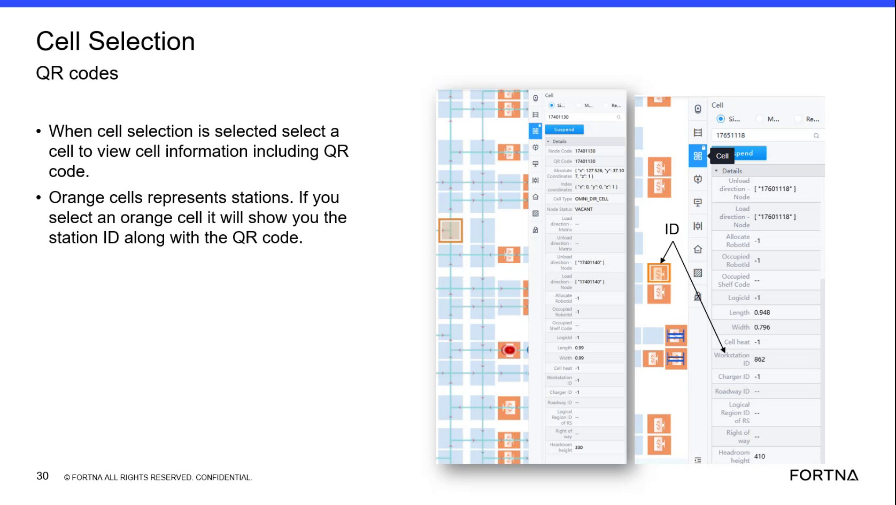

# Interpret Load And Unload Direction Fields Between Cells

## Runbook Header

| Field | Value |
| --- | --- |
| Procedure ID | `proc_interpret_load_and_unload_direction_fields_between_cells_v1` |
| Title | Interpret Load And Unload Direction Fields Between Cells |
| Procedure Type | `reference` |
| Primary Role | `L1_support` |
| Supporting Roles | None |
| Support Safe | Yes |
| Validation Status | `needs_sme_review` |
| Merge Status | `source_finalized` |

## Summary

Use the map or cell information view to interpret load and unload direction settings between cells as tote-dependent AGV travel permissions. The source explains that unload direction only allows AGVs without a tote, loaded direction only allows AGVs with a tote, and in most areas both are enabled. The source also states these fields are generally design-oriented and not a primary support control.

## When To Use

Use when reviewing a map or cell information view and you need to understand what displayed load or unload direction fields mean for AGV travel between cells.

## Do Not Use For

* Do not use this runbook to change configuration or design behavior.
* Do not use this runbook as a corrective procedure for direction-related issues.
* Do not infer unsupported troubleshooting or recovery actions from these fields.

## Safety And Operational Notes

* This source presents the direction fields as an interpretation reference, not an operational control procedure.
* The source states that load or unload direction issues are design problems rather than something support will have to deal with.
* Do not invent corrective actions or configuration changes from this source.

## Access Or Tools Needed

* Access to the map or cell information view showing direction-related fields

## Related Operational Context

* ctx_training_video_load_unload_direction_meaning_v1
* ctx_training_video_support_relevance_of_cell_fields_v1

## Procedure Steps

### Step 1 — Inspect the relevant cell information

**Responsible role:** L1_support

**Instruction:**
Select or inspect the relevant cell information in the map view where load or unload direction fields are shown.

**Expected result:**
The relevant cell information is visible and the direction-related fields can be reviewed.

**Screens / Images:**

*Cell selection and cell information context where support can inspect displayed cell fields.*

**Stop or Escalate If:**

* The required cell information cannot be viewed.
* The user is attempting to use this reference to make a design or configuration change.

---

### Step 2 — Check for unload direction only

**Responsible role:** L1_support

**Instruction:**
Check whether only unload direction is activated between two cells.

**Expected result:**
You determine whether the displayed setting is unload direction only.

**Screens / Images:**

*The cell information context where direction-related fields are displayed for inspection.*

**Stop or Escalate If:**

* The direction state is not visible or cannot be distinguished from the source-supported view.

---

### Step 3 — Interpret unload direction only

**Responsible role:** L1_support

**Instruction:**
Interpret unload direction only as meaning only AGVs without a tote can travel there.

**Expected result:**
The unload-only setting is correctly understood as permitting only AGVs without a tote.

**Stop or Escalate If:**

* There is pressure to treat this interpretation as a change procedure or corrective action.

---

### Step 4 — Check for loaded direction only

**Responsible role:** L1_support

**Instruction:**
Check whether only loaded direction is activated between two cells.

**Expected result:**
You determine whether the displayed setting is loaded direction only.

**Screens / Images:**

*The cell information context where direction-related fields are displayed for inspection.*

**Stop or Escalate If:**

* The direction state is not visible or cannot be distinguished from the source-supported view.

---

### Step 5 — Interpret loaded direction only

**Responsible role:** L1_support

**Instruction:**
Interpret loaded direction only as meaning only AGVs with a tote can travel there, and AGVs without a tote cannot.

**Expected result:**
The loaded-only setting is correctly understood as permitting only AGVs with a tote.

**Stop or Escalate If:**

* There is pressure to treat this interpretation as a change procedure or corrective action.

---

### Step 6 — Interpret both directions enabled

**Responsible role:** L1_support

**Instruction:**
If both are turned on, interpret that AGVs with and without a tote can access between those cells.

**Expected result:**
The combined setting is correctly understood as allowing both loaded and unloaded AGV travel between the cells.

**Stop or Escalate If:**

* The displayed state is ambiguous and cannot be confirmed from the source-supported view.

---

### Step 7 — Record the interpretation and maintain support boundary

**Responsible role:** L1_support

**Instruction:**
Record the observed direction setting as an interpretation of travel permission only; do not treat it as a support action to change design behavior.

**Expected result:**
The observed setting is documented as a meaning reference only, with no unsupported corrective action taken.

**Screens / Images:**

*The training note that node code and workstation ID are the main support-relevant fields, while direction-related fields are generally not important for routine support troubleshooting.*

**Stop or Escalate If:**

* A direction-related issue is being treated as a support-owned corrective task.
* A configuration or design change is requested based only on this source.

---

## Success Criteria

* The displayed load and unload direction fields are translated into the documented tote-dependent AGV travel permissions between cells.
* Unload-only is interpreted as allowing only AGVs without a tote.
* Loaded-only is interpreted as allowing only AGVs with a tote.
* Both enabled is interpreted as allowing AGVs with and without a tote.
* No unsupported corrective or configuration action is taken from this source.

## Failure Conditions

* The relevant direction-related fields cannot be viewed or distinguished.
* The displayed setting cannot be clearly interpreted from the available source-supported view.
* The reference is misused as a procedure to change design behavior or configuration.
* Unsupported troubleshooting, recovery, or corrective actions are inferred from this source.

## Escalation Guidance

* If the issue is about correcting or changing load/unload direction behavior, treat it as a design problem rather than a support action based on this source.
* Escalate when the required cell information is not visible or the direction state cannot be clearly determined from the source-supported interface context.
* Do not propose configuration changes, commands, or design fixes not explicitly supported by this source.

## Missing Details / Known Gaps

* The source does not provide a precise UI field label or exact screen control name for the load and unload direction fields.
* The source does not provide a formal documentation format for recording the interpretation.
* The source does not define a specific escalation destination or owner for design-related issues.
* The source does not provide commands, configuration steps, or change procedures for these fields.

## Source Lineage

- Candidate IDs: candidate_training_video_interpret_load_unload_direction_fields
- Source ID: `training_video_day1`
- Source Type: `training_video`
