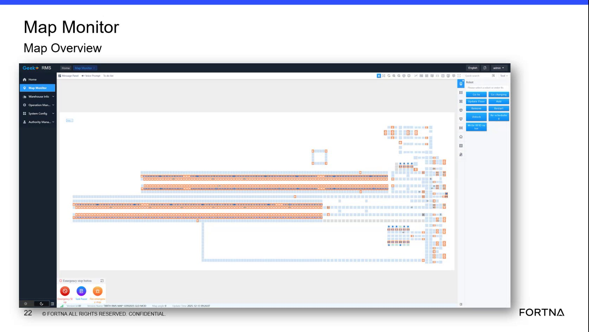

# Interpret Map Overview Location Types And System Areas

## Runbook Header

| Field | Value |
| --- | --- |
| Procedure ID | `proc_interpret_map_overview_location_types_and_system_areas_v1` |
| Title | Interpret Map Overview Location Types And System Areas |
| Procedure Type | `reference` |
| Primary Role | `operator` |
| Supporting Roles | None |
| Support Safe | Yes |
| Validation Status | `needs_sme_review` |
| Merge Status | `source_finalized` |

## Summary

Use the map overview to identify major system areas and distinguish lane versus station location types as presented in the training source.

## When To Use

Use this reference when viewing the RMS map overview to orient yourself to the overall system layout, separate major areas such as sorter side, charger side, and tipper side, and identify whether displayed map elements are lanes or stations.

## Do Not Use For

* Do not use this source alone to assign operational meaning to a special location when the source states that local site usage determines whether it functions as a sort location, tipper location, or other use.
* Do not use this reference to assume RMS itself distinguishes the operational meaning of special locations.

## Safety And Operational Notes

* This source segment is a visual interpretation reference and does not describe physical intervention.
* Do not assume the operational meaning of a special location from RMS alone when the source says the distinction depends on local usage.

## Access Or Tools Needed

* Access to the map overview screen
* Visual access to the system map display

## Related Operational Context

* ctx_training_video_map_overview_system_view_v1
* ctx_training_video_rms_station_generic_meaning_v1
* ctx_training_video_special_location_local_interpretation_v1
* ctx_training_video_lane_and_station_visual_types_v1

## Procedure Steps

### Step 1 — Open the map overview

**Responsible role:** operator

**Instruction:**
Open or click the map overview screen that gives an overview of the system.

**Expected result:**
The map overview is displayed.

**Screens / Images:**

*The overall system map view referenced as the overview screen.*

**Stop or Escalate If:**

* Stop or escalate if the map overview screen cannot be opened or viewed.

---

### Step 2 — Identify major system areas

**Responsible role:** operator

**Instruction:**
Look across the map to identify the major system areas referenced in the source, including sorter side, charger side, and tipper side.

**Expected result:**
The displayed map is mentally separated into the major areas named in the source.

**Screens / Images:**

*The overall layout used to separate sorter side, charger side, and tipper side.*

**Stop or Escalate If:**

* Escalate if the displayed map does not allow the major areas to be matched to sorter side, charger side, and tipper side.

---

### Step 3 — Identify lanes on the map

**Responsible role:** operator

**Instruction:**
Identify the light blue or grayish square blocks on the map as lanes.

**Expected result:**
Light blue or grayish square blocks are recognized as lanes.

**Screens / Images:**

*The light blue or grayish square blocks identified in the training as lanes.*

**Stop or Escalate If:**

* Escalate if the displayed map element cannot be matched to the source-described lane visual type.

---

### Step 4 — Identify stations on the map

**Responsible role:** operator

**Instruction:**
Identify the orange map elements as stations.

**Expected result:**
Orange map elements are recognized as stations.

**Screens / Images:**

*The orange map elements identified in the training as stations.*

**Stop or Escalate If:**

* Escalate if the displayed map element cannot be matched to the source-described station visual type.

---

### Step 5 — Interpret special locations carefully

**Responsible role:** operator

**Instruction:**
When reviewing a location on the map, note that RMS uses a generic station concept and that a special location may represent different operational uses depending on site usage, such as a sort location or a tipper location.

**Expected result:**
The viewer understands that RMS naming alone may not define the operational function of a special location.

**Screens / Images:**

*The map overview context where the presenter explains that RMS treats stations generically and special locations may have site-specific meaning.*

**Stop or Escalate If:**

* Stop or escalate if a special location's operational meaning cannot be confirmed locally.
* Do not assume the operational meaning of a special location from RMS alone when the source says the distinction depends on local usage.

---

### Step 6 — Communicate the observed location using source terms

**Responsible role:** operator

**Instruction:**
Record or communicate the observed area and location type using the source terms lane, station, and special location rather than assuming the system itself distinguishes the operational meaning.

**Expected result:**
The observed map area and location type are communicated using source-supported terminology.

**Screens / Images:**

*The map overview and visual location types used as the basis for lane, station, and special location terminology.*

**Stop or Escalate If:**

* Escalate if the observed map element cannot be matched to the source-described lane or station visual types.
* Escalate if the operational meaning of a special location is required but cannot be confirmed from local site usage.

---

## Success Criteria

* The user can use the map overview to orient themselves to the system.
* The user can separate major areas such as sorter side, charger side, and tipper side on the overview.
* The user can correctly identify whether displayed map elements are lanes or stations.
* The user recognizes that some special locations require local interpretation.

## Failure Conditions

* The map overview cannot be opened or viewed.
* Displayed map elements cannot be matched to the source-described lane or station visual types.
* A special location is assumed to have an operational meaning from RMS alone.
* The user cannot distinguish the major system areas referenced in the source.

## Escalation Guidance

* Escalate if the displayed map element cannot be matched to the source-described lane or station visual types.
* Escalate if the operational meaning of a special location is required but cannot be confirmed from local site usage.
* Do not assume the operational meaning of a special location from RMS alone when the source says the distinction depends on local usage.

## Missing Details / Known Gaps

* The source segment does not provide a time estimate for completing this reference procedure.
* The source segment does not define supporting roles beyond the operator-oriented viewing task.
* The source segment does not provide explicit navigation clicks, menu names, or field labels for reaching the map overview.
* The source segment does not define a site-specific method for resolving the operational meaning of a special location.

## Source Lineage

- Candidate IDs: candidate_training_video_interpret_map_overview_location_types
- Source ID: `training_video_day1`
- Source Type: `training_video`
