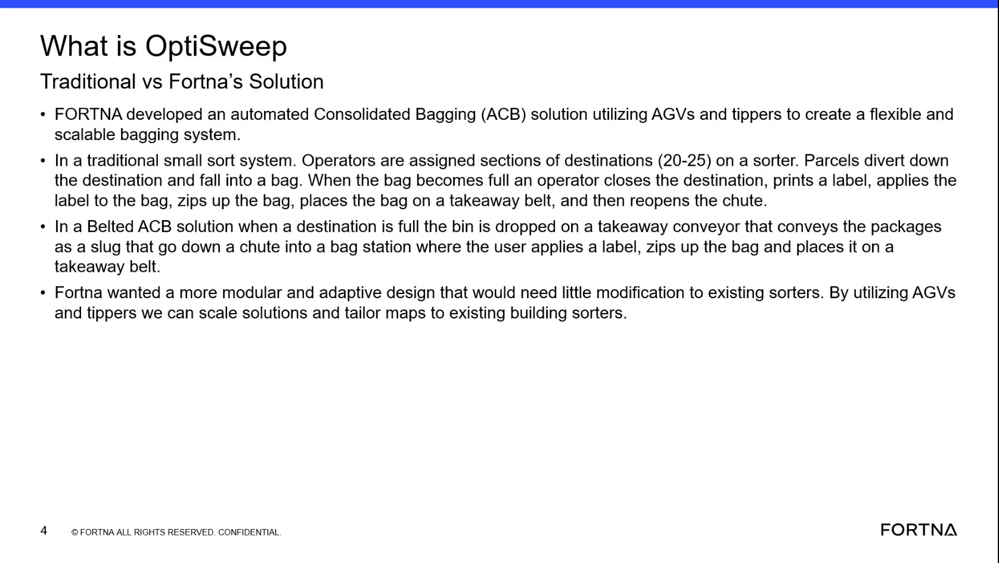

# Interpret How OptiSweep Differs From Traditional and Belted Bagging Models

## Runbook Header

| Field | Value |
| --- | --- |
| Procedure ID | `proc_interpret_optisweep_differs_from_traditional_and_belted_bagging_models_v1` |
| Title | Interpret How OptiSweep Differs From Traditional and Belted Bagging Models |
| Procedure Type | `reference` |
| Primary Role | `L1_support` |
| Supporting Roles | None |
| Support Safe | Yes |
| Validation Status | `needs_sme_review` |
| Merge Status | `source_finalized` |

## Summary

Use the source comparison to identify the documented operating characteristics that distinguish OptiSweep from traditional small sort and belted ACB bagging approaches.

## When To Use

Use when reviewing a system description, training discussion, or observed process and you need to classify it against the source-described models: traditional small sort bagging, belted ACB, or FORTNA's OptiSweep solution.

## Do Not Use For

* Do not use for detailed operational control of OptiSweep equipment.
* Do not use to infer additional OptiSweep operating details beyond the comparison points stated in the source.
* Do not use when the observed system characteristics do not align with any of the source-described models.

## Safety And Operational Notes

* This is a reference and interpretation procedure derived from training content, not a physical operating sequence.
* Do not infer unsupported controls, process steps, or system behavior beyond what is stated in the source.

## Access Or Tools Needed

* Source comparison slide or transcript
* System description or observed process characteristics to compare

## Related Operational Context

* ctx_training_video_optisweep_solution_overview_v1
* ctx_training_video_traditional_small_sort_bagging_reference_v1
* ctx_training_video_belted_acb_solution_reference_v1
* ctx_training_video_optisweep_modular_design_intent_v1

## Procedure Steps

### Step 1 — Review the source comparison

**Responsible role:** L1_support

**Instruction:**
Review the source comparison between the traditional system, the belted ACB solution, and FORTNA's solution.

**Expected result:**
The comparison categories and their distinguishing characteristics are visible and available for reference.

**Screens / Images:**

*The comparison slide titled around traditional vs FORTNA's solution, showing traditional small sort bagging, belted ACB, and FORTNA's AGV/tipper-based solution.*

**Stop or Escalate If:**

* Stop or escalate if the source comparison cannot be accessed or does not provide enough detail to distinguish the models.

---

### Step 2 — Check for traditional small sort bagging characteristics

**Responsible role:** L1_support

**Instruction:**
Identify whether the described flow depends on operators manually closing destinations, printing and applying labels, zipping bags, and placing bags on a takeaway belt for 20-25 destinations.

**Expected result:**
You can determine whether the described process matches the traditional small sort bagging model.

**Screens / Images:**

*Traditional small sort bagging portion of the comparison slide, including operator assignment to about 20-25 destinations and manual bag handling steps.*

**Stop or Escalate If:**

* Escalate if the observed or described process does not clearly confirm or rule out the traditional characteristics.

---

### Step 3 — Check for belted ACB characteristics

**Responsible role:** L1_support

**Instruction:**
Identify whether the described flow uses a full destination bin dropped onto a takeaway conveyor and conveyed as a slug down a chute into a bag station.

**Expected result:**
You can determine whether the described process matches the belted ACB model.

**Screens / Images:**

*Belted ACB portion of the comparison slide describing a full destination bin dropped onto a takeaway conveyor and conveyed as a slug to a bag station.*

**Stop or Escalate If:**

* Escalate if the observed or described process does not clearly confirm or rule out the belted ACB characteristics.

---

### Step 4 — Check for OptiSweep characteristics

**Responsible role:** L1_support

**Instruction:**
Identify whether the described solution is characterized as using AGVs and tippers for a flexible, scalable, modular, and adaptive bagging system.

**Expected result:**
You can determine whether the described process matches the source-defined OptiSweep approach.

**Screens / Images:**

*FORTNA solution portion of the comparison slide describing AGVs and tippers and the flexible, scalable, modular, and adaptive design.*

**Stop or Escalate If:**

* Escalate if the observed system characteristics do not align with any of the source-described models.

---

### Step 5 — Record the matching model

**Responsible role:** L1_support

**Instruction:**
Record which model matches the observed or discussed system description using only the source-provided characteristics.

**Expected result:**
A source-grounded classification is recorded as traditional small sort bagging, belted ACB, or OptiSweep.

**Screens / Images:**

*Use the comparison slide as the basis for the final model classification.*

**Stop or Escalate If:**

* Escalate if the observed system characteristics do not align with any of the source-described models.
* Stop if classification would require inferring additional OptiSweep operating details beyond the comparison points stated in the source.

---

## Success Criteria

* The user can distinguish the documented characteristics of OptiSweep from the traditional small sort and belted ACB models described in the source.
* A model classification is recorded using only source-provided characteristics.

## Failure Conditions

* The source comparison cannot be reviewed.
* The observed or discussed system description is too incomplete or ambiguous to match a source-described model.
* The observed system characteristics do not align with any of the source-described models.
* Classification would require unsupported inference beyond the source comparison.

## Escalation Guidance

* Escalate if the observed system characteristics do not align with any of the source-described models.
* Escalate if the available description is insufficient to distinguish between traditional small sort bagging, belted ACB, and OptiSweep.
* Do not extend the classification with additional operating details not stated in the source.

## Missing Details / Known Gaps

* The source does not provide a formal decision table or explicit tie-breaker logic when characteristics appear mixed.
* The source does not define a required recording system or output format for documenting the classification.
* The source does not provide estimated completion time.
* The source does not specify additional supporting roles beyond the interpretive L1_support role selected in the candidate.

## Source Lineage

- Candidate IDs: candidate_training_video_interpret_optisweep_solution_positioning_against_other_bagging_models
- Source ID: `training_video_day1`
- Source Type: `training_video`
