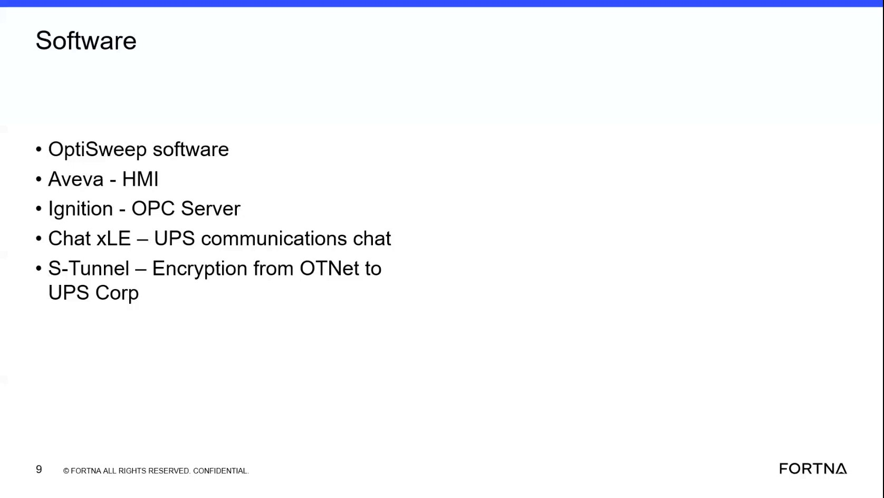

# Trace The Documented Communication Path Between OptiSweep OTNet And UPS Network

## Runbook Header

| Field | Value |
| --- | --- |
| Procedure ID | `proc_trace_documented_communication_path_between_optisweep_otnet_and_ups_network_v1` |
| Title | Trace The Documented Communication Path Between OptiSweep OTNet And UPS Network |
| Procedure Type | `reference` |
| Primary Role | `L1_support` |
| Supporting Roles | None |
| Support Safe | Yes |
| Validation Status | `needs_sme_review` |
| Merge Status | `source_finalized` |

## Summary

Use this source-backed reference procedure to interpret how the training material describes communication between the OptiSweep/WCS environment on the OT network and UPS systems. The source states that the OT network and UPS network are separate, and that communication to UPS Chat XLE crosses that boundary through S-Tunnel as a secure or encrypted channel for order or sortable destination information.

## When To Use

Use when a user needs to understand or restate the documented architecture shown in the training source for how OptiSweep or WCS communicates across the OTNet and UPS network boundary to reach Chat XLE through S-Tunnel.

## Do Not Use For

* Do not use for actual connectivity validation.
* Do not use for network configuration review or implementation.
* Do not use for encryption detail review, key handling, port identification, or protocol configuration.
* Do not add unsupported network settings, keys, ports, or configuration steps.

## Safety And Operational Notes

* This is a reference-only interpretation aid, not an execution or change procedure.
* Do not invent network configuration files, key handling steps, or protocol settings beyond the source statements.

## Access Or Tools Needed

* Access to the training video segment or extracted slide
* Source transcript describing OT net, UPS network, Chat XLE, and S-Tunnel

## Related Operational Context

* ctx_training_video_optisweep_software_overview_v1
* ctx_training_video_chatxle_stunnel_network_boundary_v1

## Procedure Steps

### Step 1 — Open the software and communications training segment

**Responsible role:** L1_support

**Instruction:**
Open the training segment covering software and network communications and locate the references to OT net, UPS network, Chat XLE, and S-Tunnel.

**Expected result:**
The relevant training segment and supporting slide are available for review.

**Screens / Images:**

*Look for the software slide labels identifying Chat XLE for UPS communications and S-Tunnel for encrypted connectivity from OTNet to UPS.*

**Stop or Escalate If:**

* Escalate if the source segment or slide cannot be accessed.
* Stop if a user requests operational validation rather than source interpretation.

---

### Step 2 — Confirm OTNet is separate from the UPS network

**Responsible role:** L1_support

**Instruction:**
Identify from the transcript that the OptiSweep environment operates on an OT network that is separate from the UPS local or corporate network.

**Expected result:**
The reviewer confirms that the source describes the OptiSweep/WCS environment as separate from the UPS network.

**Screens / Images:**

*Use the slide and aligned transcript context describing OTNet and the UPS network as separate environments.*

**Stop or Escalate If:**

* Escalate if the user needs proof beyond the training source.
* Stop if the request shifts to actual network topology verification.

---

### Step 3 — Note the source describes the networks as separate islands

**Responsible role:** L1_support

**Instruction:**
Note that the source describes the OT network and UPS network as separate 'islands.'

**Expected result:**
The reviewer records that the source frames the OT and UPS networks as distinct separated domains.

**Stop or Escalate If:**

* Stop if the user asks for unsupported details about routing, segmentation, or controls between the networks.

---

### Step 4 — Identify the information needed from UPS Chat XLE

**Responsible role:** L1_support

**Instruction:**
Identify that the WCS or OptiSweep software needs information from UPS Chat XLE about order or sortable destination information.

**Expected result:**
The reviewer can state the source-backed reason for communication with Chat XLE.

**Screens / Images:**

*Review the Chat XLE label and transcript summary describing UPS communications and order or destination information.*

**Stop or Escalate If:**

* Escalate if message content, interface specification, or transaction troubleshooting is requested.

---

### Step 5 — Identify S-Tunnel as the documented boundary-crossing channel

**Responsible role:** L1_support

**Instruction:**
Identify that the documented path across the network boundary is through S-Tunnel, which the source describes as a secure or encrypted channel.

**Expected result:**
The reviewer confirms that S-Tunnel is the named secure or encrypted path in the source.

**Screens / Images:**

*Look for the S-Tunnel label indicating encryption from OTNet to UPS Corp.*

**Stop or Escalate If:**

* Escalate if encryption implementation details are required.
* Stop if the request becomes a configuration or security review.

---

### Step 6 — Record the source-backed communication path

**Responsible role:** L1_support

**Instruction:**
Record the communication path as source-backed only: OptiSweep or WCS on OT net communicates to UPS Chat XLE through S-Tunnel.

**Expected result:**
A concise, source-backed path statement is documented.

**Stop or Escalate If:**

* Escalate if the user needs a validated live path rather than a documented training interpretation.

---

### Step 7 — Limit use to architecture interpretation only

**Responsible role:** L1_support

**Instruction:**
Use this interpretation only for understanding the documented architecture; do not add unsupported network settings, keys, ports, or configuration steps.

**Expected result:**
The reviewer keeps the output within the source-supported scope.

**Stop or Escalate If:**

* Escalate if actual connectivity validation, configuration review, or encryption details are required.
* Stop if asked to provide network configuration files, key handling steps, or protocol settings.

---

## Success Criteria

* The user can describe that OptiSweep or WCS operates on OTNet separate from the UPS network.
* The user can state that communication to UPS Chat XLE crosses the boundary through S-Tunnel.
* The interpretation remains limited to source-backed architecture statements.

## Failure Conditions

* The reviewer cannot locate the source segment or artifact supporting the architecture statement.
* The interpretation includes unsupported details such as ports, keys, certificates, or configuration steps.
* The user expects live validation or implementation guidance from this reference.

## Escalation Guidance

* Escalate if actual connectivity validation is required, because the source provides architecture explanation only.
* Escalate if configuration review is required, because the source does not provide executable setup steps.
* Escalate if encryption implementation details are required, because the source only states that S-Tunnel is a secure or encrypted channel.

## Missing Details / Known Gaps

* The source does not provide live validation steps for connectivity.
* The source does not provide network settings, ports, keys, certificates, or protocol configuration details.
* The source does not provide executable troubleshooting or setup actions for S-Tunnel or Chat XLE.

## Source Lineage

- Candidate IDs: candidate_training_video_interpret_otnet_to_ups_communication_path
- Source ID: `training_video_day1`
- Source Type: `training_video`
