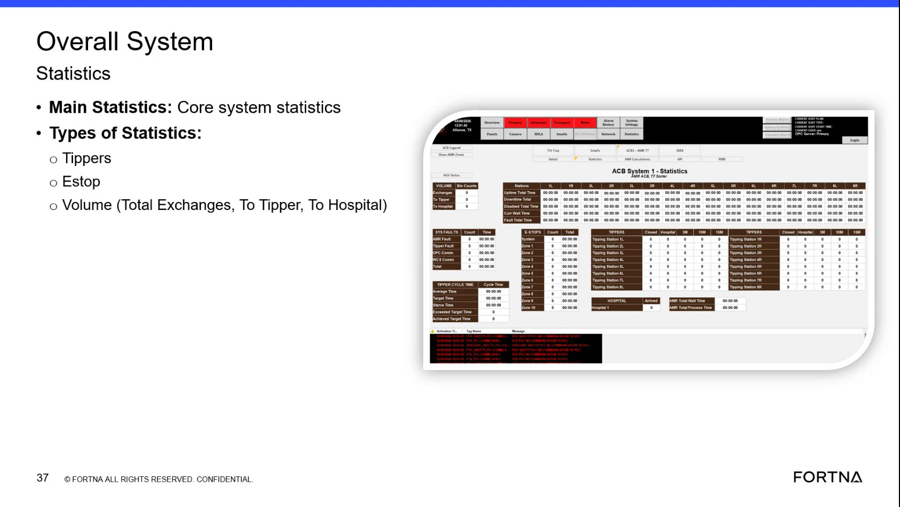

# Interpret Overall System Statistics Main Statistics

## Runbook Header

| Field | Value |
| --- | --- |
| Procedure ID | `proc_interpret_overall_system_statistics_main_statistics_v1` |
| Title | Interpret Overall System Statistics Main Statistics |
| Procedure Type | `reference` |
| Primary Role | `operator` |
| Supporting Roles | None |
| Support Safe | Yes |
| Validation Status | `needs_sme_review` |
| Merge Status | `source_finalized` |

## Summary

Use the Overall System Statistics view to identify the documented main statistics categories and read the available E-stop and volume-related metrics shown in the training source.

## When To Use

Use when reviewing the Overall System Statistics area to identify the main statistics or core system statistics shown by the source, including E-stop and volume-related categories.

## Do Not Use For

* Do not use this runbook to diagnose causes of E-stop activity.
* Do not use this runbook to determine corrective actions or recovery actions.
* Do not use this runbook to infer meanings beyond the statistics labels and values shown in the source.

## Safety And Operational Notes

* This source supports reading and identifying displayed statistics only.
* Do not infer corrective actions or status meanings beyond the statistics labels shown in the source.

## Access Or Tools Needed

* Access to the Overall System Statistics view or training material showing it
* Visual access to the displayed statistics categories and values

## Related Operational Context

* ctx_training_video_overall_system_statistics_v1
* ctx_training_video_estop_statistics_v1
* ctx_training_video_volume_statistics_v1

## Procedure Steps

### Step 1 — Locate the Overall System Statistics main statistics view

**Responsible role:** operator

**Instruction:**
Open or locate the Overall System Statistics area that shows Main Statistics or core system statistics.

**Expected result:**
The Overall System Statistics area is visible and the Main Statistics heading or core system statistics content can be seen.

**Screens / Images:**

*Overall System Statistics and Main Statistics headings or core system statistics content.*

**Stop or Escalate If:**

* Escalate if the expected statistics categories are not visible in the referenced Overall System Statistics view.

---

### Step 2 — Identify the listed statistics types

**Responsible role:** operator

**Instruction:**
Identify the listed statistics types in this view, including E-stop and Volume.

**Expected result:**
The visible statistics types are recognized from the source labels.

**Screens / Images:**

*Types of Statistics entries showing E-stop and Volume.*

**Stop or Escalate If:**

* Escalate if the expected statistics categories are not visible in the referenced Overall System Statistics view.

---

### Step 3 — Observe the displayed E-stop metric

**Responsible role:** operator

**Instruction:**
For E-stop statistics, observe the displayed E-stop-related metric shown for the system or tippers using only the values presented on the screen.

**Expected result:**
The E-stop-related metric is read directly from the displayed view without added interpretation.

**Screens / Images:**

*E-stop statistic area referenced by the slide OCR and transcript mention of tippers E stops.*

**Stop or Escalate If:**

* Escalate if the expected statistics categories are not visible in the referenced Overall System Statistics view.
* Stop if interpretation would require inferring meanings or corrective actions beyond the displayed label or value.

---

### Step 4 — Identify the volume statistic categories

**Responsible role:** operator

**Instruction:**
For Volume statistics, identify the documented categories Total Exchanges, To Tipper, and To Hospital.

**Expected result:**
The three source-supported volume categories are identified in the view.

**Screens / Images:**

*Volume categories showing Total Exchanges, To Tipper, and To Hospital.*

**Stop or Escalate If:**

* Escalate if the expected statistics categories are not visible in the referenced Overall System Statistics view.

---

### Step 5 — Read and record the displayed values

**Responsible role:** operator

**Instruction:**
Read and record the displayed counts or values for the available categories without inferring additional meanings or actions.

**Expected result:**
The visible values are recorded exactly as displayed for the available categories.

**Screens / Images:**

*Displayed statistics values associated with the visible E-stop and volume categories.*

**Stop or Escalate If:**

* Stop if interpretation would require inferring additional meanings or actions beyond the displayed values.
* Escalate if the expected statistics categories are not visible in the referenced Overall System Statistics view.

---

## Success Criteria

* The Overall System Statistics view is located.
* The main statistics categories supported by the source are identified.
* E-stop and Volume statistics are recognized in the view.
* The volume categories Total Exchanges, To Tipper, and To Hospital are identified.
* Displayed values are read and recorded exactly as shown without added interpretation.

## Failure Conditions

* The Overall System Statistics view cannot be located.
* Expected statistics categories are not visible.
* E-stop or volume categories cannot be read from the displayed view.
* The user must infer meanings or actions not supported by the source.

## Escalation Guidance

* Escalate if the expected statistics categories are not visible in the referenced Overall System Statistics view.
* Escalate for SME review if interpretation beyond the displayed labels or values is required.

## Missing Details / Known Gaps

* The source does not provide navigation steps for reaching the Overall System Statistics view from another screen.
* The source does not define thresholds, normal ranges, or interpretations for the displayed statistics.
* The source does not provide corrective or recovery actions based on E-stop or volume values.
* The source does not provide a time estimate for completing this reference procedure.

## Source Lineage

- Candidate IDs: candidate_training_video_interpret_overall_system_statistics
- Source ID: `training_video_day1`
- Source Type: `training_video`
