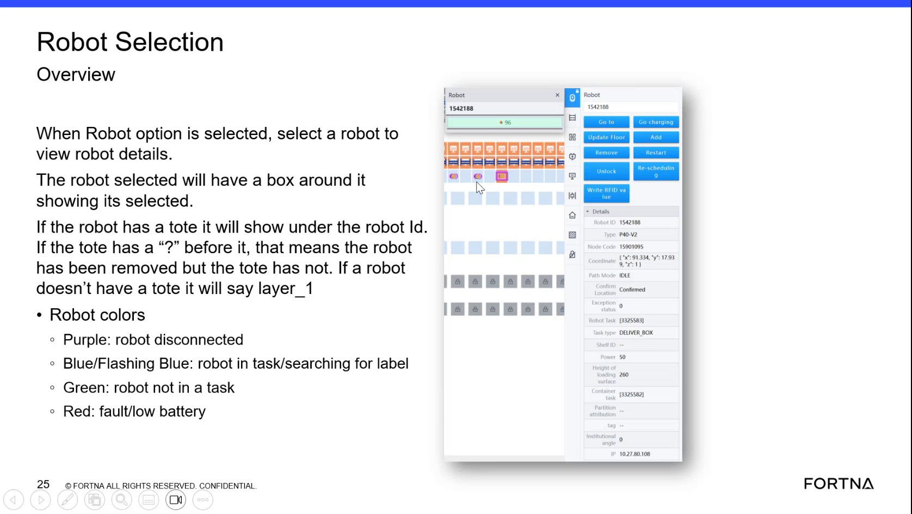

# Determine Robot Status From Robot LED Colors

## Runbook Header

| Field | Value |
| --- | --- |
| Procedure ID | `proc_determine_robot_status_from_robot_led_colors_v1` |
| Title | Determine Robot Status From Robot LED Colors |
| Procedure Type | `reference` |
| Primary Role | `operator` |
| Supporting Roles | None |
| Support Safe | Yes |
| Validation Status | `needs_sme_review` |
| Merge Status | `source_finalized` |

## Summary

Use the documented robot LED colors and flashing patterns to identify the robot's current status. This source-specific reference covers disconnected, in-task, label-searching, idle, and red fault or low-battery indications, and directs the user to the message panel when the robot is red.

## When To Use

Use when an operator needs to interpret the robot's current status by observing the robot LEDs and, for red status, checking the message panel for additional information.

## Do Not Use For

* Do not use this runbook to infer meanings for undocumented LED colors or patterns.
* Do not use this runbook as a full troubleshooting or recovery workflow for robot faults, battery recovery, or communication loss.

## Safety And Operational Notes

* Use only the documented LED meanings from the source.
* Do not infer undocumented meanings for other colors or patterns.
* If the observed LED behavior does not match one of the documented colors or patterns, escalate.

## Access Or Tools Needed

* Visual access to robot LEDs
* Access to the message panel for red robot conditions

## Related Operational Context

* ctx_training_video_robot_led_color_statuses_v1
* ctx_training_video_message_panel_fault_battery_reference_v1

## Procedure Steps

### Step 1 — Observe the robot LEDs

**Responsible role:** operator

**Instruction:**
Observe the robot LEDs on the robot. The source states there are two LEDs on each side of the robot.

**Expected result:**
The operator can clearly see the robot LED indication.

**Screens / Images:**

*Robot LED color meaning reference in the training frame.*

**Stop or Escalate If:**

* The LEDs cannot be seen clearly.
* The observed indication cannot be determined.

---

### Step 2 — Identify color and flashing state

**Responsible role:** operator

**Instruction:**
Identify the displayed color and whether the indication is solid or flashing.

**Expected result:**
The operator has identified the LED color and whether it is solid or flashing.

**Screens / Images:**

*Documented LED colors and distinction between solid blue and flashing blue.*

**Stop or Escalate If:**

* The observed LED behavior does not match one of the documented colors or patterns.

---

### Step 3 — Interpret purple LED

**Responsible role:** operator

**Instruction:**
Interpret purple as robot disconnected.

**Expected result:**
A purple LED is recognized as a disconnected robot.

**Screens / Images:**

*Purple LED meaning in the robot color reference.*

**Stop or Escalate If:**

* Purple is observed but the condition appears inconsistent with the documented meaning.
* Additional LED behavior is present that is not documented in the source.

---

### Step 4 — Interpret solid blue LED

**Responsible role:** operator

**Instruction:**
Interpret blue as robot in task.

**Expected result:**
A blue LED is recognized as the robot being in task.

**Screens / Images:**

*Blue LED meaning in the robot color reference.*

**Stop or Escalate If:**

* Blue is observed but the condition appears inconsistent with the documented meaning.

---

### Step 5 — Interpret flashing blue LED

**Responsible role:** operator

**Instruction:**
Interpret flashing blue as the robot looking for a label.

**Expected result:**
A flashing blue LED is recognized as the robot searching for a label.

**Screens / Images:**

*Flashing blue LED meaning in the robot color reference.*

**Stop or Escalate If:**

* Flashing blue is observed but the condition appears inconsistent with the documented meaning.

---

### Step 6 — Interpret green LED

**Responsible role:** operator

**Instruction:**
Interpret green as the robot being idle or not in a task.

**Expected result:**
A green LED is recognized as the robot being idle or not in a task.

**Screens / Images:**

*Green LED meaning in the robot color reference.*

**Stop or Escalate If:**

* Green is observed but the condition appears inconsistent with the documented meaning.

---

### Step 7 — Interpret red LED

**Responsible role:** operator

**Instruction:**
Interpret red as the robot having a fault or a low battery.

**Expected result:**
A red LED is recognized as indicating either a fault or a low-battery condition.

**Screens / Images:**

*Red LED meaning in the robot color reference.*

**Stop or Escalate If:**

* Red is observed but the condition appears inconsistent with the documented meaning.

---

### Step 8 — Check the message panel for red status

**Responsible role:** operator

**Instruction:**
If the robot is red, check the message panel because the source states both fault and low battery will show up there.

**Expected result:**
The operator uses the message panel to obtain additional information for a red robot condition.

**Screens / Images:**

*Reference stating that red fault or low-battery conditions show up in the message panel.*

*Message panel area and related message/fault display context.*

**Stop or Escalate If:**

* The robot is red and the message panel cannot be accessed.
* The robot is red and the message panel does not show a matching fault or low-battery indication.
* The observed condition does not match the documented source behavior.

---

## Success Criteria

* The operator can identify the documented robot status from the observed LED color or flashing pattern.
* If the robot is red, the operator knows to check the message panel for additional information.

## Failure Conditions

* The observed LED behavior does not match one of the documented colors or patterns.
* The operator attempts to infer undocumented meanings for other colors or patterns.
* The robot is red but the message panel cannot be checked or does not provide matching information.

## Escalation Guidance

* Escalate if the observed LED behavior does not match one of the documented colors or patterns.
* Escalate if the robot is red and the message panel cannot be accessed or does not show corresponding fault or low-battery information.
* Do not infer undocumented meanings for other colors or patterns.

## Missing Details / Known Gaps

* The source does not provide a full troubleshooting or recovery workflow for each LED state.
* The source does not provide role boundaries beyond operator-level use.
* The source does not provide estimated completion time.
* The source does not define required production stop or LOTO conditions for this reference procedure.
* The source does not specify exact message panel navigation steps.

## Source Lineage

- Candidate IDs: candidate_training_video_interpret_robot_led_status_colors
- Source ID: `training_video_day1`
- Source Type: `training_video`
