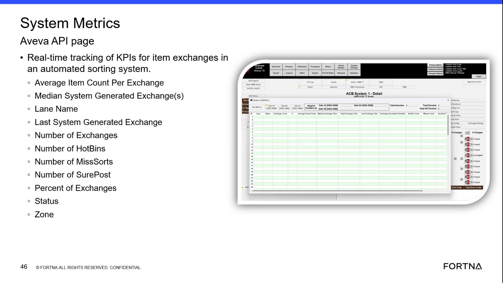

# Interpret Real-Time Item Exchange KPIs on the System Metrics Page

## Runbook Header

| Field | Value |
| --- | --- |
| Procedure ID | `proc_interpret_real_time_item_exchange_kpis_on_the_system_metrics_page_v1` |
| Title | Interpret Real-Time Item Exchange KPIs on the System Metrics Page |
| Procedure Type | `reference` |
| Primary Role | `operator` |
| Supporting Roles | None |
| Support Safe | Yes |
| Validation Status | `needs_sme_review` |
| Merge Status | `source_finalized` |

## Summary

Use the System Metrics Aveva API page to view and interpret destination-level item exchange KPI fields, lane identifiers, status values, and zone information shown in real time.

## When To Use

Use when an operator needs to read the System Metrics Aveva API page and identify the currently displayed item exchange KPI values, lane name, lane system, status, and zone information for a destination or lane.

## Do Not Use For

* Do not use this runbook to infer corrective actions from KPI values.
* Do not use this runbook to troubleshoot missing fields or undocumented status meanings beyond what is shown in this source.
* Do not use this runbook to change zone configuration or system settings.

## Safety And Operational Notes

* This source describes a screen interpretation task only and does not include physical intervention or control actions.
* Record or communicate values exactly as displayed without adding unsupported interpretation.

## Access Or Tools Needed

* Access to the System Metrics Aveva API page
* Visual access to the KPI screen or training reference image

## Related Operational Context

* ctx_training_video_system_metrics_kpi_page_v1
* ctx_training_video_item_exchange_metrics_reference_v1
* ctx_training_video_lane_status_values_v1
* ctx_training_video_zone_display_reference_v1

## Procedure Steps

### Step 1 — Open or view the System Metrics page

**Responsible role:** operator

**Instruction:**
Open or view the System Metrics Aveva API page used for real-time tracking of KPIs for item exchanges.

**Expected result:**
The System Metrics Aveva API page is visible.

**Screens / Images:**

*System Metrics Aveva API page showing destination-level item exchange KPI fields.*

**Stop or Escalate If:**

* Escalate if the required KPI page is not visible.

---

### Step 2 — Identify destination-level KPI fields

**Responsible role:** operator

**Instruction:**
Identify the destination-level KPI fields shown on the page, including Average Item Count Per Exchange, Median System Generated Exchange(s), Last System Generated Exchange, Number of Exchanges, Number of HotBins, Number of MissSorts, Number of SurePost, and Percent of Exchanges.

**Expected result:**
The displayed KPI fields are recognized and can be read from the page.

**Screens / Images:**

*The KPI field list for per-destination item exchange metrics.*

**Stop or Escalate If:**

* Escalate if a required KPI field is not visible on the page.

---

### Step 3 — Locate lane-identifying information

**Responsible role:** operator

**Instruction:**
Locate the lane-identifying information shown on the page, including lane name and lane system.

**Expected result:**
The lane name and lane system are identified for the displayed KPI row or destination.

**Screens / Images:**

*Lane name and lane system fields on the System Metrics page.*

**Stop or Escalate If:**

* Escalate if lane-identifying information is not visible on the page.

---

### Step 4 — Check the status field

**Responsible role:** operator

**Instruction:**
Check the Status field and compare the displayed value to the source-provided examples such as active, bypassed, or not tracking.

**Expected result:**
The displayed status value is identified and compared against the documented examples.

**Screens / Images:**

*The Status field showing example values such as active, bypassed, or not tracking.*

**Stop or Escalate If:**

* Escalate if the status value is not visible on the page.
* Escalate if the displayed status does not match the source-provided examples and no documented meaning is available in this source.

---

### Step 5 — Locate the zone field

**Responsible role:** operator

**Instruction:**
Locate the Zone field and note which zone is shown for the displayed side or destination; the source indicates that each side can have multiple zones.

**Expected result:**
The displayed zone information is identified from the page.

**Screens / Images:**

*The Zone field associated with the displayed side or destination.*

**Stop or Escalate If:**

* Escalate if zone information is not visible on the page.

---

### Step 6 — Record or communicate displayed values exactly

**Responsible role:** operator

**Instruction:**
Record or communicate the observed KPI values, status, lane information, and zone exactly as displayed without adding unsupported interpretation.

**Expected result:**
Observed values are documented or communicated exactly as shown on the page.

**Stop or Escalate If:**

* Escalate if required KPI, status, lane, or zone information cannot be read from the page.
* Do not infer corrective actions from KPI values because this source only describes what information is displayed.

---

## Success Criteria

* The System Metrics Aveva API page is visible.
* The user can identify the displayed destination-level KPI fields.
* The user can read lane name and lane system.
* The user can identify the displayed status value.
* The user can identify the displayed zone information.
* Observed values are recorded or communicated exactly as displayed.

## Failure Conditions

* The System Metrics page is not visible.
* Required KPI fields are missing from the page.
* Lane-identifying information is missing or unreadable.
* Status is missing, unreadable, or undocumented in this source.
* Zone information is missing or unreadable.
* Observed values cannot be recorded exactly as displayed.

## Escalation Guidance

* Escalate if the required KPI field, status value, or zone information is not visible on the page.
* Escalate if the displayed status does not match the source-provided examples and no documented meaning is available in this source.
* Do not infer corrective actions from KPI values because this source only describes what information is displayed.

## Missing Details / Known Gaps

* The source does not provide navigation steps for reaching the System Metrics page.
* The source does not define thresholds, acceptable KPI ranges, or corrective actions.
* The source provides example status values but does not define meanings beyond active, bypassed, or not tracking.
* The source does not specify how values should be logged or communicated.
* The source does not provide a time estimate for completing this reference task.

## Source Lineage

- Candidate IDs: candidate_training_video_interpret_system_metrics_item_exchange_kpis
- Source ID: `training_video_day1`
- Source Type: `training_video`
