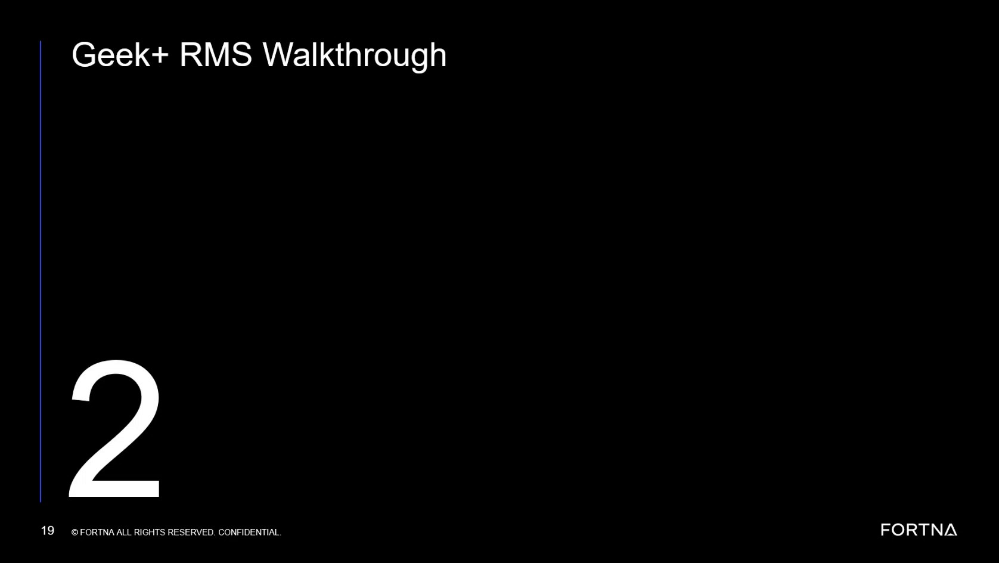

# Verify That the System Returns to Running After Bag Out Unless Shutdown Is Chosen

## Runbook Header

| Field | Value |
| --- | --- |
| Procedure ID | `proc_verify_system_returns_to_running_after_bag_out_v1` |
| Title | Verify That the System Returns to Running After Bag Out Unless Shutdown Is Chosen |
| Procedure Type | `reference` |
| Primary Role | `operator` |
| Supporting Roles | None |
| Support Safe | Yes |
| Validation Status | `needs_sme_review` |
| Merge Status | `source_finalized` |

## Summary

Use this source-based reference to confirm the expected post-bag-out state behavior described in training: once bag out or close out is complete, the system returns to running and remains ready for another sort unless an operator intentionally chooses shutdown.

## When To Use

Use when an operator needs to interpret the expected system state after bag out or close out, verify that the observed state matches the training description, and determine whether the system should remain in running or be intentionally placed into shutdown.

## Do Not Use For

* Detailed troubleshooting of why the system failed to return to running after bag out
* A step-by-step shutdown procedure
* A full bag out operating workflow with exact HMI button paths or screen names

## Safety And Operational Notes

* This runbook is an interpretation and verification reference from training content, not a full control procedure.
* Do not assume shutdown occurs automatically at the end of bag out; compare the observed state to the source description.

## Access Or Tools Needed

* Access to the system state display or HMI state indication
* Source-backed understanding of running, bag out, close out, and shutdown states

## Related Operational Context

* ctx_training_video_system_state_model_v1
* ctx_training_video_post_bagout_running_state_v1

## Procedure Steps

### Step 1 — Identify that bag out or close out has completed

**Responsible role:** operator

**Instruction:**
Confirm that the system has finished bag out or close out before interpreting the next state.

**Expected result:**
The operator is checking system state only after bag out or close out completion.

**Screens / Images:**

*Look for the training discussion of the distinction between running, bag out or close out, and shutdown states.*

*Look at the lifecycle framing that includes bag-out as a distinct phase before later state transitions.*

**Stop or Escalate If:**

* It is unclear whether bag out or close out has actually completed

---

### Step 2 — Check whether the system has returned to running

**Responsible role:** operator

**Instruction:**
Check the current system state indication and verify whether it has returned to running after bag out completion.

**Expected result:**
The displayed state shows running after bag out is done.

**Screens / Images:**

*Look for the training statement that once bag out is done, the system goes to a running state.*

**Stop or Escalate If:**

* The observed state after bag out does not match the documented training description

---

### Step 3 — Confirm readiness for another sort unless shutdown was selected

**Responsible role:** operator

**Instruction:**
Confirm that the system is ready for another sort if it has returned to running and no intentional shutdown selection has been made.

**Expected result:**
The operator understands that running after bag out means the system remains ready for another sort.

**Screens / Images:**

*Look for the transcript statement that after bag out the system returns to running unless the operator chooses shutdown.*

**Stop or Escalate If:**

* The observed state or behavior suggests the system is not ready for another sort despite returning to running

---

### Step 4 — Interpret shutdown as an intentional operator choice

**Responsible role:** operator

**Instruction:**
If the next sort will not start for a longer period, interpret the source as allowing the operator to choose shutdown rather than leaving the system in running.

**Expected result:**
The operator understands shutdown as a separate deliberate choice after bag out, not the default automatic outcome.

**Screens / Images:**

*Look for the transcript language that shutdown occurs only if the operator chooses to put the system shut down.*

**Stop or Escalate If:**

* A shutdown state appears without an intentional operator choice and does not match the training description

---

### Step 5 — Do not assume automatic shutdown after bag out

**Responsible role:** operator

**Instruction:**
Do not assume shutdown happens automatically at the end of bag out; compare the observed state to the source description.

**Expected result:**
The operator uses the training description as the reference and identifies mismatches for escalation.

**Screens / Images:**

*Use this frame as visual support for the training discussion of running versus shutdown after bag out.*

**Stop or Escalate If:**

* The observed state after bag out does not match the documented training description
* Further troubleshooting is needed, because the source does not provide detailed diagnosis steps

---

## Success Criteria

* Bag out or close out completion is correctly identified
* The operator verifies whether the system returned to running after bag out
* The operator correctly interprets that shutdown is a separate intentional choice
* Observed behavior is compared against the source-backed description rather than assumed

## Failure Conditions

* The observed state after bag out does not match the training description
* The system does not appear to return to running after bag out completion
* Shutdown is assumed to occur automatically without evidence of an intentional choice

## Escalation Guidance

* Escalate if the observed state after bag out does not match the documented training description.
* Escalate for troubleshooting if the system does not return to running after bag out, because this source does not provide detailed diagnostic steps.

## Missing Details / Known Gaps

* The source does not provide exact HMI screen names or navigation paths for checking system state.
* The source does not provide a detailed troubleshooting workflow if the system does not return to running.
* The source does not provide a formal shutdown procedure.
* The source does not provide a time estimate for this verification.

## Source Lineage

- Candidate IDs: candidate_training_video_interpret_system_state_after_bag_out
- Source ID: `training_video_day1`
- Source Type: `training_video`
