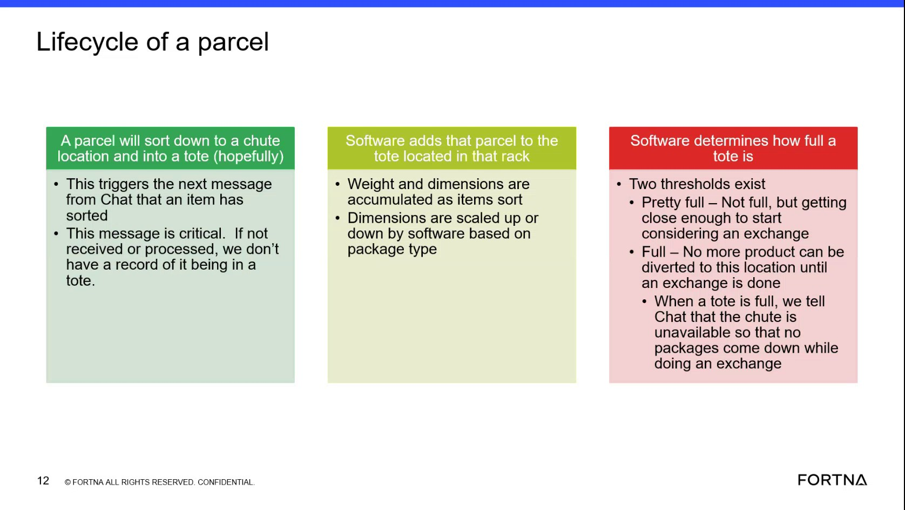

# Interpret Tote Fill Thresholds To Understand Exchange Readiness

## Runbook Header

| Field | Value |
| --- | --- |
| Procedure ID | `proc_interpret_tote_fill_thresholds_to_understand_exchange_readiness_v1` |
| Title | Interpret Tote Fill Thresholds To Understand Exchange Readiness |
| Procedure Type | `reference` |
| Primary Role | `operator` |
| Supporting Roles | None |
| Support Safe | Yes |
| Validation Status | `needs_sme_review` |
| Merge Status | `source_finalized` |

## Summary

Use the source-defined tote fill thresholds to understand whether a tote is nearing exchange consideration or is full and unavailable for additional diversion.

## When To Use

Use when reviewing tote or location status in the parcel lifecycle context and you need to interpret the source-defined meanings of the tote fullness states "Pretty full" and "Full."

## Do Not Use For

* Do not use this runbook as a tote exchange procedure.
* Do not use this runbook to define system responses, controls, or exchange actions beyond the threshold meanings stated in the source.
* Do not use this runbook if the observed tote state cannot be matched to the documented thresholds.

## Safety And Operational Notes

* This is a reference interpretation procedure derived from training content and does not provide physical exchange instructions.
* Do not invent exchange actions or system responses beyond the threshold meanings stated in the source.

## Access Or Tools Needed

* Access to the documented tote threshold information
* Visibility into the tote or location status being reviewed

## Related Operational Context

* ctx_training_video_tote_fill_thresholds_v1

## Procedure Steps

### Step 1 — Identify the tote or location in parcel lifecycle context

**Responsible role:** operator

**Instruction:**
Identify the tote or location being discussed in the parcel lifecycle context, where a parcel sorts down a chute into a tote in a rack.

**Expected result:**
The operator is looking at the correct tote or location context for threshold interpretation.

**Screens / Images:**

*The slide area showing the parcel sorting down a chute into a tote in a rack.*

**Stop or Escalate If:**

* Escalate if the tote or location being reviewed cannot be identified in the parcel lifecycle context.

---

### Step 2 — Check the documented tote fullness state

**Responsible role:** operator

**Instruction:**
Check the documented tote fullness state using the source-provided thresholds "Pretty full" and "Full."

**Expected result:**
The tote state is matched to one of the documented threshold labels.

**Screens / Images:**

*The slide section showing the two tote fill thresholds: "Pretty full" and "Full."*

**Stop or Escalate If:**

* Escalate if the observed tote state cannot be matched to the documented thresholds.

---

### Step 3 — Interpret the meaning of pretty full

**Responsible role:** operator

**Instruction:**
Interpret "Pretty full" as not full yet, but close enough to start considering an exchange.

**Expected result:**
The operator understands that "Pretty full" indicates nearing exchange readiness, not a fully blocked location.

**Screens / Images:**

*The threshold definition for "Pretty full."*

**Stop or Escalate If:**

* Escalate if "Pretty full" cannot be interpreted using the source-provided definition only.

---

### Step 4 — Interpret the meaning of full

**Responsible role:** operator

**Instruction:**
Interpret "Full" as no more product can be diverted to this location until an exchange is done.

**Expected result:**
The operator understands that a full tote is unavailable for additional diversion until exchange is completed.

**Screens / Images:**

*The threshold definition for "Full" and the exchange-related note indicating the location is unavailable for additional diversion.*

**Stop or Escalate If:**

* Escalate if the full-state meaning cannot be matched to the source definition.
* Stop if additional exchange actions or system responses would need to be assumed beyond what the source states.

---

### Step 5 — Record the threshold meaning using source definitions only

**Responsible role:** operator

**Instruction:**
Record the observed threshold meaning using only the source-provided definitions.

**Expected result:**
The threshold meaning is documented as either nearing exchange consideration or full and unavailable for additional diversion until exchange is done.

**Stop or Escalate If:**

* Escalate if the observed tote state cannot be matched to the documented thresholds.
* Stop if recording the result would require inventing exchange actions or system responses beyond the source.

---

## Success Criteria

* The user can distinguish between "Pretty full" and "Full" using the source definitions.
* The user understands that "Pretty full" means not full yet but close enough to start considering an exchange.
* The user understands that "Full" means no more product can be diverted to the location until an exchange is done.

## Failure Conditions

* The observed tote state cannot be matched to the documented thresholds.
* The threshold meaning is interpreted with invented actions or unsupported system behavior.
* The user treats this reference as a full tote exchange procedure.

## Escalation Guidance

* Escalate if the observed tote state cannot be matched to the documented thresholds.
* Escalate if additional operational action is needed beyond the threshold meanings stated in the source.
* Do not invent exchange actions or system responses beyond the threshold meanings stated in the source.

## Missing Details / Known Gaps

* The source explains threshold meanings but does not provide a full tote exchange procedure.
* The source does not provide a numeric threshold value for "Pretty full" or "Full" in this packet.
* The source does not provide a formal recording method, system screen, or field for documenting the observed threshold meaning.
* The source does not define role boundaries beyond operator-level interpretation.

## Source Lineage

- Candidate IDs: candidate_training_video_interpret_tote_fill_thresholds
- Source ID: `training_video_day1`
- Source Type: `training_video`
